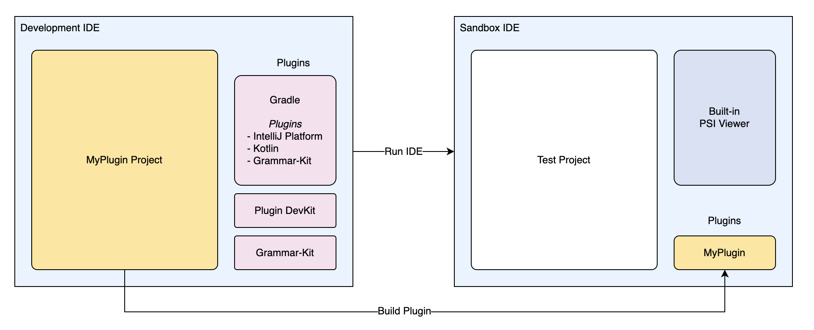

# Introduction

Nim is my favourite programming language. For a long time I've relied on VS Code for 
my Nim development, since the effort around Nim tooling has focused on that editor. 
However, JetBrains IDEs have been my development environment of choice for many years, 
and I've yet to find a comparable experience anywhere else.

Unfortunately, the official Nim plugin for JetBrains leaves a lot to be desired: closed
source, its development seem to have stagnated, and it doesn't perform some of the basic
features I've come to expect from a JetBrains IDE. I thought to myself: how hard could it
be to make my own? I went through
the [IntelliJ Platform Plugin SDK](https://plugins.jetbrains.com/docs/intellij/)
documentation, and was overwhelmed both by the complexity and richness of the platform.
So, as I usually do when I encounter a complex topic, I ignore all the warning signs and
jump in head first. This is the story of that journey.

## Developing a Language Plugin

We'll use the IntelliJ IDE itself to develop the plugin in Kotlin. To run the plugin,
IntelliJ uses a sandboxed version of itself, which is a separate installation of the IDE
that loads the plugin. The following diagram shows the two instances of the IDEs, and what
plugins are loaded in each.

In the development IDE, we have the following plugins:
- **Gradle**: to manage the project and dependencies. Gradle itself has a number of plugins 
  that are used to build the project:
    - **IntelliJ Platform** Gradle Plugin (for building IntelliJ plugins)
    - **Kotlin** Gradle Plugin (for compiling Kotlin code)
    - **Grammar-Kit** Gradle Plugin (for generating the lexer and parser during the build)
- **Plugin DevKit**: to provide the necessary tools to develop a plugin.
- **Grammar-Kit**: to provide JFlex and BNF authoring support, and to generate the lexer 
  and parser.

The sandboxed IDE will host the plugin we're developing, and any other plugins we 
choose to install. The sandboxed IDE is run in
[Internal Mode](https://plugins.jetbrains.com/docs/intellij/enabling-internal.html), 
which enables many additional features through the **Tools | Internal Actions** menu. 
It also enables the built-in PSI viewer, which we will use to inspect the PSI tree of 
the code we're working with (more on PSI later).

In the next section, we'll set up the development environment and create a new plugin 
project.
