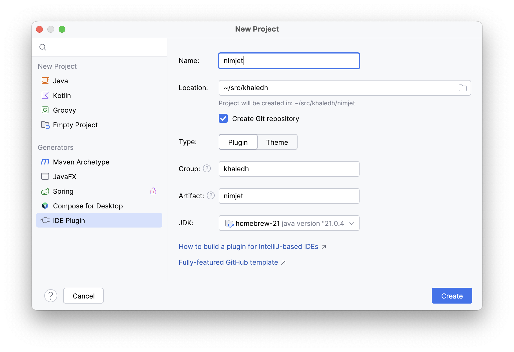
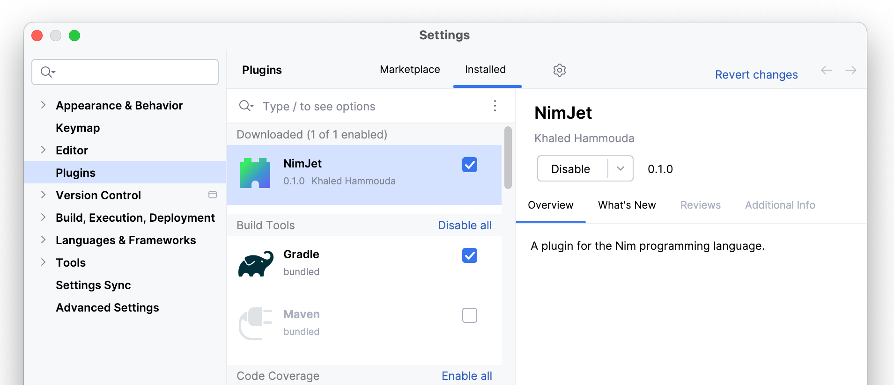

# Project Setup

Let's go ahead and install the requirements:
- [IntelliJ IDEA Community Edition](https://www.jetbrains.com/idea/download)
- Plugins:
  - [Gradle](https://plugins.jetbrains.com/plugin/13112-gradle) (comes bundled with
    IntelliJ)
  - [Plugin DevKit](https://plugins.jetbrains.com/plugin/22851-plugin-devkit)
  - [Grammar-Kit](https://plugins.jetbrains.com/plugin/6606-grammar-kit)

Since we're going to target IntelliJ Platform 2024.2+, we'll need Java 21. On my
macOS machine, I installed it using homebrew:

```sh-session
$ brew install openjdk@21
```

## New Plugin Project

Because we installed Plugin DevKit, we can now create a new project of type **IDE
Plugin**.



Unfortunately, the new project by default targets IntelliJ IDEA 2023.2 (using Java 17),
and uses the IntelliJ Grade plugin version 1.x. We need to update the project to target
IntelliJ IDEA 2024.2 (using Java 21) and use the IntelliJ Gradle plugin version 2.x.
For this, we'll need to replace the `build.gradle.kts` file with the following:

```kts
// build.gradle.kts

plugins {
    id("org.jetbrains.intellij.platform") version "2.0.1"
    id("org.jetbrains.kotlin.jvm") version "2.0.20"
}

repositories {
    mavenCentral()

    intellijPlatform {
        defaultRepositories()
    }
}

dependencies {
    intellijPlatform {
        intellijIdeaCommunity("2024.2.1")
        instrumentationTools()
    }
}

intellijPlatform {
    buildSearchableOptions = false
}
```

Here's a breakdown of the changes:

- We updated the IntelliJ Platform Gradle plugin to version 2.0.1.
- We updated the Kotlin plugin to version 2.0.20.
- We added the `intellijPlatform` block under `repositories` to add the
  `defaultRepositories()` to the project.
- We updated the `intellijPlatform` block under `dependencies` to target IntelliJ IDEA
  2024.2.1. We also added the `instrumentationTools()` dependency to instrument the
  compiled code (like nullability assertions).
- We added the `intellijPlatform` block at the end of the file to configure the plugin
  build. For now, we only disabled building searchable options (which we don't need for
  now).

We can now tell Gradle to reload the project from the Gradle tool window. Gradle will then
download the configured Gradle plugins, and all the declared dependencies, including an
IDEA Community Edition 2024.2 sandbox. It takes a while to download everything and index
the dependencies, so be patient.

## Plugin Configuration

Plugins have an XML-driven configuration file called `plugin.xml`, stored under the
`src/main/resources/META-INF` directory. It contains metadata about the plugin, such as
the plugin ID, name, version, and description, as well as registrations for extension
points that the plugin implements.

Let's update the `plugin.xml` file to reflect the details of our plugin:

```xml
<!-- src/main/resources/META-INF/plugin.xml -->

<idea-plugin>

    <id>khaledh.nimjet</id>

    <name>NimJet</name>
    <vendor email="..." url="...">Khaled Hammouda</vendor>
    <description><![CDATA[A plugin for the Nim programming language.]]></description>
    <version>0.1.0</version>

    <!-- plugin dependencies on core modules -->
    <depends>com.intellij.modules.platform</depends>
    <depends>com.intellij.modules.lang</depends>

    <extensions defaultExtensionNs="com.intellij">
        <!-- extension point registrations go here -->
    </extensions>

</idea-plugin>
```

The `<depends>` elements declare the compatibility of the plugin with the IntelliJ
Platform products.

- The `com.intellij.modules.platform` dependency is required all plugins to indicate
  dependency on shared functionality.
- The `com.intellij.modules.lang` dependency indicates dependency on the platform module
  that provides language support (e.g. syntax highlighting, code completion, etc.).

## Running the Plugin

Although we haven't written any code yet, we can still run the plugin to see if
everything is set up correctly. To run the plugin, we trigger the `runIde` task from
the Gradle tool window under `Tasks` > `intellij platform` > `runIde`.

We should be presented with a new instance of IntelliJ IDEA 2024.2 with our plugin
loaded. Let's create an empty test project and verify that our plugin is loaded by
checking the
**Settings | Plugins**
dialog:



Great! We can see that our plugin is loaded and enabled, although not doing anything at
the moment.

::: tip
When you close the sandbox project, the IDE doesn't completely close. Instead, it goes
back to the welcome screen, which needs to be closed as well. Moreover, when you run the
sandbox IDE again, it will show the welcome screen instead of the last project you had
open. To avoid this, when you are in the project, quit the IDE using `Cmd+Q` (macOS), not
by closing the project window.
:::

In the next section, we'll start by registering a new file type for the Nim
language so that the IDE can recognize Nim files and associate them with our plugin.
