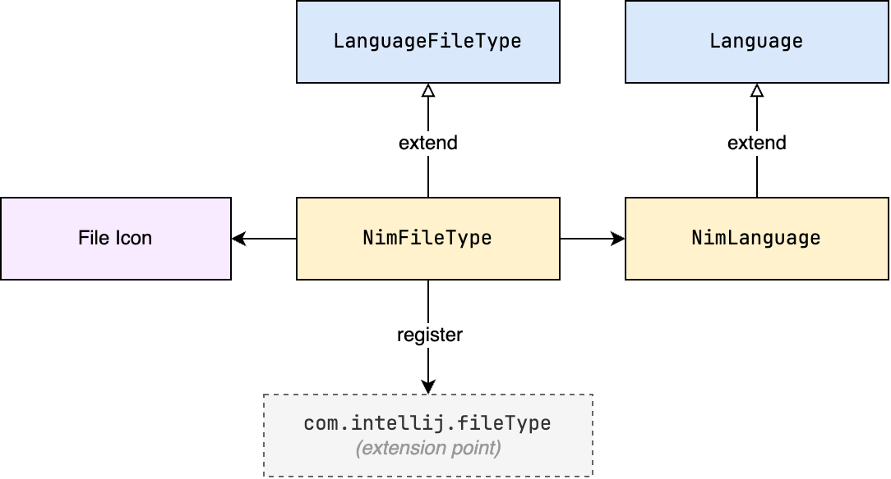
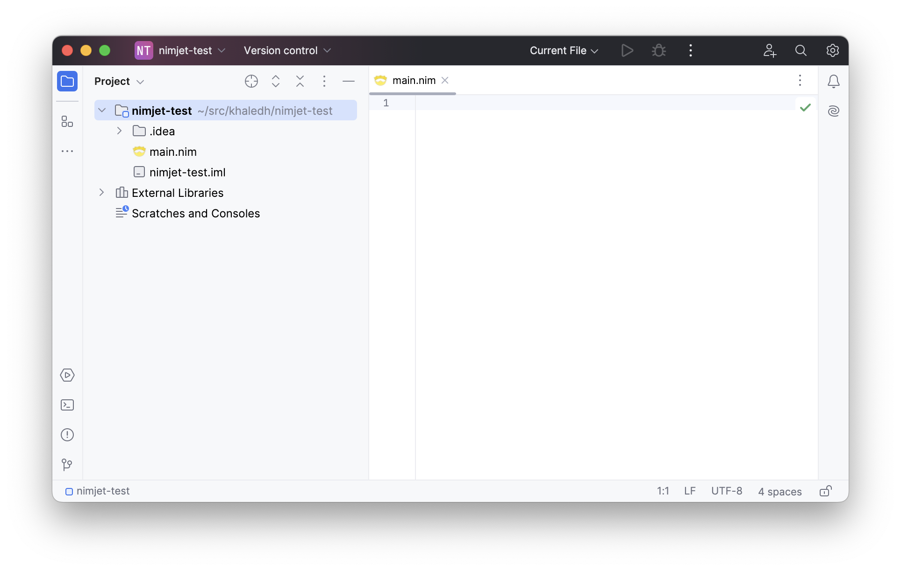

# File Type

For the IDE to recognize files of a new language, we need to register a new file type. The
following diagram shows the relationship between a few classes that are involved in
registering a new file type.



- The `NimFileType` class, which extends `LanguageFileType`, is responsible for defining
  the file type, such as the file extension, icon, and language associated with the file
  type.
- The `NimLanguage` class, which extends `Language`, is used to identify the language. It
  defines the language ID, and optionally a display name, any MIME types associated with
  the language, and whether the language is case-sensitive. 

## File Type and Language

Let's start by defining the language class for Nim. This is simply a singleton object that
extends `Language` and defines the language ID as
"Nim".

```kotlin
// src/main/kotlin/khaledh/nimjet/NimLanguage.kt

package khaledh.nimjet

import com.intellij.lang.Language

object NimLanguage : Language("Nim")
```

Next, we define the file type class.
```kotlin
// src/main/kotlin/khaledh/nimjet/NimFileType.kt

package khaledh.nimjet

import com.intellij.openapi.fileTypes.LanguageFileType

object NimFileType : LanguageFileType(NimLanguage) {
    override fun getName() = "Nim"
    override fun getDescription() = "Nim file"
    override fun getDefaultExtension() = "nim"
    override fun getIcon() = NimIcons.FILE
}
```

Let's break things down:
- We associate the Nim file type with the Nim language instance we created earlier.
- We provide a name and a description for the file type.
- We specify `nim` as the default extension for files of this type.
- We provide an icon for the file type.

For the icon, I downloaded the Nim crown logo and placed it in the `resources/icons`
folder. Let's create the `NimIcons` object to load the icon (if we need more icons later,
we can add them here as well).

```kotlin
// src/main/kotlin/khaledh/nimjet/NimIcons.kt

package khaledh.nimjet

import com.intellij.openapi.util.IconLoader

object NimIcons {
    val FILE = IconLoader.getIcon("/icons/nim.png", NimIcons::class.java)
}
```

## Registering the File Type

Finally, we can register the file type in the `plugin.xml` file under the `fileType` 
extension point.

```xml
<!-- src/main/resources/META-INF/plugin.xml -->

<idea-plugin>

    <id>khaledh.nimjet</id>

    <!-- ... -->

    <extensions defaultExtensionNs="com.intellij">

        <fileType
            name="Nim"
            language="Nim"
            extensions="nim"
            implementationClass="khaledh.nimjet.NimFileType"
            fieldName="INSTANCE"/>

    </extensions>

</idea-plugin>
```

It's not clear to me why we need to repeat the file type name, language and file extension
here, since we've already defined them in the `NimFileType` class. I suspect it may have
to do with the need for the IDE to gather all the information it needs about the file type
without needing to load the class until it's actually needed.

## Testing the File Type

Let's run the sandbox IDE and create a new file with the `.nim` extension to see if the
IDE recognizes it as a Nim file.



Great! The IDE recognizes the file as a Nim file, and we can see the Nim icon in the 
file tree as well as the editor tab. We're now ready to flesh out the plugin with more 
features.

Our next goal is to provide syntax highlighting for Nim files. But to get there, we need
to implement a lexer first, since syntax highlighting is based on the tokens produced by
the lexer. We'll cover that in the next section.
