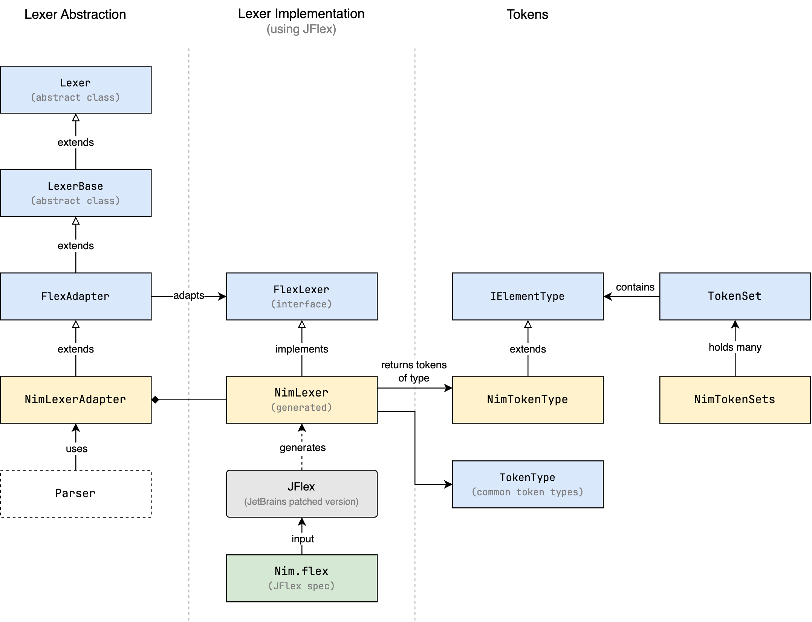
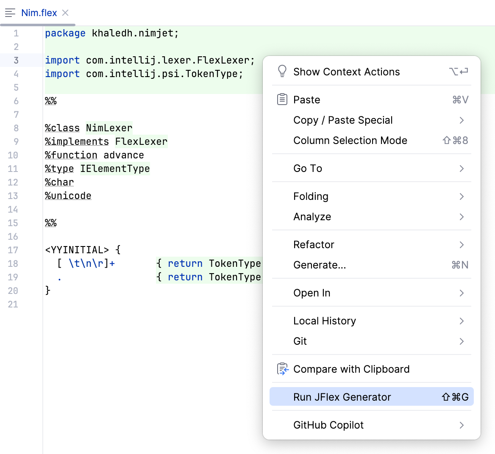

# Lexer

The role of the lexer is to tokenize the input text into a stream of tokens. Typically,
this stream of tokens is used by the parser to build the Abstract Syntax Tree (AST) of the
code, or in the case of an IntelliJ language plugin, the
<abbr title="Program Structure Interface">PSI</abbr> tree, which we will get to in a 
later section. Another use for the lexer is to provide syntax highlighting in the 
editor, which gives different colors to different tokens depending on their type.

## The Lexer Interface

The IntelliJ Platform provides an abstract class called `Lexer` that language plugins can
extend to implement their own lexer.

```java
public abstract class Lexer {
    public abstract void start(CharSequence buffer, int startOffset, int endOffset, int initialState);
    public abstract int getState();
    public abstract IElementType getTokenType();
    public abstract int getTokenStart();
    public abstract int getTokenEnd();
    public abstract void advance();
    public abstract LexerPosition getCurrentPosition();
    public abstract void restore(LexerPosition position);
    public abstract CharSequence getBufferSequence();
    public abstract int getBufferEnd();
}
```

Typically, the lexer works in a pull mode, where the caller repeatedly calls the
`getTokenType` and `advance` in a loop to get the next token in the stream, until
`getTokenType` returns `null` to indicate the end of the stream. The `getTokenStart`
and `getTokenEnd` methods return the start and end offsets of the current token in the
input buffer. The other methods are used to manage the lexer's state and position in the
input.

We _can_ implement our own lexer from scratch by extending the `Lexer` class, but this is
rarely done in practice. Instead, a lexer generator is typically used to generate the
lexer code from a lexer specification. The lexer specification is a set of pattern
matching rules that define the tokens in the language. Fortunately, the Grammar-Kit plugin
supports the [JFlex](https://www.jflex.de/) lexer generator out of the box, so we can use
it to generate the lexer for Nim.

## Lexer Components

Let's first understand the different classes and interfaces that are involved in the
lexer. The following diagram shows the relationships between these classes and interfaces.



- Given a lexer specification file, here called `Nim.flex`, JFlex generates a lexer class
  called `NimLexer` that implements the `FlexLexer` interface.
- However, the platform expects a lexer class that extends the `Lexer` abstract class, so
  an adapter class is needed to bridge the two. In our case, this adapter class is called
  `NimLexerAdapter`, and it extends the `FlexAdapter` base class, which does the actual
  work of adapting the `FlexLexer` interface to the `Lexer` interface. This is the 
  class that will be used by the parser, not the generated `NimLexer`.
- The `NimTokenType` class is a specialization of the `IElementType` class, which is used
  to represent the different types of tokens in the language. The lexer will return 
  instances of `NimTokenType` (which we will create later), or one of the built-in token 
  types defined in the `TokenType` class, according to the matching rules in the 
  lexer specification.
- In some cases, we may need to refer to a set of tokens as a single entity. For 
  example, the set of all keywords in the language, or the set of all operators. This 
  is where the `TokenSet` class comes in, which is a holder of `IElementType` 
  instances. We will declare all token sets in the `NimTokenSets` class for easy access.

## Lexer Specification

JFlex comes from a family of lexer generators that has roots in the `lex` tool that 
was developed to generate lexical analyzers under Unix. Given a lexer specification 
file, JFlex generates a lexer class in Java that can be used to tokenize the input text.

The lexer specification file includes three sections separated by `%%`:

```java
// User code

%%

// Options and declarations

%%

// Lexical rules
```

**User code**
: This part is copied verbatim to the generated lexer class. It typically contains
  package declarations, imports, and other user-defined code.

**Options and declarations**
: This part contains JFlex options and declarations. Options are used to configure the
  behavior of the lexer generator, while declarations are used to define variables and
  methods that are used in the lexical rules.

**Lexical rules**
: This part contains the pattern matching rules that define the tokens in the language.
  Each rule consists of a regular expression pattern followed by a Java action that is
  executed when the pattern is matched. The action typically returns the token type of
  the matched token.


Let's start by creating a minimal lexer specification file, `Nim.flex`, which contains 
the bare minimum to tokenize only whitespace for now (anything else will be considered 
a bad character).

```java
// src/main/kotlin/khaledh/nimjet/Nim.flex

package khaledh.nimjet;

import com.intellij.lexer.FlexLexer;
import com.intellij.psi.TokenType;
import com.intellij.psi.tree.IElementType;

%%

%class NimLexer
%implements FlexLexer
%function advance
%type IElementType
%char
%unicode

%%

<YYINITIAL> {
  [ \t\n\r]+       { return TokenType.WHITE_SPACE; }

  // error fallback
  [^]              { return TokenType.BAD_CHARACTER; }
}
```

- In the first section, we declare the package and imports that will be copied to the 
  generated lexer class.
- In the second section, we specify the options and declarations:
  - we specify the name to be used for the generated lexer class: `NimLexer`,
  - specify that it implements the `FlexLexer` interface,
  - speicfy the name of the function that advances the lexer to the next token as 
    `advance`,
  - specify the return type of the `advance` function as `IElementType`,
  - specify that the lexer should count characters (so that the current offset is 
    available to the parser), and
  - specify that the lexer should use the full Unicode input character set.
- In the third section, we define the lexical rules. The rules are defined within the 
  scope of _states_. The lexer can be in one of several states, depending on the
  context (e.g. inside a string literal, inside a comment, etc.). The initial state is
  called `<YYINITIAL>`. Here, we define the following rules under the initial state:
  - The `[ \t\n\r]+` regex matches one or more whitespace characters and returns the 
    built-in `TokenType.WHITE_SPACE` token type.
  - The `[^]` is an error fallback regex that matches any character that was not 
    matched by any of the previous rules, and returns the built-in
    `TokenType.BAD_CHARACTER` token type. We're using this expression instead of `.` 
    since it matches any character, including newlines and unpaired Unicode surrogate 
    characters.

  Later, we will add more rules to match the different tokens in the language.

## Generating the Lexer

The Grammar-Kit plugin provides an action to generate the lexer from the lexer
specification file. To do that, right-click on the `Nim.flex` file in the project view or
the editor, and select **Run JFlex Generator** from the context menu.



This will generate the lexer class under the `src/main/gen` directory that looks like 
the following:


```java
// Generated by JFlex 1.9.2 http://jflex.de/  (tweaked for IntelliJ platform)
// source: src/main/kotlin/khaledh/nimjet/Nim.flex

package khaledh.nimjet;

import com.intellij.lexer.FlexLexer;
import com.intellij.psi.TokenType;


class NimLexer implements FlexLexer {
    // ...
}
```

In order to include the generated lexer in the project, we need to add the `src/main/gen`
directory to the `sourceSets` in the `build.gradle.kts` file:

```kts
// build.gradle.kts
...

sourceSets {
    main {
        java {
            srcDirs("src/main/gen")
        }
    }
}
```

Let's also mark the `src/main/gen` directory as a generated source directory in 
IntelliJ. To do that, right-click on the `src/main/gen` directory in the project view, 
and select **Mark Directory as | Generated Sources Root**.

## Automating the Lexer Generation

There's one inconvenience though: every time we change the lexer specification file, 
we need to manually run the JFlex generator to update the lexer. To automate this 
process, we can use the `generateLexer` task that comes with the Grammar-Kit 
Gradle plugin. Let's add the plugin to the build file and configure the task:

```kts{6,11-20}
// build.gradle.kts

plugins {
    id("org.jetbrains.intellij.platform") version "2.0.1"
    id("org.jetbrains.kotlin.jvm") version "2.0.20"
    id("org.jetbrains.grammarkit") version "2022.3.2.2"
}

...

tasks {
    generateLexer {
        sourceFile = file("src/main/kotlin/khaledh/nimjet/Nim.flex")
        targetOutputDir = file("src/main/gen/khaledh/nimjet")
        purgeOldFiles = true
    }

    compileJava { dependsOn(generateLexer) }
    compileKotlin { dependsOn(generateLexer) }
}
```

This configures the `generateLexer` task and makes it a dependency of the 
`compileJava` and `compileKotlin` tasks, so that the lexer is generated every time the
project is compiled.

At this point it would be good to test the lexer to make sure it's working as expected.
Unfortunately, we can't register the lexer directly. We'll need to create a parser 
definition and register that first, which provides access to the lexer. We'll get to 
that in the next section.
