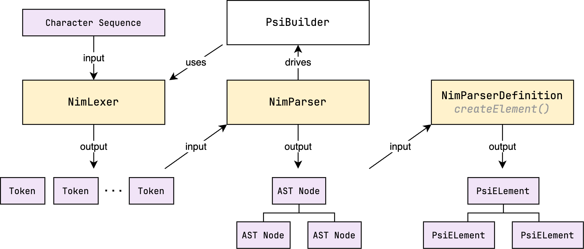

# Parser

In order to work with the language constructs at a higher level, we need to parse the
source code. The parser is responsible for converting the stream of tokens provided by the
lexer into an abstract syntax tree (AST).

However, while the AST provides a view into the structure of the source code, it does not
provide any semantic information. For example, while the parser can determine that a
sequence of tokens is a function call, it cannot determine if the function is defined or
if the arguments are valid. This is where the Program Structure Interface
(PSI) comes in. The PSI is built on top of the AST, and provides a higher-level API for
working with the source code.

The following diagram shows the relationship between the lexer, parser, AST, and PSI.

- The lexer reads the source code as a sequence of characters and produces a stream of
  tokens.
- The parser (with the help of `PsiBuilder`) reads the stream of tokens and produces an 
  abstract syntax tree (AST).
- The conversion from AST to PSI is done through the `ParserDefinition.createElement()`
  method, which is responsible for creating the appropriate PSI elements for a given AST
  node.

I'm not sure why the `PsiBuilder` is named as such, since it is used in the parsing 
step which produces AST nodes, not PSI elements. In my opinion, it would make more 
sense to name it `AstBuilder` instead ¯\\\_(ツ)_/¯.

## AST Structure

Every node in the AST is represented by the `ASTNode` interface, which holds a reference
to an `IElementType` object that represents the type of the node. There are three 
types of nodes in the AST, represented by classes that extend `IElementType`:
- the root node: represents the entire file (an instance of `IFileElementType`),
- intermediate nodes: represent the production rules in the grammar (instances of 
  `NimElementType`), and
- leaf nodes: represent the tokens produced by the lexer (instances of `NimTokenType`).

Note that the `IFileElementType` node type has nothing to do with the file type discussed
in the [File Type](03-filetype.md) section. The former is a node type in the AST, while
the latter represents a file type in the IDE (which does not necessarily have to be a 
language file).

The following diagram illustrates this structure.

The three boxes labelled with the `AST` tag represent the three types of nodes 
described above. They are given placeholder names to indicate that they are instances 
of classes that extend `IElementType`, and that the name of those instances depends on 
the language construct they represent.
- `$FileElementName$` is a singleton that represents the root node type of the AST (e.g. 
  `NIM_FILE`)
- `$ElementName$` represents an intermediate node (e.g. `CASE_STMT`)
- `$TokenName$` represents a leaf node (e.g. `COLON`)

Since the root file node is a singleton, it is created by the `ParserDefinition` itself,
rather than by the parser. The parser is responsible for creating the intermediate and
leaf nodes, with the help of the `PsiBuilder`, which in turn uses the lexer to get the
tokens. The lexer and the parser objects are created by the `ParserDefinition` as well.

## PSI Structure

TODO
