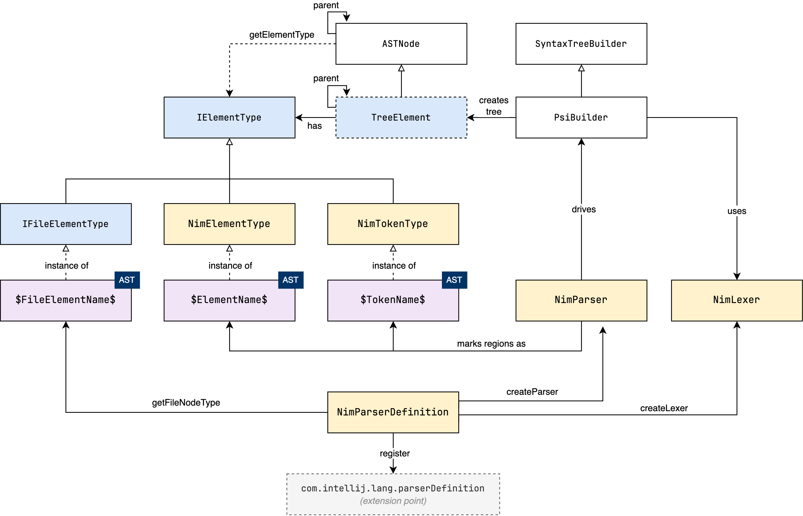
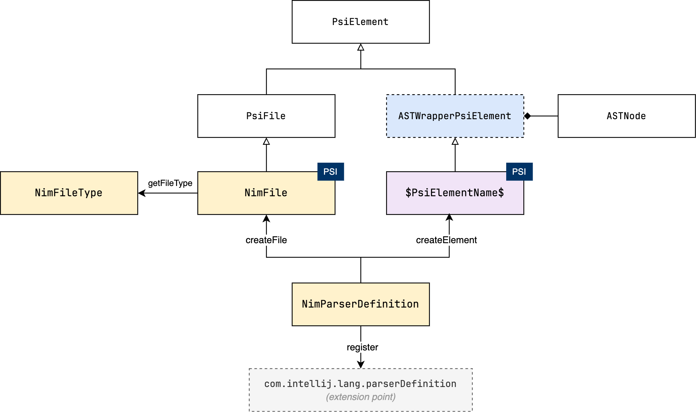

# Parser

In this section, we will explore the various concepts involved in parsing, including how
the parser works, structure of the AST and the PSI, and how they are related. In the next
section, we will implement a simple parser by hand, before moving on to generate the
parser using Grammar-Kit.

## Overview

In order to work with the language constructs at a higher level, we need to parse the
source code. The parser is responsible for converting the stream of tokens provided by the
lexer into an abstract syntax tree (AST).

However, while the AST provides a view into the structure of the source code, it does not
provide any semantic information. For example, while the parser can determine that a
sequence of tokens is a function call, it cannot determine if the function is defined or
if the arguments are valid. This is where the Program Structure Interface
(PSI) comes in. The PSI is built on top of the AST, and provides a higher-level API for
working with the source code.

The following diagram shows the relationship between the lexer, parser, AST, and PSI.

  

- The lexer reads the source code as a sequence of characters and produces a stream of
  tokens.
- The parser (with the help of `PsiBuilder`) reads the stream of tokens and produces an 
  abstract syntax tree (AST).
- The conversion from AST to PSI is done through the `ParserDefinition.createElement()`
  method, which is responsible for creating the appropriate PSI elements for a given AST
  node.

I'm not sure why the `PsiBuilder` is named as such, since it is used in the parsing 
step which produces AST nodes, not PSI elements. In my opinion, it would make more 
sense to name it `AstBuilder` instead ¯\\\_(ツ)_/¯.

## AST Structure

Every node in the AST is represented by the `ASTNode` interface, which holds a reference
to an `IElementType` object that represents the type of the node. There are three 
types of nodes in the AST, represented by classes that extend `IElementType`:
- the root node: represents the entire file (an instance of `IFileElementType`),
- intermediate nodes: represent the production rules in the grammar (instances of 
  `NimElementType`), and
- leaf nodes: represent the tokens produced by the lexer (instances of `NimTokenType`).

Note that the `IFileElementType` node type has nothing to do with the file type discussed
in the [File Type](03-filetype.md) section. The former is a node type in the AST, while
the latter represents a file type in the IDE (which does not necessarily have to be a 
language file).

In the following diagram, I try to illustrate these types of nodes, their base classes,
and how the AST is created by the parser.

The three boxes labelled with the `AST` tag represent the three types of nodes 
described above. They are given placeholder names to indicate that they are instances 
of classes that extend `IElementType`, and that the name of those instances depends on 
the language construct they represent.
- `$FileElementName$` is a singleton that represents the root node type of the AST (e.g. 
  `NIM_FILE`)
- `$ElementName$` represents an intermediate node (e.g. `CASE_STMT`)
- `$TokenName$` represents a leaf node (e.g. `STRING_LIT`)

But how does the parser actually create the AST? In the diagram, `NimParser` is the actual
parser class (which can be handwritten or generated), which drives the `PsiBuilder` by
_marking_ regions of tokens in the input stream as nodes in the tree. When the parser
tries to parse a grammar rule, it tells the `PsiBuilder` to start a
_marker_ (a region of tokens that will be converted into a node in the AST), and then
calls the appropriate method to parse the rule. When the rule is successfully parsed, the
parser tells the `PsiBuilder` to set the marker as _done_, and passes the matched element
type to be associated with the node. If the rule is not parsed successfully, the parser
either tells the `PsiBuilder` to _rollback_ the marker, or generate an error node.
Creating markers is done recursively, as the parser descends into the grammar rules.

As nodes are marked by the parser, the `PsiBuilder` creates `ASTNode` instances
(implemented by `TreeElement`), to represent the nodes in the AST. Each `ASTNode` has a
reference to the `IElementType` object that represents the type of the node (the ones
mentioned above). The parser returns the final root node of the AST by calling the 
`PsiBuilder.getTreeBuilt()` method.

The final piece of the puzzle is the `ParserDefinition` class, which provides methods for 
creating the lexer (`createLexer`), the parser (`createParser`), and the element type 
representing the root node of the AST (`getFileNodeType`), which is an instance of 
`IFileElementType`.

The `ParserDefinition` class also provides a few methods for returning `TokenSet` objects
(not shown in the diagram) that identify certain types of tokens: comments, whitespace,
and string literals.
- `getWhitespaceTokens()`: returns a `TokenSet` of whitespace tokens. These tokens are 
  typically ignored by the parser.
- `getCommentTokens()`: returns a `TokenSet` of comment tokens. These tokens are also 
  typically ignored by the parser. They are also used to search for `TODO` patterns in 
  comments.
- `getStringLiteralElements()`: returns a `TokenSet` of string literal tokens. These 
  tokens are used by the "Search in strings" option during refactoring.

## PSI Structure

As mentioned earlier, the PSI is built on top of the AST, and provides a higher-level API
for working with the source code. You can think of the PSI as an enriched view of the 
AST, with capabilities to navigate, search, and modify the source code. The following 
diagram shows the different classes and interfaces that make up the PSI, and their 
relationship to the AST and the `ParserDefinition`.

  

The bridge between the AST and the PSI is the `ASTWrapperPsiElement` class, which is a 
wrapper around an `ASTNode` that implements the `PsiElement` interface. The AST is 
converted to a PSI tree through the `ParserDefinition.createElement()` method, which 
creates the appropriate PSI element for a given AST node.

The entire file is represented by an instance of the `PsiFile` interface, which also 
extends `PsiElement`. This interface is the typical entry point for working with the 
PSI tree. In our case, the `NimFile` class implements `PsiFile`, and is created 
through the `ParserDefinition.createFile()` method.

The PSI tree is then used by the IDE to provide code completion, navigation, 
refactoring, and other features.

Now that we have an idea of how the various components of the parser work together, in 
the next section we will implement a very simpler parser by hand for a simple 
statement to get a deeper understanding of the process. Later, we will use Grammar-Kit 
to generate the parser for us from a BNF grammar, since writing a full parser for Nim 
by hand would be tedious and error-prone.
