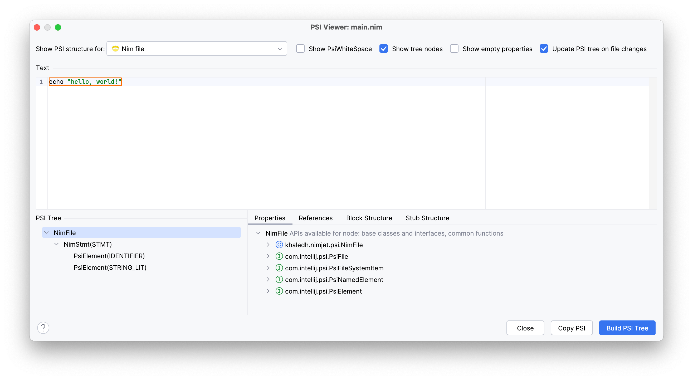

# Parser Implementation

In this section, we will implement a simple parser by hand to parse the following Nim 
statement:

```nim
echo "Hello, World!"
```

The result of the parsing will be:
- an AST representing the structure of the statement, and
- an equivalent PSI tree that the IDE recognizes and can work with.

We will rely on the built-in PSI viewer to inspect the PSI tree generated by our parser.

## Token, Element, and PSI Types

Before we start parsing, we need to define the token and element types we will be 
using. Let's start with the token types:

```kotlin
// src/main/kotlin/khaledh/nimjet/NimTokenType.kt
...

class NimTokenType(debugName: String) : IElementType(debugName, NimLanguage)

interface NimToken {
    companion object {
        @JvmField val IDENTIFIER = NimTokenType("IDENTIFIER")
        @JvmField val STRING_LIT = NimTokenType("STRING_LIT")
    }
}
```

We define two token types: `IDENTIFIER` and `STRING_LIT`, which are instances of 
`NimTokenType` (which extends `IElementType`). We will use `IDENTIFIER` to represent the
`echo` proc name, and `STRING_LIT` to represent the string literal `"Hello, World!"`. 


<p style="font-size: 80%">
<b>Note:</b> The <code>@JvmField</code> annotation is used to expose the companion object 
fields as static fields so that we can refer to them as <code>NimToken.IDENTIFIER</code>
instead of <code>NimToken.Companion.IDENTIFIER</code>.
</p>

Next, we define the element types that will be used to represent the nodes in the AST:

```kotlin
// src/main/kotlin/khaledh/nimjet/NimElementType.kt
...

class NimElementType(debugName: String) : IElementType(debugName, NimLanguage)

interface NimElement {
    companion object {
        @JvmField val FILE = IFileElementType(NimLanguage)
        @JvmField val STMT = NimElementType("STMT")
    }
}
```

We have two element types: `FILE`, which is an instance of `IFileElementType` (the root
element type), and `STMT`, which is an instance of `NimElementType`. We will use the
`STMT` element to represent the whole statement.

Finally, we define the PSI element types that will be used to represent the nodes in the
PSI tree. We'll use a separate class/file for each PSI element, since we'll be adding more
functionality to them later. First, let's define the root PSI element, `NimFile`:

```kotlin
// src/main/kotlin/khaledh/nimjet/psi/NimFile.kt
...

class NimFile(viewProvider: FileViewProvider) : PsiFileBase(viewProvider, NimLanguage) {
    override fun getFileType(): FileType = NimFileType
    override fun toString(): String = "NimFile"
}
```

The `NimFile` class extends `PsiFileBase`, which is a base class that provides a default
implementation for the `PsiFile` interface methods. We override `getFileType` to return
our `NimFileType` instance, and `toString` to return a string representation of the PSI
file node.

Next, we define the PSI element for the statement, `NimStmt`:

```kotlin
// src/main/kotlin/khaledh/nimjet/psi/NimStmt.kt
...

class NimStmt(node: ASTNode) : ASTWrapperPsiElement(node)
```

All PSI elements will extend `ASTWrapperPsiElement`, which is a base class that wraps an
`ASTNode` and provides a default implementation for the `PsiElement` interface methods.

This completes the definition of the token, element, and PSI types we will be using in our
simple parser.

## Lexer

Let's update our JFlex lexer spec to recognize the two types of tokens we introduced:

```java
// src/main/kotlin/khaledh/nimjet/Nim.flex
...
import khaledh.nimjet.NimTokenType;

%%
...

%%

<YYINITIAL> {
  [a-zA-Z][a-zA-Z0-9]*           { return NimToken.IDENTIFIER; }
  \"([^\"\\]|\\.)*\"             { return NimToken.STRING_LIT; }
  [ \t\n\r]+                     { return TokenType.WHITE_SPACE; }

  // error fallback
  [^]                            { return TokenType.BAD_CHARACTER; }
}
```

We added two rules to match the two token types we defined:
- `IDENTIFIER`: matches any sequence of letters and digits starting with a 
  letter
- `STRING_LIT`: matches a string literal enclosed in double quotes (with support for 
  escape sequences)

## Parser

Now, let's implement the parser. We will create a `NimParser` class that extends 
`PsiParser`, and drives a `PsiBuilder` to create the AST by marking regions of tokens
as nodes in the tree. The parsing approach we will use is called _recursive descent_,
where each grammar rule is implemented as a method in the parser class. Let's start with a
simple implementation without error handling to focus on the parsing logic:

```kotlin
// src/main/kotlin/khaledh/nimjet/NimParser.kt
...

class NimParser : PsiParser {

    // Grammar:
    //   file ::= stmt
    //   stmt ::= IDENTIFIER STRING_LIT

    override fun parse(root: IElementType, builder: PsiBuilder): ASTNode {
        parseFile(root, builder)
        return builder.treeBuilt
    }

    private fun parseFile(root: IElementType, builder: PsiBuilder) {
        var marker = builder.mark()

        parseStmt(builder)

        marker.done(NimElement.FILE)
    }

    private fun parseStmt(builder: PsiBuilder) {
        var marker = builder.mark()

        assert(builder.tokenType == NimToken.IDENTIFIER)
        builder.advanceLexer()

        assert(builder.tokenType == NimToken.STRING_LIT)
        builder.advanceLexer()

        marker.done(NimElement.STMT)
    }
}
```

The parser is very simple: it defines two grammar rules:
- `file ::= stmt`: a file consists of a single statement
- `stmt ::= IDENTIFIER STRING_LIT`: a statement consists of an identifier followed by a 
  string literal

The recursive descent parsing is done by starting with the `parseFile` method, which 
represents the `file` rule. Since the rule consists of a single statement, we 
_descend_ into the `stmt` rule by calling `parseStmt`. The `parseStmt` method parses 
its rule by asserting that there is an `IDENTIFIER` token followed by a `STRING_LIT` 
token (advancing the lexer after each token). A proper implementation would include 
error handling and reporting, but they're intentionally omitted here for simplicity.

To tell the `PsiBuilder` that a region of tokens should be converted into a node in 
the AST, we create a _marker_ by calling `builder.mark()` at the beginning of the 
region, and then call `done` on the marker at the end of the region to convert it into a 
node. You'll see this being done in the `parseFile` and `parseStmt` methods, where a 
marker is set at the beginning of the rule, and then marked as _done_ when the rule is 
successfully parsed. The `done` method takes the element type to be associated with 
the node, which is `NimElement.FILE` (the root element) for the file node, and 
`NimElement.STMT` for the statement node.

Needless to say, this parser will crash if the input doesn't exactly match the grammar 
rules. We'll improve it later to handle errors gracefully.

## Parser Definition

Let's now create the `NimParserDefinition` class, which we will register as an extension
to the `com.intellij.lang.parserDefinition` extension point. This class provides the IDE
with the necessary methods to create the lexer, parser, and a few other things:

```kotlin
// src/main/kotlin/khaledh/nimjet/NimParserDefinition.kt
...

class NimParserDefinition : ParserDefinition {
    override fun createLexer(project: Project?): Lexer = NimLexerAdapter()
    override fun createParser(project: Project?): PsiParser = NimParser()

    // AST
    override fun getFileNodeType(): IFileElementType = NimElement.FILE
    override fun getWhitespaceTokens(): TokenSet = TokenSet.WHITE_SPACE
    override fun getCommentTokens(): TokenSet = TokenSet.EMPTY
    override fun getStringLiteralElements(): TokenSet = TokenSet.create(NimToken.STRING_LIT)

    // PSI
    override fun createFile(viewProvider: FileViewProvider): PsiFile = NimFile(viewProvider)
    override fun createElement(node: ASTNode): PsiElement {
        return when (node.elementType) {
            STMT -> NimStmt(node)
            else -> throw AssertionError("Unknown element type: ${node.elementType}")
        }
    }
}
```

Most of the methods should be self-explanatory. The last method, `createElement`, is
responsible for creating the appropriate PSI element for a given AST node. In our case,
we only have one type of element, `STMT`, so we create a `NimStmt` instance for that
element type, and throw an error if we encounter an unknown element type (for now).

Finally, we need to register the `NimParserDefinition` class in the `plugin.xml` file:

```xml
<!-- src/main/resources/META-INF/plugin.xml -->

<idea-plugin>
    ...

    <extensions defaultExtensionNs="com.intellij">
        ...

        <lang.parserDefinition
            language="Nim"
            implementationClass="khaledh.nimjet.NimParserDefinition"/>

    </extensions>

</idea-plugin>
```

This completes the implementation of the parser. We can now test it by running the
plugin and inspecting the PSI tree using the built-in PSI viewer.

## Testing the Parser

Let's run the `Run Plugin` gradle task to start the IDE with our plugin. Once the IDE
starts, create a new file with the following content:

```nim
echo "hello, world!"
```

Now, open the PSI viewer from the **Tools | View PSI Structure of Current File** menu.



Great! We can see the PSI tree with the `NimFile` and `NimStmt` nodes, in addition to the
`IDENTIFIER` and `STRING_LIT` tokens under the `NimStmt` node. Our simple parser is
working as expected.

## Error Handling

Let's add error handling to our parser to make it more robust. We'll change the parser 
to detect and recover from errors, and report them to the user. We'll make each parsing
method return a boolean indicating whether the rule was successfully parsed. If a rule
fails, we'll mark the region as _error_ and return early. Since returning early means 
that not all tokens are consumed, we need to advance the lexer to the end of the token 
stream to ensure that the PSI tree is properly built (this is a requirement of the
`PsiBuilder`).

Here's the updated parser:

```kotlin
// src/main/kotlin/khaledh/nimjet/NimParser.kt
...

class NimParser : PsiParser  {

    // Grammar:
    //   file ::= stmt
    //   stmt ::= IDENTIFIER STRING_LIT

    override fun parse(root: IElementType, builder: PsiBuilder): ASTNode {
        parseFile(root, builder)
        return builder.treeBuilt
    }

    private fun parseFile(root: IElementType, builder: PsiBuilder) {
        var marker = builder.mark()

        if (!builder.eof()) {
            parseStmt(builder)
        }

        // consume any remaining tokens (in case of error)
        while (!builder.eof()) {
            builder.advanceLexer()
        }

        marker.done(NimElement.FILE)
    }

    private fun parseStmt(builder: PsiBuilder): Boolean {
        var marker = builder.mark()

        if (builder.tokenType != NimToken.IDENTIFIER) {
            reportError(builder, "Expecting an identifier")
            marker.drop()
            return false
        }
        builder.advanceLexer()

        if (builder.tokenType != NimToken.STRING_LIT) {
            reportError(builder, "Expecting a string literal")
            marker.drop()
            return false
        }
        builder.advanceLexer()

        marker.done(NimElement.STMT)
        return true
    }

    private fun reportError(builder: PsiBuilder, message: String) {
        var marker = builder.mark()
        builder.advanceLexer()
        marker.error(message)
    }
}
```

We added a check for the end of the token stream in the `parseFile` method to ensure that
we don't try to parse an empty file. The `reportError` method is used to mark the region
as an error and report the error message to the user. If a rule fails, we drop the marker
and return `false` to indicate that the rule was not successfully parsed.

Let's run the plugin again and test the error handling by creating a file with the 
contents `echo hello` (missing the string quotation marks).

<p style="text-align: center">
  
</p>

And it works! The token `hello` is marked as an error with a red squiggly line, and 
our error message is displayed when we hover over the token.

OK, we now have a good understanding of how to implement a parser by hand. In the next
section, we will look at how to generate a parser using Grammar-Kit by defining the
grammar in a BNF-like format. This will allow us to focus on the language grammar rules
without worrying about the details of the lexer and parser implementation.
