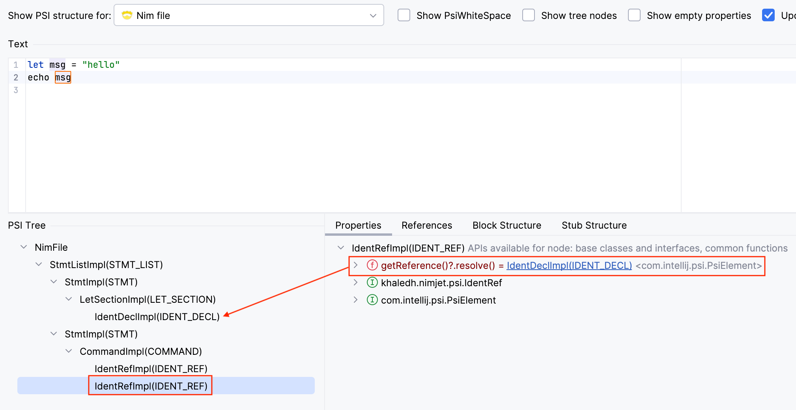

# Go To Declaration

Now that we've got the basics in place, let's add our first actual feature: Go To 
Declaration. Consider this simple Nim program:

```nim /msg/
let msg = "hello"   # <- declaration
echo msg            # <- reference
```

We want to be able to navigate from the identifier `msg` in `echo msg` to the 
declaration of `msg` on the first line. In IntelliJ terminology, the `msg` identifier 
on the second line is called a _reference_, which can be _resolved_ to its declaration 
element.

The IDE knows that a PSI element is a reference if its `getReference()` method returns
a `PsiReference` object. This object is _not_ the target element, but rather an object
that can resolve the reference to its target by invoking its `resolve()` method. The
implementation of the `resolve()` method will have to locate the target element in the
PSI tree, which can get complex depending on the scoping rules of the language.

Let's take a look at the AST generated by the Nim compiler for this code snippet. We 
can use the `dumpTree` macro from the `macros` module to print the AST:

```nim
# dumptree.nim
import std/macros

dumpTree:
  let msg = "hello"
  echo msg
```

Macros are evaluated at compile time, so to see the output we just need to compile the 
program using `nim c dumptree.nim`:

```text {4,9}
StmtList
  LetSection
    IdentDefs
      Ident "msg"
      Empty
      StrLit "hello"
  Command
    Ident "echo"
    Ident "msg"
```

The `Ident` node on line 4 is the declaration of `msg`, and the one on line 9 is the
reference to that declaration. In Nim, one of the places where declarations can be found
is the `LetSection` node, as seen in the output above. So, we need to implement
`getReference` on the element representing the reference to return a `PsiReference`
object. That object will implement `resolve` to find and return the declaration under the
`LetSection` node.

However, instead of creating a dedicated class for the reference, we can use the PSI class
representing the identifier itself; we just need to make it implement the `PsiReference`
interface. One more thing, even though the Nim AST defines both the declaration and the
reference as `Ident` nodes, it will make our lives easier if we create a separate PSI
class for each, e.g. `IdentDecl` and `IdentRef`. This way, we can avoid any confusion
between the two, and will make identifying `IdentDecl` in the tree easier when resolving a
reference.

## Updating the Grammar

Let's start by updating the grammar to support the two statements in the example above.
We'll use a simplified version of the Nim AST to guide us:

```bnf
// src/main/kotlin/khaledh/nimjet/parser/Nim.bnf
{
  ...
}

Module     ::= !<<eof>> StmtList
StmtList   ::= Stmt*
Stmt       ::= LetSection
             | Command

LetSection ::= LET IdentDecl EQ STRING_LIT

Command    ::= IdentRef IdentRef

IdentDecl  ::= IDENT
IdentRef   ::= IDENT
```

You'll notice that I simplified the `LetSection` rule to allow only a single declaration
for now (we'll come back to handling multiple declarations in a single `let` section
later), using `IdentDecl` instead of an undifferentiated `IDENT`. The `Command` rule is
also simplified to only allow two `IdentRef` elements.

If we generate the parser and PSI classes now, we'll have the following files:

```tree
src/main/gen
└── khaledh/nimjet
    ├── parser
    │   ├── NimElement.java
    │   └── NimParser.java
    └── psi
        ├── impl
        │   ├── CommandImpl.java
        │   ├── IdentDeclImpl.java
        │   ├── IdentRefImpl.java
        │   ├── LetSectionImpl.java
        │   ├── Stmt.java
        │   └── StmtListImpl.java
        ├── Command.java
        ├── IdentDecl.java
        ├── IdentRef.java
        ├── LetSection.java
        ├── Stmt.java
        └── StmtList.java
```

## Reference Mixin

Our goal is to be able to navigate from a reference to its declaration. In our case, the
reference element is `IdentRef`, and the declaration element is `IdentDecl`. The reference
element needs to override the `getReference` method to return a `PsiReference` object. 
But how do we tell Grammar-Kit to generate the `getReference` method for `IdentRef`? 
The answer is using mixins. The way mixins work in Grammar-Kit is that we create a
mixin class for a particular element, and then we tell Grammar-Kit to mix that class into
the generated PSI class for that element. So, let's go ahead and create a mixin class for
`IdentRef` that implements the `getReference` method:

```kotlin
// src/main/kotlin/khaledh/nimjet/psi/impl/IdentRefMixin.kt
...

abstract class IdentRefMixin(node: ASTNode) : ASTWrapperPsiElement(node), IdentRef {

    override fun getReference(): PsiReference {
        return IdentReference(this, TextRange(0, this.textLength))
    }

}
```

We haven't implemented `IdentReference` yet; we'll do that in a moment. But first, notice
that the mixin class extends `ASTWrapperPsiElement`, and implements the `IdentRef` 
interface generated by Grammar-Kit. Normally, this signature would be implemented by 
the generated `IdentRefImpl` class, but when we tell Grammar-Kit to use a mixin class 
for an element, it will use the mixin class as the base class for the element instead. 
So, the generated `IdentRefImpl` class will extend `IdentRefMixin`, and that's why the 
mixin class needs to take over the responsibility of extending `ASTWrapperPsiElement`.

Let's update the BNF file to use the mixin:

```bnf
{
  ...
  mixin("IdentRef")="khaledh.nimjet.psi.impl.IdentRefMixin"
}
...
```

Now, if we generate the parser and PSI classes, we'll see that the `IdentRefImpl` class
extends `IdentRefMixin` instead of `ASTWrapperPsiElement`:

```java
// src/main/gen/khaledh/nimjet/psi/impl/IdentRefImpl.java
...

public class IdentRefImpl extends IdentRefMixin implements IdentRef {
    ...
}
```

Now, let's implement the `IdentReference` class, which represents the reference to an
identifier. This class will implement the `PsiReference` interface, and its `resolve`
method will find and return the declaration element in the PSI tree.

```kotlin
// src/main/kotlin/khaledh/nimjet/psi/IdentReference.kt
...

class IdentReference(element: IdentRef, textRange: TextRange)
    : PsiReferenceBase<IdentRef>(element, textRange) {

    override fun resolve(): PsiElement? {
        // This is a naive implementation; we'll improve it later
        val identDecl = PsiTreeUtil.findChildOfType<IdentDecl>(
            myElement.containingFile, IdentDecl::class.java
        )
        return if (identDecl?.name == myElement.text) identDecl else null
    }

}
```

The `resolve` method uses the `PsiTreeUtil` utility class to find the first child of the
file that is an `IdentDecl` element. It then checks if the name of the declaration matches
the text of the reference, and returns the declaration element if it does.

Obviously, this is a naive implementation that works only if the first declaration in the
file is the one we're looking for. Another thing I'm ignoring here is Nim's insensitivity
to naming style (e.g. `myVar` and `my_var` are considered the same). This is just simple
way to demonstrate the concept. We'll improve it later.

## Declaration Mixin

Now that we have the reference side of things set up, let's move on to the declaration
side. The platform docs state that:

> Every PSI element that can be renamed or referenced needs to implement [the]
> `PsiNamedElement` interface.

It also mentions, in a different section, that:

> In order to enable more advanced functionality, prefer implementing 
> `PsiNameIdentifierOwner` over `PsiNamedElement` where possible.

It's not clear to me in what context and what features `PsiNameIdentifierOwner` provides
over `PsiNamedElement`. From what I can tell, `PsiNameIdentifierOwner` is used when the
name of the element is not directly accessible from the element itself, but is instead
stored in a separate child element. In our case, the actual name of the identifier is
stored in the `IDENT` token, which is a child of the `IdentDecl` element. So, we'll go
with `PsiNamedElement` and implement its `getNameIdentifier` method to return the `IDENT`
element.

Let's create a mixin class for `IdentDecl` that implements `PsiNameIdentifierOwner`:

```kotlin
abstract class IdentDeclMixin(node: ASTNode) : ASTWrapperPsiElement(node), IdentDecl {

    override fun getNameIdentifier(): PsiElement? = ident

    override fun getName(): String = ident.text

    override fun setName(name: String): PsiElement {
        TODO("Not yet implemented")
    }
}
```

The `getNameIdentifier` method returns the `IDENT` token element. Let's look at how 
it's implemented in the generated `IdentDeclImpl` class:

```java
public class IdentDeclImpl extends IdentDeclMixin implements IdentDecl {

  public IdentDeclImpl(@NotNull ASTNode node) {
    super(node);
  }

  @Override
  @NotNull
  public PsiElement getIdent() {
    return findNotNullChildByType(IDENT);
  }

}
```

The implementation generated by Grammar-Kit has a `getIdent` method that finds the 
`IDENT` child token. Since we're using Kotlin, the `getIdent` method is automatically
converted to a property `ident` in the Kotlin class. This is why we can access `ident`
directly in the mixin class.

Let's update the BNF file to use the mixin, and also tell Grammar-Kit that `IdentDecl` 
implements `PsiNameIdentifierOwner`:

```bnf
{
  ...
  implements("IdentDecl")="com.intellij.psi.PsiNameIdentifierOwner"
  mixin("IdentDecl")="khaledh.nimjet.psi.impl.IdentDeclMixin"
}
...
```

Now, let's generate the parser and PSI classes and test the **Go To Declaration** 
feature in the sandbox IDE.


Notice that the reference and declaration are highlighted when the cursor is on either of
them. This is because the IDE recognizes that the reference can be resolved to the
declaration, and it highlights the declaration when the reference is selected (and 
vice versa). To test the navigation feature, place the cursor on the reference and press
`Ctrl+B` (or `Cmd+B` on macOS) to navigate to the declaration. We can also place the 
cursor on the declaration and press `Ctrl+B` to navigate to the reference. Neat!

Let's also take a look at the PSI tree:



If we click on the `IdentRef` node, we can see that it has a reference to the `IdentDecl`
node. Great!

In the next section, we'll improve reference resolution to take into account scoping 
rules, so that references are resolved to their correct declaration.
