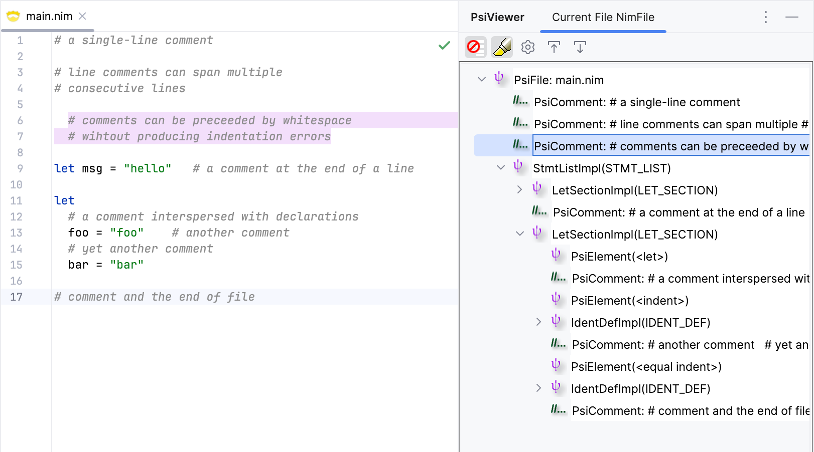

# Comments

Nim comments are similar to those in Python. They start with a `#` and continue to the end
of the line. Nim also supports multi-line comments that start with `#[` and end with `]#`,
which can be nested. Nim is very flexible with comments, allowing them to appear 
almost anywhere in the code.  

Examples: 

```nim
# a single-line comment

# line comments can span multiple
# consecutive lines

  # comments can be preceeded by whitespace
  # wihtout producing indentation errors

#[ a multi-line comment on a single line ]#

#[ a multi-line comment that
  spans multiple lines
]#

#[ a multi-line comment that contains another #[ nested ]# comment ]#

let msg = "hello"   # a comment at the end of a line

let 
  # a comment interspersed with declarations
  foo = "foo"    # another comment
  # yet another comment
  bar = "bar"
```

One thing to note from the Nim
[language manual](https://nim-lang.org/docs/manual.html#lexical-analysis-comments):

> Comments consist of a concatenation of comment pieces. A comment piece starts with `#`
> and runs until the end of the line. The end of line characters belong to the piece. 
> If the next line only consists of a comment piece with no other tokens between it 
> and the preceding one, it does not start a new comment:
> 
> ```nim
> i = 0     # This is a single comment over multiple lines.
> # The lexer merges these two pieces.
> # The comment continues here.
> ```

It's not clear to me what purpose does this merging serve, as comments are ignored by the 
parser anyway. That said, we'll follow this behavior in our lexer.

Nim also supports documentation comments that start with `##`. Unlike regular comments,
which are ignored by the parser, documentation comments are part of the syntax tree 
and are typically used to generate documentation and provide hints in the IDE. We'll 
get to documentation comments later in the section.

## Lexing Comments

Since multiline comments can be nested, they require a dedicated state in the lexer, 
with a way to track the nesting level. This means that we have to match line comments 
separately from multiline comments.

Typically, we'd use a regex to match line comments. However, I wasn't able to find a 
single regex that would allow matching merged line comments (as described in the Nim 
manual) but reject multiline comments. JFlex does not support negative lookahead, 
which makes it difficult to implement this behavior. So, I'm going to use a separate 
state for line comments as well, which provides more flexibility in driving the lexer 
behaviour.

Let's introduce a `L_COMMENT` state that will be entered when a `#` character is 
encountered. In this state, we'll consume the rest of the line, and any subsequent 
lines as long as they start with a `#` (optionally preceded by whitespace), but not `#[` 
(which would start a multiline comment).

```java {4,11,15-22}
// src/main/kotlin/khaledh/nimjet/lexer/Nim.flex
...

%state L_COMMENT
%state BEGIN_LINE_1 BEGIN_LINE_2

%%

<YYINITIAL> {
  ...
  "#"                            { yybegin(L_COMMENT); }
  ...
}

<L_COMMENT> {
  {EOL}[ \t]*#                   { /* merge line comment */ }
  {EOL}[ \t]*([^#] | "#[")       { // not a line comment
                                   yypushback(yylength());
                                   yybegin(YYINITIAL); return NimToken.COMMENT; }
  <<EOF>>                        { yybegin(YYINITIAL); return NimToken.COMMENT; }
  [^]                            { /* consume all other character */ }
}
```

The `L_COMMENT` state keeps matching lines that start with a `#` character, and only 
exits when it encounters a line that doesn't start with a `#` character or starts with 
`#[`. The `<<EOF>>` rule ensures that a comment at the end of file (without a newline) 
is also matched.

Now that we have a way to recognize line comments, let's tell our `NimParserDefinition` to
treat them as comments (so they can be ignored by the parser).

First, let's add a `TokenSet` for comments in the `NimTokenSets` interface.

```kotlin {7}
// src/main/kotlin/khaledh/nimjet/lexer/NimTokenSets.kt

interface NimTokenSet {

    companion object {
        ...
        @JvmField val COMMENTS = TokenSet.create(NimToken.COMMENT)
    }
}
```

Now we can update the `NimParserDefinition` to use this token set for comments.

```kotlin {8}
// src/main/kotlin/khaledh/nimjet/parser/NimParserDefinition.kt

class NimParserDefinition : ParserDefinition {
  ...

    override fun getFileNodeType(): IFileElementType = NIM_FILE
    override fun getWhitespaceTokens(): TokenSet = TokenSet.WHITE_SPACE
    override fun getCommentTokens(): TokenSet = NimTokenSet.COMMENTS
    override fun getStringLiteralElements(): TokenSet = NimTokenSet.STR_LITERALS
    ...
}
```

Let's test this out.



All seems to be working as expected! The lexer correctly recognizes line comments and 
merges them when they are on consecutive lines.

## Multiline Comments

Multiline comments pose a bit of a challenge for a couple of reasons:

- Since they can be nested, we need to keep track of the nesting level, and only close 
  the comment when all nested levels have been closed.
- We need to handle the case where the comment is not closed properly, which would be 
  an error.

To solve the first issue, we need to introduce a variable, `multilineCommentLevel`, 
and increment it when we encounter an opening `[#` sequence, and decrement it when we 
encounter a closing `]#` sequence. We'll only switch back to the `YYINITIAL` state when 
`multilineCommentLevel` reaches zero.

The second issue is a bit more tricky. The lexer doesn't have a way to report errors; 
all it can do is return a token. We've already seen this with the `BAD_CHARACTER` 
token, which is used to represent any character that doesn't match any lexer rule. But 
what does the parser do with this token? Well, it's not expecting such token, so it 
reports an error at that location about what it was expecting. 

The issue with unterminated multiline comments (as well as unterminated triple-quoted
strings, as we'll see later) is that they cause all subsequent text to be treated as part
of the comment. This would show up in the editor as the entire block of code following 
the unterminated comment being highlighted as an error. Here's what it looks like:


While this is technically correct, it's not very user-friendly. A better user 
experience would be to show an error at the end of the file with a more descriptive 
error message, like `"Unterminated multiline comment"`. Let's put this aside for now, 
and we'll come back to it later.

Let's introduce a new lexer state for multiline comments, `ML_COMMENT`, which would enter 
when it encounters a `#[`. Let's also add a new class field, `multilineCommentLevel`, 
to track the nesting level.

```java {4,8,14,18-29}
...

%{
  private int multilineCommentLevel = 0;
  ...
%}

%state LCOMMENT ML_COMMENT

%%

<YYINITIAL> {
  ...
  "#["                           { yybegin(ML_COMMENT); multilineCommentLevel++; }
  ...
}

<ML_COMMENT> {
  "#["                           { multilineCommentLevel++; }
  "]#"                           { multilineCommentLevel--;
                                   if (multilineCommentLevel == 0) {
                                     yybegin(YYINITIAL);
                                     return NimToken.COMMENT;
                                   }
                                 }
 <<EOF>>                         { yybegin(YYINITIAL);
                                   return NimToken.UNTERMINATED_ML_COMMENT; }
 [^]                             { /* consume all other character */ }
}
```

Once we encounter a `#[`, we enter the `ML_COMMENT` state and increment the nesting 
level (which is initially zero). When we encounter a `]#`, we decrement the nesting 
level, and if it reaches zero, we exit the `ML_COMMENT` state and return a comment 
token. If we reach the end of the file without closing the comment, we return the 
special token `UNTERMINATED_ML_COMMENT`. 

We'll leave the handling of this token for later when we introduce annotations. For 
now, let's test multiline comments and see if the nesting works as expected.


Great! We can insert multiline comments anywhere in the code, even if they are nested, 
and they are correctly recognized.


## Documentation Comments

TODO
