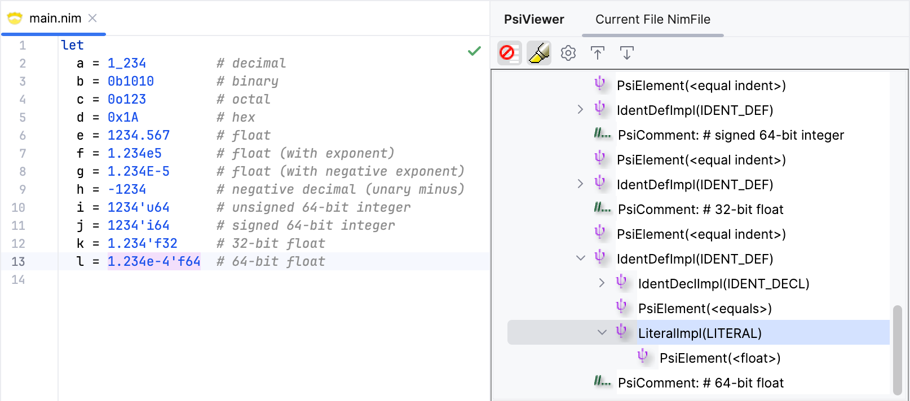
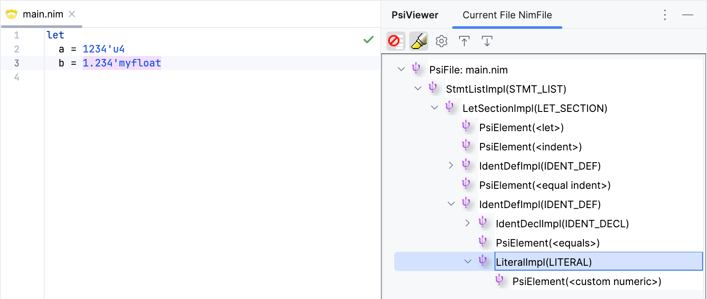

# Numeric Literals

Numeric literals in Nim have specific rules, as specified in the
[Nim manual](https://nim-lang.org/docs/manual.html#lexical-analysis-numeric-literals). 
The rules are as follows:

- A numeric literal is a sequence of digits, possibly containing underscores.
- A numeric literal can have a type suffix, e.g. `1234'i32`, `1234'u64`, `1234'f32`.
- Nim supports decimal, binary, octal, and hexadecimal literals, using a prefix to 
  specify the base. The prefixes are `0b`, `0o`, and `0x`, respectively (no prefix 
  means decimal).
- Floating point literals can have a decimal point, an exponent (`e` or `E`), or both.
- Unary minus is part of the literal, but must be preceded by a specific set of 
  characters.
- Nim supports custom numeric literals (we'll come to this later).

Here are some examples of numeric literals in Nim:

```nim
let
  a = 1_234         # decimal
  b = 0b1010        # binary
  c = 0o123         # octal
  d = 0x1A          # hex
  e = 1234.567      # float
  f = 1.234e5       # float (with exponent)
  g = 1.234E-5      # float (with negative exponent)
  h = -1234         # negative decimal (unary minus)
  i = 1234'u64      # unsigned 64-bit integer
  j = 1234'i64      # signed 64-bit integer
  k = 1.234'f32     # 32-bit float
  l = 1.234e-4'f64  # 64-bit float
```

## Lexer Changes

Let's start by defining the tokens for numeric literals. We'll need two tokens: one 
for integer literals and one for floating point literals.

```kt
// src/main/kotlin/khaledh/nimjet/lexer/NimToken.kt
...

interface NimToken {
    companion object {
        ...

        // numeric literals
        @JvmField val INT_LIT = NimTokenType("<int>")
        @JvmField val FLOAT_LIT = NimTokenType("<float>")

        ...
    }
}
```

Next, we'll define the regular expressions for integer and floating point literals in 
the JFlex spec file.

```java
// src/main/kotlin/lexer/Nim.flex
...

// numeric literals
Digit           = [0-9]
BinDigit        = [01]
OctDigit        = [0-7]
HexDigit        = [0-9a-fA-F]

DecNum          = {Digit} ("_"? {Digit})*
BinNum          = "0" [bB] {BinDigit} ("_"? {BinDigit})*
OctNum          = "0" [o] {OctDigit} ("_"? {OctDigit})*
HexNum          = "0" [xX] {HexDigit} ("_"? {HexDigit})*

IntNum          = {DecNum} | {BinNum} | {OctNum} | {HexNum}
IntSuffix       = \'? [iIuU] (8 | 16 | 32 | 64)
IntLit          = {IntNum} {IntSuffix}?

Exp             = [eE] [+\-]? {DecNum}
FloatNum        = {DecNum} ("\." {DecNum} {Exp}? | {Exp})
FloatSuffix     = ([fF] (32 | 64) | [dD])
FloatLit        = {FloatNum}
                | ({FloatNum} | {DecNum} | {OctNum} | {BinNum}) \'? {FloatSuffix}
                | {HexNum} \' {FloatSuffix}

%%

<DEFAULT> {
  ...

  "-"? {IntLit}                  { return NimToken.INT_LIT; }
  "-"? {FloatLit}                { return NimToken.FLOAT_LIT; }

  ...
}
```

The regexes should be fairly straightforward to understand. The only one that might look a
bit odd is the `FloatLit` regex, which has three alternatives. The first is a floating
point literal (i.e. with a decimal point and/or exponent), the second adds decimal, octal,
or binary literals, but requires a type suffix (since the absence of a suffix would 
make it an integer literal), and the third is a hexadecimal literal with a mandatory 
apostrophe and type suffix (since the float type suffix starts with a valid hex digit).

The rules are also simple, they include an optional unary minus followed by either an
integer or floating point literal. There are, however, cases when a minus character can 
mean an operator, so we'll have to handle that later when we add support for operators.

## Grammar Changes

So far we only support string literals in the grammar. Let's add support for numeric 
literals as well, so we can initialize variables with them.

```bnf
// src/main/kotlin/khaledh/nimjet/parser/Nim.bnf
...

IdentDef          ::= IdentDecl EQ Literal DocComment?
...

Literal           ::= INT_LIT | FLOAT_LIT | STRING_LIT
...
```

We moved the existing `STRING_LIT` token along with the new `INT_LIT` and `FLOAT_LIT` 
tokens into the `Literal` rule, and updated the `IdentDef` rule to use it instead.

Let's test it out.



Looks good! We can now use numeric literals in our code.

## Custom Numeric Literals

Nim allows you to define custom numeric literals by defining a proc (or other callable)
with the same name as the literal prefixed with the `'` character. For example:

```nim
type u4 = distinct uint8 # a 4-bit unsigned integer

proc `'u4`(n: string): u4 =
  ...

var x = 5'u4
```

In this example, `5'u4` is a custom numeric literal that calls the `'u4` proc with the 
string `"5"` as an argument. The proc then converts the string to a `u4` value 
(possibly with some validation).

Let's add a new token for custom numeric literals.

```kt {8}
interface NimToken {
    companion object {
        ...

        // numeric literals
        @JvmField val INT_LIT = NimTokenType("<int>")
        @JvmField val FLOAT_LIT = NimTokenType("<float>")
        @JvmField val CUSTOM_NUMERIC_LIT = NimTokenType("<custom numeric>")

        ...
    }
}
```

We'll also need to update the lexer to recognize custom numeric literals. We'll need 
to add a regex for identifiers so that we can use it to match the custom numeric 
callable. We'll use the same regex in the existing rule that matches regular identifiers.

```java {3,6,16,19}
...

Identifier      = [a-zA-Z][a-zA-Z0-9]*
...

CustomNumLit   = ({IntLit} | {FloatLit}) \' {Identifier}

%%
...

<DEFAULT> {
  ...

  "-"? {IntLit}                  { return NimToken.INT_LIT; }
  "-"? {FloatLit}                { return NimToken.FLOAT_LIT; }
  "-"? {CustomNumLit}            { return NimToken.CUSTOM_NUMERIC_LIT; }
  ...

  {Identifier}                   { return NimToken.IDENT; }
  ...
}
```

Finally, let's add the new token to the `Literal` rule in the grammar.

```bnf
...

Literal           ::= INT_LIT | FLOAT_LIT | CUSTOM_NUMERIC_LIT | STRING_LIT
...
```

Let's test it out.



Great! All seems to be working as expected.
