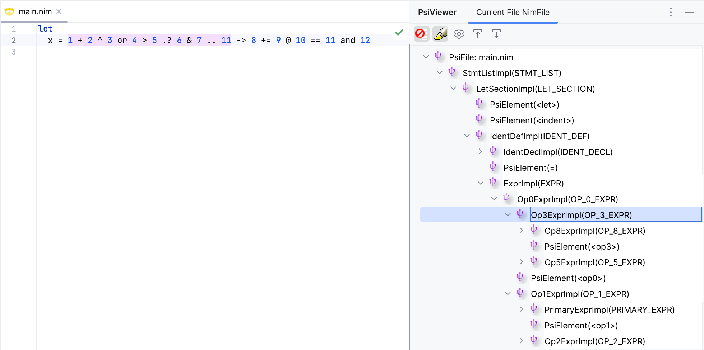
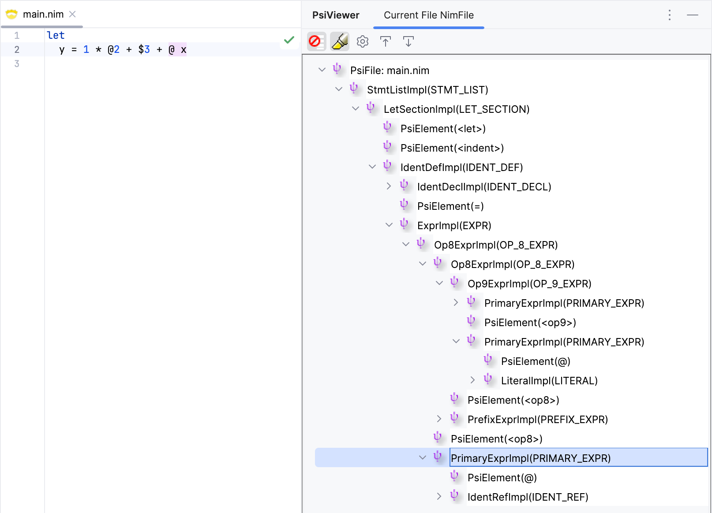
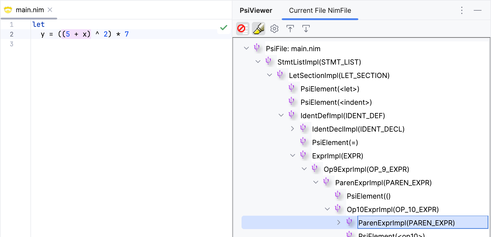
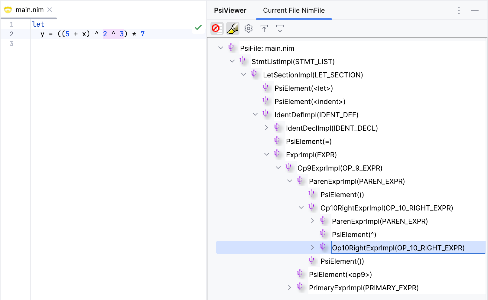
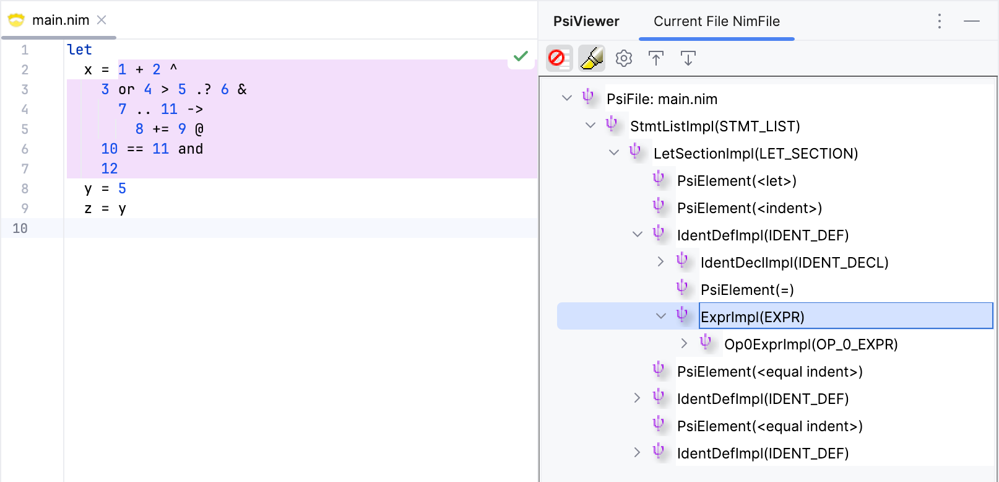

# Expressions

Now that we have support for identifiers and literals, we can start adding support for 
expressions. We cannot talk about expressions without talking about operators and operator precedence.
Nim's approach to operators is unique, as it treats operators as regular procedures. This
means that we can define our own operators using any combination of operator symbols.
There are three types of operators:

- Unary operators: operators that take one argument and can be written in prefix notation
  (e.g., `-a`).
- Binary operators: operators that take two arguments and can be written in infix
  notation (e.g., `a + b`).
- Operators that take more than two arguments, which can only be used as a proc call
  (e.g. `` `*+`(a, b, c) ``).

Examples:

```nim
let
  a = 40                # literal
  b = a                 # identifier
  c = a + 2             # binary expression
  d = -c                # unary expression
  e = 2 + 4 * 10        # operator precedence (* has higher precedence than +)
  f = (2 + 4) * 10      # parentheses can be used to change precedence
  g = true              # boolean literal
  h = not g             # unary boolean expression
  i = g and h           # binary boolean expression
  j = i or (e < f)      # boolean expression using relational operators
```

In addition to typical expressions like arithmetic and logical operations, Nim supports
block expressions, which are expressions that contain a block of code, where the value of
the block is the value of the last expression in the block.

Examples:

```nim
let
  a = block:                        # block expression
    echo "Hello"
    42

  b = if a > 50: a else: a + 10     # if expression

  c = case a:                       # case expression
    of 0: "zero"
    of 42: "forty-two"
    else: "not forty-two"
```

We'll come back to block expressions later, but for now, let's start with the basics.

## Nim Operators

Operators in Nim can be defined using any combination of the following operator symbols:

```
=     +     -     *     /     <     >
@     $     ~     &     %     |
!     ?     ^     .     :     \
```

An exception is made for the following set since these are used for other purposes in 
the language:
- `.` (member access, method call syntax)
- `=` (assignment, initialization)
- `:` (type declaration, block start)
- `::` (seems to be reserved for future use)
- `..` (slice or range operator)

There's also a predefined set of keyword operators:

```
and or not xor shl shr div mod in notin is isnot of as from
```

Special patterns of operators affect the operator precedence:
- operators that start with a `.` are called dot-like operators
- operators that start with a `@` are called sigil-like operators
- operators that end with `->`, `~>` or `=>` are called arrow-like operators
- operators that end with `=` and their first character is not one of `<`, `>`, `!`, 
  `=`, `~`, `?` are called assignment operators

Here's a modified version of the operator precedence table from the Nim manual:

<div style="font-size: 85%">

| Precedence<br/>Level | Operators                                                                        | First<br/>character                     | Trailing<br/>character(s) | Terminal<br/>symbol |
|----------------------|----------------------------------------------------------------------------------|-----------------------------------------|---------------------------|---------------------|
| 10 (highest)         |                                                                                  | `$` `^`                                 |                           | OP10                |
| 9                    | `*` `/` `%` `div` `mod` `shl` `shr`                                              | `*` `/` `%` `\`                         |                           | OP9                 |
| 8                    | `+` `-`                                                                          | `+` `-`, `\|`, `~`                      |                           | OP8                 |
| 7                    | `&`                                                                              | `&`                                     |                           | OP7                 |
| 6                    | _dot-like operator_ (e.g. `.?`) `..`                                             | `.`                                     |                           | OP6                 |
| 5                    | `==` `<=` `<` `>=` `>` `!=`<br/>`in` `notin` `is` `isnot` `not` `of` `as` `from` | `=` `<` `>` `!`                         |                           | OP5                 |
| 4                    | `and`                                                                            |                                         |                           | OP4                 |
| 3                    | `or` `xor`                                                                       |                                         |                           | OP3                 |
| 2                    |                                                                                  | `@` `:` `?`                             |                           | OP2                 |
| 1                    | _assignment operator_ (e.g. `+=`, `*=`)                                          | not one of:<br/>`<` `>` `!` `=` `~` `?` | `=`                       | OP1                 |
| 0 (lowest)           | _arrow-like operator_ (e.g. `->`, `=>`)                                          |                                         | `->` `~>` `=>`            | OP0                 |

</div>

## Lexing Operators

Let's apply the above operator rules to recognize operators. We'll classify them into 
the 11 precedence levels mentioned above, from `OP0` to `OP10`.  There's also a 
couple of things we need to address:
- we'll need to make sure that the five exceptions mentioned above are handled 
  separately, since they cannot be combined with other operator symbols
- we'll need to consider the assignment operators when matching certain cases, since it 
  changes the precedence level of the operator to `OP1`

```java
// src/main/kotlin/khaledh/nimjet/lexer/Nim.flex
...

{%
  ...

  private IElementType considerAssign(IElementType type) {
    // if the last character is '=', then it's an assignment operator
    return yycharat(yylength() - 1) == '=' ? NimToken.OP1 : type;
  }
}%
...

Opr             = [=+\-*/<>@$~&%|!?\^\.:\\]
NotOpr          = [^=+\-*/<>@$~&%|!?\^\.:\\]

%%
...

<DEFAULT> {
  ...

  // special tokens: `=`, ':', '::', '.', '..'
  "=" / {NotOpr}                 { return NimToken.EQ; }
  ":" / {NotOpr}                 { return NimToken.COLON; }
  "::" / {NotOpr}                { return NimToken.COLONCOLON; }
  "." / {NotOpr}                 { return NimToken.DOT; }
  ".." / {NotOpr}                { return NimToken.DOTDOT; }

  // operators have 11 precendence levels (0 to 10)
  {Opr}*?[\-~=]">"               { return NimToken.OP0; }
  [@:\?]{Opr}*                   { return NimToken.OP2; }
  [=<>!]{Opr}*                   { return NimToken.OP5; }
  \.{Opr}+                       { return considerAssign(NimToken.OP6); }
  \&{Opr}*                       { return considerAssign(NimToken.OP7); }
  \~{Opr}*                       { return NimToken.OP8; }
  [+\-|]{Opr}*                   { return considerAssign(NimToken.OP8); }
  [*%/\\]{Opr}*                  { return considerAssign(NimToken.OP9); }
  [$\^]{Opr}*                    { return considerAssign(NimToken.OP10); }

  // keyword operators
  "or"                           { return NimToken.OP3; }
  "xor"                          { return NimToken.OP3; }
  "and"                          { return NimToken.OP4; }
  "in"                           { return NimToken.OP5; }
  "notin"                        { return NimToken.OP5; }
  "is"                           { return NimToken.OP5; }
  "isnot"                        { return NimToken.OP5; }
  "not"                          { return NimToken.OP5; }
  "of"                           { return NimToken.OP5; }
  "as"                           { return NimToken.OP5; }
  "from"                         { return NimToken.OP5; }
  "div"                          { return NimToken.OP9; }
  "mod"                          { return NimToken.OP9; }
  "shl"                          { return NimToken.OP9; }
  "shr"                          { return NimToken.OP9; }

  ...
}
```

The `Opr` regex matches any operator symbol, while `NotOpr` does the opposite. We use the
`NotOpr` regex in first set of rules (using the lookahead `/` operator), the five special 
cases, to ensure that these tokens are not followed by another operator symbol (which 
would make them part of a different operator).

In the second set of rules, we use the `Opr` regex to match the different kinds of
operators based on leading and/or trailing symbols, and return their precedence level
token. Some of these rules call the `considerAssign` utility function to check if the last
character is an equals sign, which makes the operator an assignment operator (thus
returning `OP1` instead of the original precedence level). Notice that we split the case
of `OP8` into two rules: the one with a `~` prefix shouldn't consider assignment
operators, while the one with the `+`, `-`, or `|` prefixes should (as per the Nim 
manual).

In the third set of rules, we match the predefined keyword operators and return their
corresponding precedence level.

We have a bit of a problem though. The `..` operator should be recognized as an `OP6` 
token, since it's an operator with that precedence level. However, it's also going to 
be used in other places in the grammar. Since we can't use two different tokens for 
the same lexeme, we'll have to handle this in the parser. Instead of returning `OP6` 
from the lexer, we'll define an `OP6` rule in the grammar that matches any token from 
that precedence level. The only other lexer rule with that precedence level is the 
dot-like operator rule, so we'll give it a different token name, `DOT_LIKE`. Then we 
can combine `DOTDOT` and `DOT_LIKE` in the parser under the `OP6` rule.

```java
<DEFAULT> {

  // turned into OP6 in the grammar
    ".." / {NotOpr}                { return NimToken.DOTDOT; }
  ...

  // turned into OP6 in the grammar
  \.{Opr}+                         { return considerAssign(NimToken.DOT_LIKE); }
}
```

Now, let's turn our attention to the grammar.

## Parsing Expressions

Parsing expressions in recursive descent parsers usually requires implementing a 
function for each precedence level, which delegates to the next higher precedence 
level to parse its operands, and keeps parsing until it encounters an operator with
a lower precedence level. This has a couple of issues: first, the grammar must not be 
left-recursive, otherwise the parser will go into an infinite loop; and second, 
recursive implementation can be slow for deeply nested expressions (not to mention the 
risk of stack overflow).

Fortunately, Grammar-Kit has built-in support for [parsing expressions](https://github.com/JetBrains/Grammar-Kit/blob/master/HOWTO.md#24-compact-expression-parsing-with-priorities)
using an optimized approach that avoids these issues. All we need to do is define our 
expression rules in the order of precedence levels (from lowest to highest), and have 
each rule extend the root expression rule.

Let's start by adding the new expression rules to the grammar.

```bnf
{
  ...
  extends(".+Expr")=SimpleExpr
}
...

// Expressions

Expr              ::= SimpleExpr

SimpleExpr        ::= Op0Expr
                    | Op1Expr
                    | Op2Expr
                    | Op3Expr
                    | Op4Expr
                    | Op5Expr
                    | Op6Expr
                    | Op7Expr
                    | Op8Expr
                    | Op9Expr
                    | Op10Expr
                    | PrimaryExpr

Op0Expr           ::= SimpleExpr OP0 SimpleExpr
Op1Expr           ::= SimpleExpr OP1 SimpleExpr
Op2Expr           ::= SimpleExpr OP2 SimpleExpr
Op3Expr           ::= SimpleExpr OP3 SimpleExpr
Op4Expr           ::= SimpleExpr OP4 SimpleExpr
Op5Expr           ::= SimpleExpr OP5 SimpleExpr
Op6Expr           ::= SimpleExpr OP6 SimpleExpr
Op7Expr           ::= SimpleExpr OP7 SimpleExpr
Op8Expr           ::= SimpleExpr OP8 SimpleExpr
Op9Expr           ::= SimpleExpr OP9 SimpleExpr
Op10Expr          ::= SimpleExpr OP10 SimpleExpr
PrimaryExpr       ::= Literal | IdentRef

// Operators

private OP6       ::= DOTDOT | DOT_LIKE
```

A few notes on the rules:
- The starting rule is `Expr`, which is the root rule for all expressions. Currently, 
  it only includes `SimpleExpr`, but it will include block expressions later.
- The `SimpleExpr` rule matches any of the 11 precedence level rules, as well as primary 
  expressions.
- Each precedence level rule is a binary expression that matches two operands and an 
  operator of the corresponding precedence level.
- Notice that we use the `SimpleExpr` rule as the operand type, which allows for 
  recursive parsing of expressions. This leads to left recursion, which is handled by 
  Grammar-Kit's optimized expression parsing. For this to work properly, we make all 
  rules that end in `Expr` extend `SimpleExpr` using the `extends` directive.
- The `PrimaryExpr` rule simply matches either a literal or an identifier reference 
  (for now).
- The `OP6` rule combines the `DOTDOT` and `DOT_LIKE` tokens into a single rule, as 
  mentioned earlier.

Time to test everything out.



For testing, I used an expression that includes most of the operators and precedence 
levels. The result looks good, with the expression being parsed correctly. Since it's 
hard to see the entire expression tree from the screenshot, I have included a textual 
representation below.

```text
                ┌────────────────────── -> ───┐
        ┌────── or ──┐                     ┌ += ──┐
      ┌ + ──┐      ┌ > ────────────┐       8    ┌ @ ──────────┐
      1   ┌ ^ ┐    4     ┌─────── .. ─┐         9      ┌──── and ─┐
          2   3        ┌ .? ──┐      11             ┌─ == ─┐     12
                       5    ┌ & ┐                   10    11
                            6   7
  
  x = 1 + 2 ^ 3 or 4 > 5 .? 6 & 7 .. 11 -> 8 += 9 @ 10 == 11 and 12
```

## Unary Operators

Nim also supports unary operators, or prefix operators as they're called in the manual:

> Whether an operator is used as a prefix operator is also affected by preceding 
> whitespace.

So, a unary operator has leading whitespace, but no trailing whitespace; e.g., in `echo 
$foo` the `$` is a unary operator, while in `let c = a $ b` the `$` is a binary 
operator. Note that, in `a$ b` and `a$b` the `$` is also a binary operator.

While we can recognize unary operators in the lexer, this will double the number of 
operator tokens we have to handle in the parser. A simpler approach is to add an 
external rule to the parser to check if an operator is unary by looking at the 
whitespace around the operator token. Let's add this rule to the parser utility class.

```kt
class NimParserUtil : GeneratedParserUtilBase() {
    companion object {
        ...

        @JvmStatic
        @Suppress("UNUSED_PARAMETER")
        fun isUnary(builder: PsiBuilder, level: Int): Boolean {
            var leading = (
                builder.currentOffset > 0 &&
                builder.originalText[builder.currentOffset - 1].isWhitespace()
            )

            var trailing = builder.tokenText?.let {
                builder.currentOffset + it.length < builder.originalText.length &&
                builder.originalText[builder.currentOffset + it.length].isWhitespace()
            } == true

            return leading && !trailing
        }
    }
}
```

The method should be self-explanatory. We make use of the `currentOffset` and 
`originalText` properties of the `PsiBuilder` to check if the character before and after 
the token is whitespace. We then return `true` if the operator has leading whitespace 
but no trailing whitespace.

Let's add the external rule to the grammar and use it to handle unary operators. 

```bnf {5,7,13,18}
...

PrimaryExpr       ::= Literal
                    | IdentRef
                    | PrefixExpr

PrefixExpr        ::= OP_UNARY PrimaryExpr

// Operators

private OP6       ::= DOTDOT | DOT_LIKE
private OP        ::= OP0 | OP1 | OP2 | OP3 | OP4 | OP5 | OP6 | OP7 | OP8 | OP9 | OP10
private OP_UNARY  ::= <<is_unary>> OP
...

// external rules

external is_unary       ::= isUnary
...
```

We added a private `OP` rule that matches any operator, and an `OP_UNARY` rule that 
uses the `<<is_unary>>` external rule to check if the operator is unary.

The `PrefixExpr` rule matches a unary operator followed by a `PrimaryExpr`. This rule 
itself is a case of the `PrimaryExpr` rule, since it binds stronger than binary 
expressions.

### Sigil-like Operators

Another special case for unary operators is the sigil-like operators, i.e. those that 
start with the `@` symbol. From the Nim manual:

> If a unary operator's first character is `@` it is a sigil-like operator which binds 
> stronger than a `primarySuffix`: `@x.abc` is parsed as `(@x).abc` whereas `$x.abc` 
> is parsed as `$(x.abc)`.

We are not tackling the `primarySuffix` rule yet, but we can still handle those 
sigil-like operators in order to be ready for when we do. Even though the Nim manual 
refers to them as unary operators, in the actual implementation they are allowed to 
have trailing whitespace for some reason (maybe it was an oversight?).

Let's split the `OP2` token into two tokens, `OP2_SIGIL_LIKE` and `OP2_OTHER`, and add a 
rule in the parser to group them under an `OP2` rule.

```java
  [@:\?]{Opr}*                   { return NimToken.OP2; } // [!code --]
  @{Opr}*                        { return NimToken.OP2_SIGIL_LIKE; } // [!code ++]
  [:\?]{Opr}*                    { return NimToken.OP2_OTHER; } // [!code ++]
```

Sigil-like operators are allowed to appear before identifier and literals. Let's 
update the grammar to reflect this.

```text {5,8-9,16}
...

Op0Expr           ::= SimpleExpr OP0 <<expr_ind>> SimpleExpr
Op1Expr           ::= SimpleExpr OP1 <<expr_ind>> SimpleExpr
Op2Expr           ::= SimpleExpr OP2_OTHER <<expr_ind>> SimpleExpr
...

PrimaryExpr       ::= OP2_SIGIL_LIKE? Literal
                    | OP2_SIGIL_LIKE? IdentRef
                    | PrefixExpr
                    | ParenExpr
...

// Operators

private OP2       ::= OP2_SIGIL_LIKE | OP2_OTHER
...
```



The sigil-like operator is parsed correctly. It is treated as a unary operator, even 
if it has trailing whitespace.

## Parentheses

Parentheses are used to group expressions and change the order of evaluation. They 
have higher precedence than any binary operator, and can be nested. They're usually 
considered a form of primary expression.

Let's first add the opening and closing parentheses tokens to the lexer.

```java
...

<DEFAULT> {
  ...
  
  "("                             { return NimToken.LPAREN; }
  ")"                             { return NimToken.RPAREN; }
    ...
}
```

Now, let's add the parentheses rule to the grammar.

```bnf {6,9}
...

PrimaryExpr       ::= Literal
                    | IdentRef
                    | PrefixExpr
                    | ParenExpr

PrefixExpr        ::= OP_UNARY PrimaryExpr
ParenExpr         ::= LPAREN SimpleExpr RPAREN
...
```



Looks good. We have two nested parentheses expressions, and they are parsed with the 
correct precedence, overriding the default precedence of the operators. 

## Right Associativity

One final thing to consider is right-associative operators. In Nim, the only 
right-associative operator starts with the `^` symbol. From the manual:

> Binary operators whose first character is `^` are right-associative, all other binary 
> operators are left-associative.
> 
> ```nim
> proc `^/`(x, y: float): float =
> # a right-associative division operator
> result = x / y
> echo 12 ^/ 4 ^/ 8 # 24.0 (4 / 8 = 0.5, then 12 / 0.5 = 24.0)
> echo 12  / 4  / 8 # 0.375 (12 / 4 = 3.0, then 3 / 8 = 0.375)
> ```

Fortunately, Grammar-Kit supports right-associative operators through the 
`rightAssociative` rule attribute. Right now, operators starting with `^` are grouped 
with those starting with `$` under the same precedence level, `OP10`. We'll need to 
update the lexer to recognize them separately, and then use each in a separate rule in 
the grammar.

```java
  [$\^]{Opr}*                    { return considerAssign(NimToken.OP10); } // [!code --]
  [$]{Opr}*                      { return considerAssign(NimToken.OP10_DOLLAR); } // [!code ++]
  [\^]{Opr}*                     { return considerAssign(NimToken.OP10_CARET); } // [!code ++]
```

Let's update the grammar to reflect this change.

```text
...

SimpleExpr        ::= Op0Expr
                    | Op1Expr
                    ...
                    | Op10Expr // [!code --]
                    | Op10LeftExpr // [!code ++]
                    | Op10RightExpr // [!code ++]
                    | PrimaryExpr

Op0Expr           ::= SimpleExpr OP0 <<expr_ind>> SimpleExpr
Op1Expr           ::= SimpleExpr OP1 <<expr_ind>> SimpleExpr
...
Op10Expr          ::= SimpleExpr OP10 <<expr_ind>> SimpleExpr // [!code --]
Op10LeftExpr      ::= SimpleExpr OP10_DOLLAR <<expr_ind>> SimpleExpr // [!code ++]
Op10RightExpr     ::= SimpleExpr OP10_CARET <<expr_ind>> SimpleExpr {rightAssociative=true} // [!code ++]

...

// Operators

private OP2       ::= OP2_SIGIL_LIKE | OP2_OTHER
private OP6       ::= DOTDOT | DOT_LIKE
private OP10      ::= OP10_DOLLAR | OP10_CARET // [!code ++]
private OP        ::= OP0 | OP1 | OP2 | OP3 | OP4 | OP5 | OP6 | OP7 | OP8 | OP9 | OP10
private OP_UNARY  ::= <<is_unary>> OP

```

Let's see if it works.



The right-associative operator is parsed correctly. The expression `(5 + x) ^ 2 ^ 3` 
is parsed as `(5 + x) ^ (2 ^ 3)`, as expected (the second `^` operator has higher 
precedence than the first one).

## Handling Indentation

Nim supports a flexible indentation format within expressions. Unlike structured
indentation of code blocks (which requires every indent to have a corresponding
dedent), expressions can have indents, equal indents, and dedents after any operator
in an expression. For example, the above expression can be written as follows:

```nim
let
  x = 1 + 2 ^
    3 or 4 > 5 .? 6 &
      7 .. 11 ->
        8 += 9 @
    10 == 11 and
    12
```

This poses a challenge for us, since there's no pattern for the indentation inside an
expression that we can capture through a grammar rule. A naive approach would be to
update the expression rules to allow any number of indentation tokens (including none) to
appear after an operator. The issue with this approach is that, after an expression
ends, we can't tell how many dedent tokens we need to skip to get back to the correct
indentation level. We need a way to track the indentation level in the parser.

Fortunately, Grammar-Kit supports adding custom methods to the parser, which can be
invoked using the `<<method>>` notation in the grammar. Those are called external
rules. We can use this feature to call into methods that handle indentation tracking,
and once an expression ends, we can use the tracked indentation level to skip the
right number of dedent tokens.

Let's start by adding a parser utility class that will handle the indentation tracking.

```kt
// src/main/kotlin/khaledh/nimjet/parser/NimParserUtil.kt

class NimParserUtil : GeneratedParserUtilBase() {

    companion object {
        private var exprIndentLevel = 0

        @JvmStatic
        @Suppress("UNUSED_PARAMETER")
        fun exprIndentStart(builder: PsiBuilder, level: Int): Boolean {
            exprIndentLevel = 0
            return true
        }

        @JvmStatic
        @Suppress("UNUSED_PARAMETER")
        fun exprIndent(builder: PsiBuilder, level: Int): Boolean {
            if (builder.tokenType == NimToken.IND) {
                exprIndentLevel++
                builder.advanceLexer()
            } else {
                while (builder.tokenType == NimToken.DED && exprIndentLevel > 0) {
                    exprIndentLevel--
                    builder.advanceLexer()
                }
                if (builder.tokenType == NimToken.EQD) {
                    builder.advanceLexer()
                }
            }
            return true
        }

        @JvmStatic
        @Suppress("UNUSED_PARAMETER")
        fun exprIndentEnd(builder: PsiBuilder, level: Int): Boolean {
            while (builder.tokenType in setOf(NimToken.DED, NimToken.EQD) && exprIndentLevel > 0) {
                if (builder.tokenType == NimToken.DED) {
                    exprIndentLevel--
                }
                builder.advanceLexer()
            }
            return true
        }
    }

}
```

We declare an `exprIndentLevel` variable to track the current indentation level in an
expression. We define three methods:
- `exprIndentStart`: resets the `exprIndentLevel` to 0 at the start of an expression
- `exprIndent`: has two cases:
  - If the current token is `IND`, it increments the `exprIndentLevel` and advances the
    lexer to the next token
  - Otherwise, it consumes any `DED` tokens (if any) while decrementing the
    `exprIndentLevel` and advancing the lexer. After consuming any `DED` tokens, it
    checks if the next token is `EQD` and simply advances the lexer if it is. This
    consumes any equal indents that might appear after an operator. Remember that
    dedents can be followed by an equal indent if the dedents bring the indentation level
    to the same level as a previous indentation.
- `exprIndentEnd`: similar to the second case of `exprIndent`, but it consumes any
  remaining `DED` tokens (if any) after the expression ends. It doesn't consume `EQD`
  (if any) since such a token would belong to the parent block, not the expression.

Note: The `@Suppress("UNUSED_PARAMETER")` annotation is used to suppress the warning
about the unused `level` parameter (this is just the parser level, which we don't need).
We use the `builder` parameter to get the current token type and advance the lexer
when needed.

The idea here is to call `exprIndentStart` at the start of an expression, `exprIndent`
after any operator within the expression, and `exprIndentEnd` at the end of the
expression. Let's modify the grammar to use these external rules.

```bnf
{
  ...    
  parserUtilClass="khaledh.nimjet.parser.NimParserUtil"
  ...
}

Expr              ::= <<expr_ind_start>> SimpleExpr <<expr_ind_end>>
...

Op0Expr           ::= SimpleExpr OP0 <<expr_ind>> SimpleExpr
Op1Expr           ::= SimpleExpr OP1 <<expr_ind>> SimpleExpr
...
Op10Expr          ::= SimpleExpr OP10 <<expr_ind>> SimpleExpr

...

// external rules

external expr_ind_start ::= exprIndentStart
external expr_ind       ::= exprIndent
external expr_ind_end   ::= exprIndentEnd
```

We first tell Grammar-Kit to use the `NimParserUtil` class for the parser utilities
(i.e. external rules). The external rules are declared at the end using the `external`
directive by assigning the rule name to the corresponding method in the parser utility
class.

We then use the `<<expr_ind_start>>` and `<<expr_ind_end>>` rules at the start and end
of the `Expr` rule, respectively. This ensures that the indentation level is reset at
the beginning of an expression and that any leftover dedent tokens are consumed at the
end.

Finally, we use the `<<expr_ind>>` rule after each operator in the expression rules.
This takes care of tracking indentation changes within the expression.

Let's try it out.



It seems to work as expected. The expression is parsed correctly, and the declaration
following it are also parsed correctly.

This has been a long section. We've covered a lot of ground: operator precedence,
binary and unary operators (including some special cases), right-associative operators, 
and handling indentation within expressions. We still need to handle block expressions,
but for now we've got basic expressions under our belt.