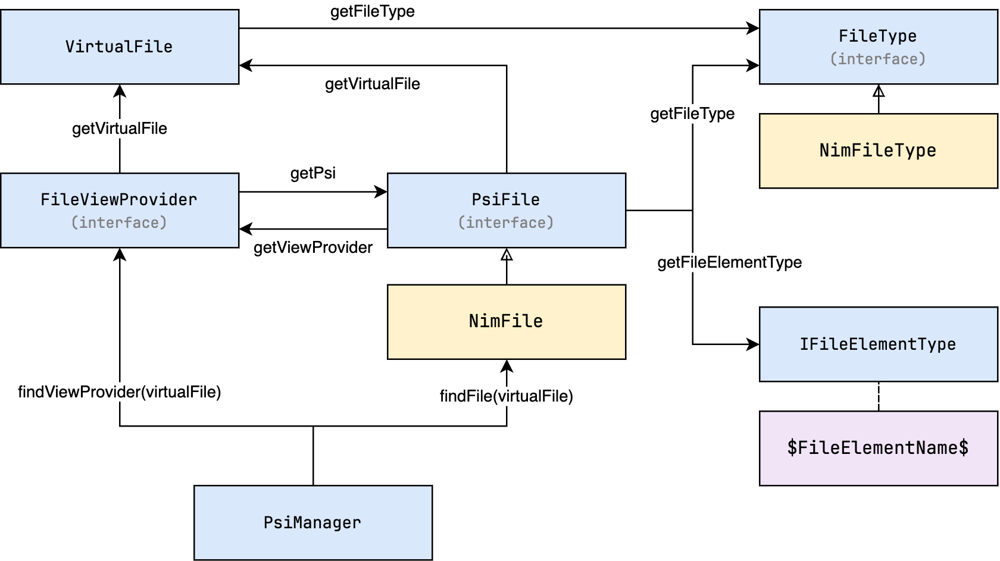

## FileViewProvider

There's one thing remaining to complete the picture: how does the IDE know which PSI tree
to use for a given file? This is where the `FileViewProvider` comes in, with its
`getPsi` method. It is a bridge between the PSI and the file system, and is responsible
for creating the PSI tree for a given file.

  

