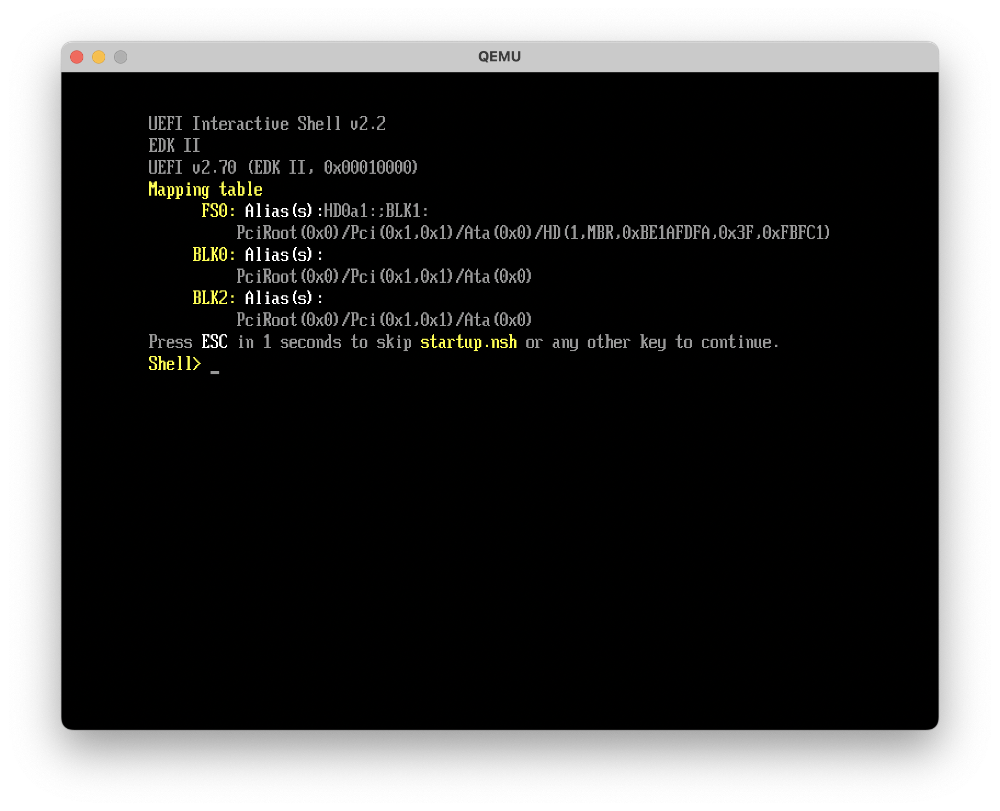

# UEFI Bootloader

Writing a UEFI bootloader is a complex task. In this section, we'll start by writing a simple UEFI entry point for the bootloader, which we'll build on later.

## Entry point

The UEFI spec defines an application's entry point as:

```c
// UEFI Specification v2.10, Section 4.11
// https://uefi.org/specs/UEFI/2.10/04_EFI_System_Table.html?highlight=efi_system_table#efi-image-entry-point

typedef uint64_t UINTN;
typedef UINTN EFI_STATUS;
typedef void *EFI_HANDLE;
typedef struct { ... } EFI_SYSTEM_TABLE;

typedef EFI_STATUS (*EFI_IMAGE_ENTRY_POINT)(
  IN EFI_HANDLE        ImageHandle,
  IN EFI_SYSTEM_TABLE  *SystemTable
);
```

where `ImageHandle` is a handle to the loaded image, and `SystemTable` is a pointer to the system table. We'll come back to them later. Based on this definition, we'll define our entry point in `src/bootx64.nim`:

```nim
# src/bootx64.nim

type
  EfiStatus = enum
    EfiSuccess = 0
  EfiHandle = pointer
  EFiSystemTable = object  # to be defined later

proc efiMain(imgHandle: EfiHandle, sysTable: ptr EFiSystemTable): EfiStatus {.exportc.} =
  return EfiSuccess
```

Let's compile this and see check the output:

```sh-session
$ nim c --out:build/bootx64.efi src/bootx64.nim
...

$ file build/bootx64.efi
build/bootx64.efi: ELF 64-bit LSB pie executable, x86-64, version 1 (SYSV), dynamically linked, interpreter /lib64/ld-linux-x86-64.so.2, BuildID[sha1]=fd551bd4216ec4e0413961b191d99f0e0775c4f1, for GNU/Linux 4.4.0, not stripped
```

The output binary is an **ELF 64-bit** executable that targets GNU/Linux, which is not what we want. We want a **PE32+** executable as defined by the UEFI spec.

## PE32+ executable

To do this, we'll need to tell the Nim compiler to use the **MinGW-w64** toolchain, and use the `any` target, which only requires a handful of ANSI C library functions (which we'll implement later).

Before we start adding a lot of flags to the Nim compiler, let's create a **nim.cfg** file in the project root to store our compiler flags:

```properties
# nim.cfg

--nimcache:build
--out:build/bootx64.efi
--cpu:amd64
--os:any
--gcc.exe:x86_64-w64-mingw32-gcc
--gcc.linkerexe:x86_64-w64-mingw32-ld
```

```sh-session
$ nim c src/bootx64.nim
...lib/std/typedthreads.nim(51, 10) Error: Threads not implemented for os:any. Please compile with --threads:off.
```

### No threads

Obviously threads are not supported in an environment with no OS support. Let's disable them in **nim.cfg**:

```properties
# nim.cfg

...
--threads:off
```

```sh-session
$ nim c src/bootx64.nim
...lib/system/osalloc.nim(218, 10) Error: Port memory manager to your platform
```

It looks like we need to implement a memory allocator.

### Memory allocator

Since we don't have an OS yet, we need a way to provide memory allocation primitives to the Nim compiler.  The Nim docs say:

> The `-d:useMalloc` option configures Nim to use only the standard C memory manage primitives `malloc()`, `free()`, `realloc()`. If your platform does not provide these functions it should be trivial to provide an implementation for them and link these to your program.

So eventually we'll need to implement these functions. But fortunately, Nim already has a primitive implementation of a bump pointer based heap allocator that we can take advantage of initially. We just need to tell the compiler to use it (here I'm setting the heap size to 1MB):

```properties
# nim.cfg

...
--d:StandaloneHeapSize=1048576
```

```sh-session
$ nim c src/bootx64.nim
...
26196 lines; 0.248s; 30.406MiB peakmem; proj: /home/khaled/src/fusion/src/bootx64.nim; out: /home/khaled/src/fusion/build/bootx64.efi [SuccessX]

$ file build/bootx64.efi
build/bootx64.efi: PE32+ executable (console) x86-64, for MS Windows, 20 sections
```

Great! Now we have a PE32+ executable.

### UEFI subsystem types

Not so fast. It says that the executable type is `console`. This is called the subsystem. The UEFI spec defines [three subsystem types](https://uefi.org/specs/UEFI/2.10/02_Overview.html?highlight=pe32#uefi-images) for EFI images:

```c
// PE32+ Subsystem type for EFI images
#define EFI_IMAGE_SUBSYSTEM_EFI_APPLICATION          10
#define EFI_IMAGE_SUBSYSTEM_EFI_BOOT_SERVICE_DRIVER  11
#define EFI_IMAGE_SUBSYSTEM_EFI_RUNTIME_DRIVER       12
```

In our case, we want to use the `EFI_IMAGE_SUBSYSTEM_EFI_APPLICATION` subsystem type since we're writing a bootloader. To do this, we'll need to tell the linker to use the `--subsystem,10` flag. 

```properties
# nim.cfg

...
--passL:"-Wl,--subsystem,10"
```

```sh-session
$ nim c src/bootx64.nim
...

$ file build/bootx64.efi
build/bootx64.efi: PE32+ executable (EFI application) x86-64, for MS Windows, 20 sections
```

Now we have a PE32+ executable with the correct subsystem type. Let's see how we can load it in QEMU.

## Loading the bootloader

The default BIOS for QEMU is a legacy BIOS. We need to use a UEFI BIOS instead. We can use OVMF (Open Virtual Machine Firmware), which is an open source UEFI firmware from TianoCore's EDK II project. We can install it on Arch Linux with:

```sh-session
$ sudo pacman -S edk2-ovmf
...
$ # The OVMF image is installed to /usr/share/edk2-ovmf/x64/OVMF_CODE.fd
```

For macOS, we can use a Homebrew package ([not official][1], but it will do):

```sh-session
$ brew tap uenob/qemu-hvf
$ brew install ovmf
...

$ # The OVMF image is installed to /opt/homebrew/opt/ovmf/share/OVMF/OvmfX64/OVMF_CODE.fd
```

The firmware expects to find a bootloader at a specific path in a FAT filesystem: `EFI\BOOT\BOOTX64.EFI`. We can create a disk image with such a filesystem, but QEMU has a nice trick up its sleeve that we can use to speed up our iteration. We can use the `-drive` flag to mount a directory as a virtual FAT filesystem. Let's create a directory structure to mount as a virtual disk and copy our bootloader to it:

```sh-session
$ mkdir -p build/efi/boot
$ cp build/bootx64.efi build/efi/boot/bootx64.efi
``` 

While we're at it, let's modify the output path in **nim.cfg** to match the expected path, so that we don't have to copy the file every time we build:

```properties
# nim.cfg
...
--out:build/efi/boot/bootx64.efi
```

Now we ask QEMU to use the `build` directory as a virtual FAT filesystem. Here, I'm also setting `-nic none` to disable the default network card (to prevent the firmware from trying to use PXE network boot):

```sh-session
$ qemu-system-x86_64 \
    -drive if=pflash,format=raw,readonly=on,file=/usr/share/edk2-ovmf/x64/OVMF_CODE.fd \
    -drive format=raw,file=fat:rw:build \
    -nic none
```

We're greeted with the TianoCore splash screen, and then we are dropped into the UEFI shell:



At this point we don't know if our bootloader has been loaded or not, since we return 0 (i.e. `EfiSuccess`) from the entry point without doing anything. The UEFI spec says that in the case 


[1]: https://gist.github.com/haharoit/a81fecd847003626ef9ef700e4901d15
