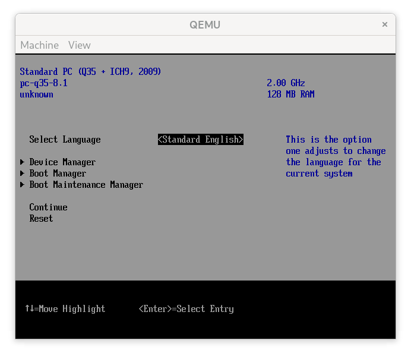
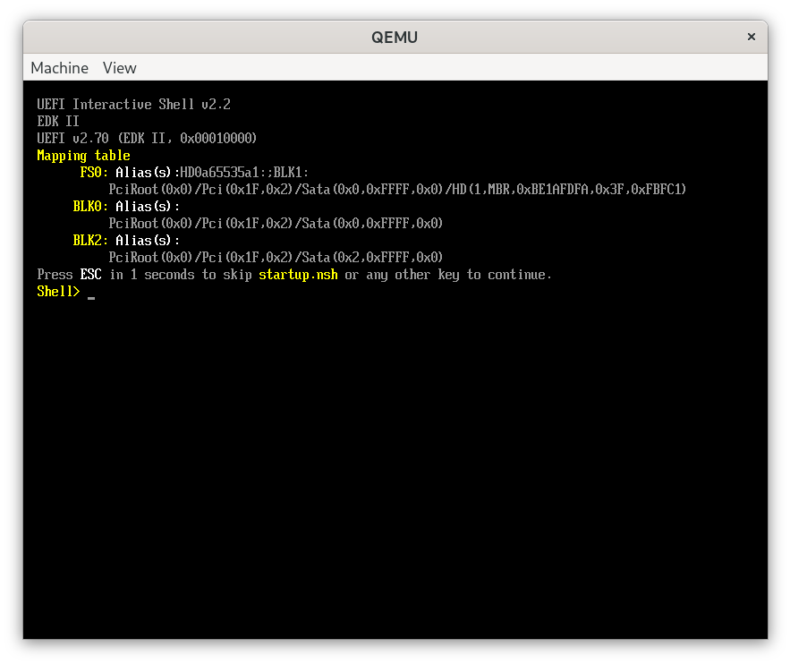
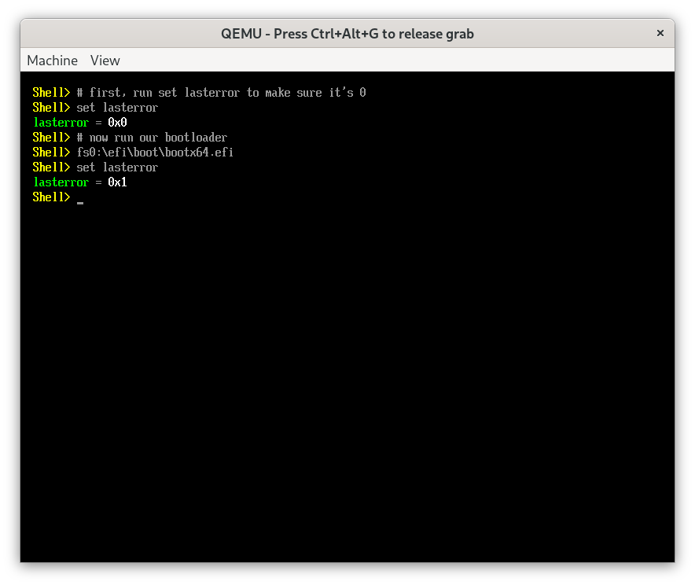

# UEFI Bootloader - Part 1

Now that we have a solid base to target a UEFI in a freestanding environment, we can start writing our bootloader. Writing a UEFI bootloader is a complex task. In this section, we'll start by writing a simple UEFI entry point for the bootloader, which we'll build on later.

## Entry point

The UEFI spec defines an application's entry point as:

```c
// UEFI Specification v2.10, Section 4.11
// https://uefi.org/specs/UEFI/2.10/04_EFI_System_Table.html?highlight=efi_system_table#efi-image-entry-point

typedef uint64_t UINTN;
typedef UINTN EFI_STATUS;
typedef void *EFI_HANDLE;
typedef struct { ... } EFI_SYSTEM_TABLE;

typedef EFI_STATUS (*EFI_IMAGE_ENTRY_POINT)(
  IN EFI_HANDLE        ImageHandle,
  IN EFI_SYSTEM_TABLE  *SystemTable
);
```

where `ImageHandle` is a handle to the loaded image, and `SystemTable` is a pointer to the system table. We'll come back to them later. Based on this definition, we'll define our entry point in `src/bootx64.nim`:

```nim
# src/bootx64.nim

import libc

type
  EfiStatus = uint
  EfiHandle = pointer
  EFiSystemTable = object  # to be defined later

const
  EfiSuccess = 0

proc NimMain() {.exportc.}

proc EfiMain(imgHandle: EfiHandle, sysTable: ptr EFiSystemTable): EfiStatus {.exportc.} =
  NimMain()
  return EfiSuccess
```

I'm also changing the entry point from `main` to `EfiMain`, which is a typical convention for UEFI applications. Let's change the entry point in the linker arguments in `nim.cfg`:

```properties
# nim.cfg

--out:"build/bootx64.efi"
...
--passL:"-Wl,-entry:EfiMain"
```

Let's compile the code, changing the output executable to `bootx64.efi`:

```sh-session
$ nim c --os:any src/bootx64.nim --out:build/bootx64.efi
...

$ file build/bootx64.efi
build/bootx64.efi: PE32+ executable (EFI application) x86-64, for MS Windows, 4 sections
```

Great! We have a minimal UEFI bootloader application. Let's see if we can load it in QEMU. But before we do that, we need to run QEMU with a UEFI firmware image, instead of the default legacy BIOS.

## OVMF UEFI Firmware

The default BIOS for QEMU is a legacy BIOS. We need to use a UEFI BIOS instead. We can use OVMF (Open Virtual Machine Firmware), which is an open source UEFI firmware from TianoCore's EDK II project. There are some prebuilt packages available for Linux and macOS. We can also build it from source, but we'll leave that for another time if we need to.

On Arch Linux:

```sh-session
$ sudo pacman -S edk2-ovmf
...
$ # The OVMF image is installed to /usr/share/edk2-ovmf/x64/OVMF_CODE.fd
```

For macOS, we can use a Homebrew package ([not official][1], but it will do):

```sh-session
$ brew tap uenob/qemu-hvf
$ brew install ovmf
...

$ # The OVMF image is installed to /opt/homebrew/opt/ovmf/share/OVMF/OvmfX64/OVMF_CODE.fd
```

There are two files we're interested in: `OVMF_CODE.fd` and `OVMF_VARS.fd`. The first one is the firmware image, and the second one is the NVRAM image that contains UEFI variables that persist across reboots, and it needs to be writable. Let's copy them to our project directory, mainly to avoid depending on the system's OVMF installation, and also to be able to write to the NVRAM image:

```sh-session
$ mkdir ovmf
$ cp /usr/share/edk2-ovmf/x64/OVMF_{CODE,VARS}.fd ovmf
$ chmod +w ovmf/OVMF_VARS.fd
```

## Loading the bootloader

The firmware expects to find a bootloader at a specific path in a FAT filesystem: `EFI\BOOT\BOOTX64.EFI`. We can create a disk image with such a filesystem, but QEMU has a nice trick up its sleeve that we can use to speed up our iteration. We can use the `-drive` flag to mount a directory as a virtual FAT filesystem. Let's create a directory structure to mount as a virtual disk and copy our bootloader to it:

```sh-session
$ mkdir -p diskimg/efi/boot
$ cat diskimg >> .gitignore
$ cp build/bootx64.efi diskimg/efi/boot/bootx64.efi
```

Now we ask QEMU to use the `diskimg` directory as a virtual FAT filesystem. A couple of notes on the QEMU arguments I used:
- I'm setting `-machine q35` to use the Q35 + ICH9 chipsets (circa 2009), instead of the default i440FX + PIIX chipsets (circa 1996). This gives us a more modern environment, with support for PCI Express, AHCI, and better UEFI, ACPI, and USB support.
- I'm setting `-nic none` to disable the default network card (to prevent the firmware from trying to use PXE network boot)

```sh-session
$ qemu-system-x86_64 \
    -drive if=pflash,format=raw,file=ovmf/OVMF_CODE.fd,readonly=on \
    -drive if=pflash,format=raw,file=ovmf/OVMF_VARS.fd \
    -drive format=raw,file=fat:rw:diskimg \
    -machine q35 \
    -net none
```

We're greeted with the TianoCore splash screen, and then we are dropped into the UEFI boot menu:



The spec says that upon boot, the firmware should try the available boot options (e.g. DVD-ROM, HDD, etc.) stored in _Boot####_ variables, in an order also stored in a variable called _BootOrder_. In the case of OVMF, the default boot order is DVD-ROM, HDD, and then the UEFI shell. If a boot option returns `EFI_SUCCESS`, the firmware is expected to present a boot manager menu to the user. This is exactly what we're seeing here, since our bootloader returns `EFI_SUCCESS` from the entry point.

On the other hand, if the bootloader returns any other value, the firmware is expected to try the next boot option, which in the case of OVMF is the UEFI shell. Let's change the return value of our bootloader to `EFI_LOAD_ERROR` (numeric value `1`) to see what happens:

```nim
# src/bootx64.nim

...
const
  EfiSuccess = 0
  EfiLoadError = 1

proc NimMain() {.exportc.}

proc EfiMain(imgHandle: EfiHandle, sysTable: ptr EFiSystemTable): EfiStatus {.exportc.} =
  NimMain()
  return EfiLoadError
```

If we compile and run the bootloader again, we're greeted with the UEFI shell, as expected (since it's the next boot option):



Let's use the UEFI shell to run our bootloader manually and check its exit code using the `set lasterror` command, to make sure that it's working as expected. The UEFI shell has a `map` command that lists the available filesystems. By default, the shell already runs this command on startup, so we can see that the virtual FAT filesystem is mounted as `fs0`. We can use the `fs0:` prefix to run our bootloader:



As expected, the bootloader returns `1` as its exit code. Great! Now we have a working bootloader (if you can call it that). In the next section, we'll implement text output using the UEFI console so that we can print messages to the screen. But before we do that, let's add a build tool to our project so that we don't have to repeat the same commands over and over again.

## Build tool

Typically we'd use `make` to build our project, but I'm not a big fan of `make`. I recently started using the [`Just`](https://github.com/casey/just) build tool, which is a simple command runner that uses a `justfile` to define commands. Assuming it's already installed, let's create a `justfile` in the project root directory:

```justfile
# justfile

bootloader:
  nim c --os:any src/bootx64.nim --out:build/bootx64.efi

run: bootloader
  qemu-system-x86_64 \
    -drive if=pflash,format=raw,file=ovmf/OVMF_CODE.fd,readonly=on \
    -drive if=pflash,format=raw,file=ovmf/OVMF_VARS.fd \
    -drive format=raw,file=fat:rw:diskimg \
    -machine q35 \
    -net none
```

Now we can build and run our bootloader using `just`:

```sh-session
$ just run
nim ...
qemu-system-x86_64 ...
```

Much better!

[1]: https://gist.github.com/haharoit/a81fecd847003626ef9ef700e4901d15
