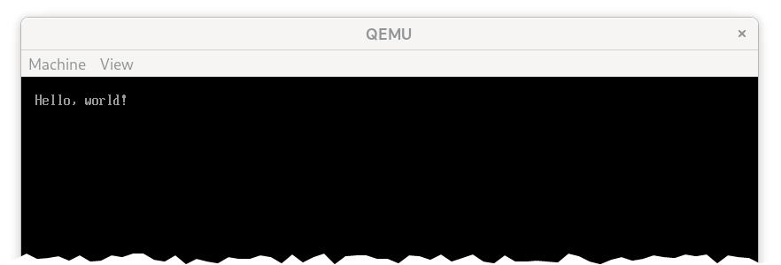
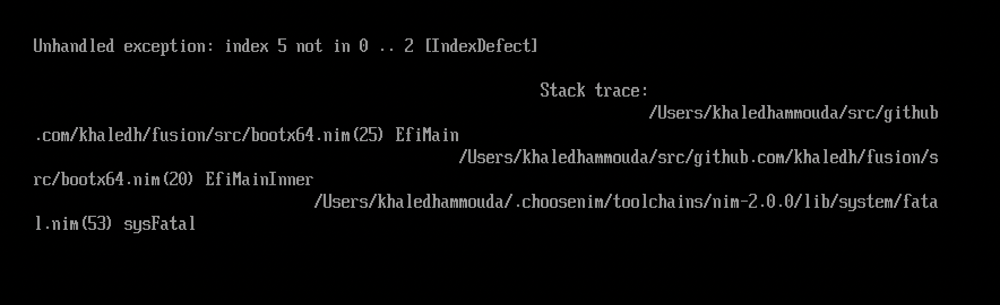
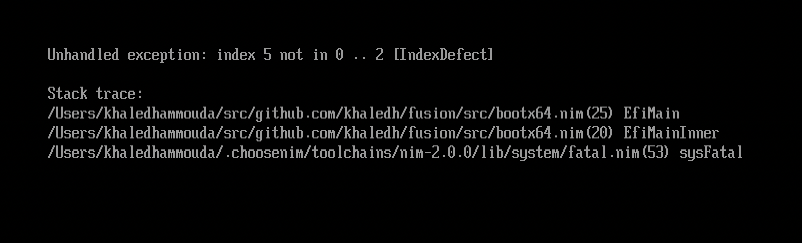

# UEFI Bootloader (Part 2)

In the previous section, we wrote a simple UEFI entry point for the bootloader. In this section, we'll use the UEFI API provided to us through the UEFI system table to print a simple message to the screen.

## UEFI System Table

The UEFI system table is a data structure that is passed to the bootloader by the UEFI firmware. It contains pointers to various UEFI services, such as the console, file system, and memory management. We'll start by defining the system table in `src/bootx64.nim`:

```nim{8-40}
# src/bootx64.nim

type
  EfiStatus = uint

  EfiHandle = pointer

  EfiTableHeader = object
    signature: uint64
    revision: uint32
    headerSize: uint32
    crc32: uint32
    reserved: uint32

  EfiSystemTable = object
    header: EfiTableHeader
    firmwareVendor: WideCString
    firmwareRevision: uint32
    consoleInHandle: EfiHandle
    conIn: pointer
    consoleOutHandle: EfiHandle
    conOut: ptr SimpleTextOutputProtocol
    standardErrorHandle: EfiHandle
    stdErr: SimpleTextOutputProtocol
    runtimeServices: pointer
    bootServices: pointer
    numTableEntries: uint
    configTable: pointer
  
  SimpleTextOutputProtocol = object
    reset: pointer
    outputString: proc (this: ptr SimpleTextOutputProtocol, str: WideCString): EfiStatus {.cdecl.}
    testString: pointer
    queryMode: pointer
    setMode: pointer
    setAttribute: pointer
    clearScreen: proc (this: ptr SimpleTextOutputProtocol): EfiStatus {.cdecl.}
    setCursorPos: pointer
    enableCursor: pointer
    mode: ptr pointer

const
  EfiSuccess = 0
  EfiLoadError = 1
```

We're particularly interested in the `conOut` field, which is a pointer to the console output interface `SimpleTextOutputProtocol`. We'll use this to clear the screen (using the `clearScreen` function) and print to the screen (using the `outputString` function).

## Printing to the screen

Let's start by clearing the screen. To avoid returning to the UEFI shell, we'll call the `quit` function, which eventually calls the `exit` function we implemented earlier, which halts the CPU.

```nim{6}
# src/bootx64.nim
...

proc EfiMain(imgHandle: EfiHandle, sysTable: ptr EFiSystemTable): EfiStatus {.exportc.} =
  NimMain()
  discard sysTable.conOut.clearScreen(sysTable.conOut)
  quit()
```

When we compile and load this in QEMU, we see a blank screen, as expected.

Next, let's print a simple message to the screen. We'll use the `outputString` function, which takes a pointer to a null-terminated UTF-16 string. Nim supports UTF-16 strings through the `Utf16Char` and `WideCString` types. Before we start using `WideCString`, I want to highlight a difference in how Nim declares this type in the presence of a `nimv2` flag. Without this flag, Nim defines `WideCString` as a `ref UnchekcedArray[Utf16Char]`. With the `nimv2` flag, Nim defines `WideCString` as a `ptr UncheckedArray[Utf16Char]`.

```nim
# nim-2.0.0/lib/std/widestrs.nim

when defined(nimv2):
  type
    WideCString* = ptr UncheckedArray[Utf16Char]
    WideCStringObj* = object
      bytes: int
      data: WideCString
 ...
    converter toWideCString*(x: WideCStringObj): WideCString {.inline.} =
      result = x.data

else:
  ...
  type
    WideCString* = ref UncheckedArray[Utf16Char]
    WideCStringObj* = WideCString
```

Since we're going to pass a pointr to a null-terminated UTF-16 string to `outputString`, we need to use the `ptr` version of `WideCString`. So let's add the `nimv2` flag to our `nim.cfg`:

```properties
# nim.cfg

-d:nimv2
```

We create a wide string using `newWideCString` (which returns a `WideCStringObj`), use the `toWideCString` converter to get access to the underlying data buffer, and then pass it to `outputString`.

```nim{6-9}
# src/bootx64.nim

proc EfiMain(imgHandle: EfiHandle, sysTable: ptr EFiSystemTable): EfiStatus {.exportc.} =
  NimMain()

  let msg = newWideCString("Hello, world!\n").toWideCString

  discard sysTable.conOut.clearScreen(sysTable.conOut)
  discard sysTable.conOut.outputString(sysTable.conOut, msg)

  quit()
```

When we compile and load this in QEMU, we see the message printed to the screen, as expected.



Let's make it easier to create a wide string by adding a `W` prefix operator to `string`:

```nim
# src/uefi.nim

proc W*(str: string): WideCString =
  newWideCString(str).toWideCString
```

Now we can create a wide string using `W`:

```nim{7}
# src/bootx64.nim

proc EfiMain(imgHandle: EfiHandle, sysTable: ptr EFiSystemTable): EfiStatus {.exportc.} =
  NimMain()

  discard sysTable.conOut.clearScreen(sysTable.conOut)
  discard sysTable.conOut.outputString(sysTable.conOut, W"Hello, world!\n")

  quit()
```

## Using `echo`

Preparing a UTF-16 string and calling `outputString` every time we want to print to the screen is tedious. Ideally we should be able to use the built-in `echo` procedure to print to the screen. This requires us to define a `stdout` file descriptor, and implement `fwrite` to use the UEFI `outputString` function. But instead of making the `libc` module deal with UEFI internals, we'll create a new module called `uefi` to handle this. We'll also move all the UEFI types and constants to this module. In the process, we'll mark all types, constants, and vars as public so that they can be used by other modules.

```nim{7-20}
# src/uefi.nim

type
  EfiStatus* = uint
  ...

var
  sysTable*: ptr EfiSystemTable

proc consoleClear*() =
  assert not sysTable.isNil
  discard sysTable.conOut.clearScreen(sysTable.conOut)

proc consoleOut*(str: string) =
  assert not sysTable.isNil
  discard sysTable.conOut.outputString(sysTable.conOut, W(str))

proc consoleError*(str: string) =
  assert not sysTable.isNil
  discard sysTable.stdErr.outputString(sysTable.stdErr, W(str))
```

We'll initalize the `sysTable` variable in `src/bootx64.nim` later. Let's implement `fwrite` to use the `consoleOut` procedure we just defined. Notice that we don't use the `stream` argument to differentiate between `stdout` and `stderr` here (since they're both `nil` for now). We'll leave that for later.

```nim{6-7}
# src/libc.nim

import uefi

proc fwrite*(buf: const_pointer, size: csize_t, count: csize_t, stream: File): csize_t {.exportc.} =
  let output = $cast[cstring](buf)
  consoleOut(output)
  return count
```

Now let's update `src/bootx64.nim` to initialize the `sysTable` variable and call `echo` to print to the screen.

```nim{8,10-11}
# src/bootx64.nim

import uefi
...

proc EfiMain(imgHandle: EfiHandle, sysTable: ptr EFiSystemTable): EfiStatus {.exportc.} =
  NimMain()
  uefi.sysTable = sysTable

  consoleClear()
  echo "Hello, world!"

  quit()
```

When we compile and load this in QEMU, we still see the message printed to the screen, as expected.

## Handling exceptions

Right now, if an exception is raied we won't see any output on the screen. In fact, the bootloader will return the default value 0, which will cause the firmware boot manager to load next.

In a normal application, Nim generates a `main` entry point which executes our top-level code, and then checks for exceptions, and if one was raised it prints the exception message to `stderr`. There's an `unhandledExceptionHook` we can use to set to a custom handler, but the issue is that it's only called when Nim is in charge of generating the `main` entry point. Since we're using `--noMain:on` and provoiding a custom `EfiMain` entry point, we need to handle exceptions ourselves.

We'll do this by wrapping the code in `EfiMain` in a `try` block, and printing the exception message (and the stack trace, if one exists) to the screen if one was raised. To avoid cluttering the `try` block with a lot of code, we'll move that code to a new `EfiMainInner` procedure.

```nim{3-17,22-25}
# src/bootx64.nim

proc unhandledException*(e: ref Exception) =
  echo "Unhandled exception: " & e.msg & " [" & $e.name & "]"
  if e.trace.len > 0:
    echo "Stack trace:"
    echo getStackTrace(e)
  quit()

proc EfiMainInner(imgHandle: EfiHandle, sysTable: ptr EFiSystemTable): EfiStatus =
  uefi.sysTable = sysTable
  consoleClear()

  # force an IndexDefect exception
  let a = [1, 2, 3]
  let n = 5
  discard a[n]

proc EfiMain(imgHandle: EfiHandle, sysTable: ptr EFiSystemTable): EfiStatus {.exportc.} =
  NimMain()

  try:
    return EfiMainInner(imgHandle, sysTable)
  except Exception as e:
    unhandledException(e)
```

When we compile and load this in QEMU, we see the exception message and stack trace printed to the screen, but it looks like the newlines are not being printed correctly.



The problem is that Nim uses LF as the newline character, but UEFI expects CRLF. We can fix this by modifying the `fwrite` procedure to split the string into lines, and print a CR after each line.

```nim{7-9}
# src/libc.nim

import std/strutils

proc fwrite(buf: const_pointer, size: csize_t, count: csize_t, stream: File): csize_t {.exportc.} =
  let output = $cast[cstring](buf)
  for line in output.splitLines(keepEOL = true):
    consoleOut(line)
    consoleOut("\r")
  return count
```



Much better! We just have to keep in mind that stack traces are available only in debug builds (which is the default). If we compile in release mode, we won't see the stack trace. But this is great! We now have a way to print to the screen and catch and display unhandled exceptions (so we're not flying blind).

The next logical step is to load our kernel from disk, but we don't have a kernel yet. So we'll take a short break from the bootloader and start working on the kernel in the next section.
