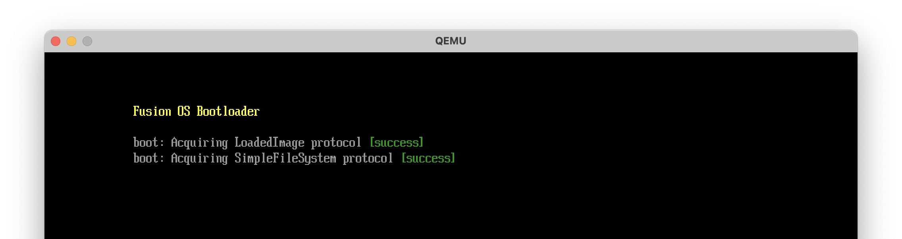
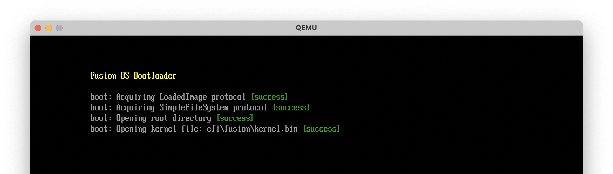

# UEFI Bootloader - Part 3

In the last section we built a raw binary kernel image. We'll pick up where we left off in the bootloader and load the kernel image into memory. We'll rely on UEFI Boot Services to do so.

## UEFI Boot Services

UEFI Boot Services provides a number of services to help us, including accessing the file system, getting information about a file, allocating memory, and reading a file into memory. Here's the plan:

- Use the bootloader image `EfiHandle` (which is passed to the entry point) to get its `EfiLoadedImageProtocol`.
- Use the `EfiLoadedImageProtocol` device handle to get the `EfiSimpleFileSystemProtocol` of that device.
- Use the `EfiSimpleFileSystemProtocol` to get the `EfiFileSystemInfo` represnting the root directory of the file system.
- Use the `EfiSimpleFileSystemProtocol` and the kernel image path on the file system to get the `EfiFileProtocol` of the kernel file.
- Use the `EfiFileProtocol` to get the `EfiFileInfo` of the kernel file, which contains the size of the file.
- Use the Boot Services `AllocatePages` function to allocate enough pages, starting at address `0x100000` (1 MiB), to hold the kernel image.
- Use the `EfiFileProtocol` function to read the kernel image into memory.

After reading the kernel into memory, and before jumping to it, we'll need to call the Boot Services `ExitBootServices` function to signal to the UEFI firmware that we're done with the Boot Services. To do so, we're required to also call the `GetMemoryMap` function to get the memory map, which contains a key that we'll pass to `ExitBootServices`. We'll also eventually pass this memory map to the kernel. So in addition to the plan above, we'll also:

- Use the Boot Services `GetMemoryMap` function to get the memory map.
- Use the Boot Services `ExitBootServices` function, passing it the memory map key.
- Jump to the kernel image starting address.

This is a lot to take in, but it's how the UEFI spec was designed ¯\\_(ツ)_/¯. We'll take it one step at a time.

## Boot device handle

Since we plan on storing the kernel image on the same device as the bootloader, we want to access the file system of the device from which the bootloader was loaded. The `EfiLoadedImageProtocol` (which we can get through the bootloader image handle) has a `DeviceHandle` field that we can use to get the `EfiSimpleFileSystemProtocol` of that device. So let's define the `EfiLoadedImageProtocol` in `src/common/uefi.nim`.

```nim{10}
# src/common/uefi.nim

type
  ...
  EfiLoadedImageProtocol* = object
    revision*: uint32
    parentHandle*: EfiHandle
    systemTable*: ptr EfiSystemTable
    # Source location of the image
    deviceHandle*: EfiHandle
    filePath*: pointer
    reserved*: pointer
    # Image's load options
    loadOptionsSize*: uint32
    loadOptions*: pointer
    # Location where image was loaded
    imageBase*: pointer
    imageSize*: uint64
    imageCodeType*: EfiMemoryType
    imageDataType*: EfiMemoryType
    unload*: pointer

  EfiMemoryType* = enum
    EfiReservedMemoryType,
    EfiLoaderCode,
    EfiLoaderData,
    EfiBootServicesCode,
    EfiBootServicesData,
    EfiRuntimeServicesCode,
    EfiRuntimeServicesData,
    EfiConventionalMemory,
    EfiUnusableMemory,
    EfiACPIReclaimMemory,
    EfiACPIMemoryNVS,
    EfiMemoryMappedIO,
    EfiMemoryMappedIOPortSpace,
    EfiPalCode,
    EfiPersistentMemory,
    EfiUnacceptedMemoryType,
    EfiMaxMemoryType,
```

To get the `EfiLoadedImageProtocol` from the bootloader image handle, we'll use the `handleProtocol` function of the Boot Services. So let's define the `BootServices` type and the `handleProtocol` function in `src/common/uefi.nim`. It's a large type with many functions, so I won't define the type of every field; we'll use `pointer` for those fields until we need to use them.

```nim
# src/common/uefi.nim

type
  EfiBootServices* = object
    hdr*: EfiTableHeader
    # task priority services
    raiseTpl*: pointer
    restoreTpl*: pointer
    # memory services
    allocatePages*: pointer
    freePages*: pointer
    getMemoryMap*: pointer
    allocatePool*: pointer
    freePool*: pointer
    # event & timer services
    createEvent*: pointer
    setTimer*: pointer
    waitForEvent*: pointer
    signalEvent*: pointer
    closeEvent*: pointer
    checkEvent*: pointer
    # protocol handler services
    installProtocolInterface*: pointer
    reinstallProtocolInterface*: pointer
    uninstallProtocolInterface*: pointer
    handleProtocol*: proc (handle: EfiHandle, protocol: EfiGuid, `interface`: ptr pointer): EfiStatus {.cdecl.}
    reserved*: pointer
    registerProtocolNotify*: pointer
    locateHandle*: pointer
    locateDevicePath*: pointer
    installConfigurationTable*: pointer
    # image services
    loadImage*: pointer
    startImage*: pointer
    exit*: pointer
    unloadImage*: pointer
    exitBootServices*: pointer
    # misc services
    getNextMonotonicCount*: pointer
    stall*: pointer
    setWatchdogTimer*: pointer
    # driver support services
    connectController*: pointer
    disconnectController*: pointer
    # open and close protocol services
    openProtocol*: pointer
    closeProtocol*: pointer
    openProtocolInformation*: pointer
    # library services
    protocolsPerHandle*: pointer
    locateHandleBuffer*: pointer
    locateProtocol*: pointer
    installMultipleProtocolInterfaces*: pointer
    uninstallMultipleProtocolInterfaces*: pointer
    # 32-bit CRC services
    calculateCrc32*: pointer
    # misc services
    copyMem*: pointer
    setMem*: pointer
    createEventEx*: pointer
```

One of the parameters of the `handleProtocol` function is of type `EfiGuid`. Let's define it as well.

```nim
type
  EfiGuid* = object
    data1: uint32
    data2: uint16
    data3: uint16
    data4: array[8, uint8]
```

We're interested in the `EfiLoadedImageProtocol`, so we need to define its GUID.

```nim
const
  EfiLoadedImageProtocolGuid* = EfiGuid(
    data1: 0x5B1B31A1, data2: 0x9562, data3: 0x11d2,
    data4: [0x8e, 0x3f, 0x00, 0xa0, 0xc9, 0x69, 0x72, 0x3b]
  )
```

Now we're ready to call the `handleProtocol` function to get the `EfiLoadedImageProtocol` from the bootloader image handle.

```nim{3,6-11,,13-23}
# src/boot/bootx64.nim

import common/uefi
...

proc checkStatus*(status: EfiStatus) =
  if status != EfiSuccess:
    consoleOut &" [failed, status = {status:#x}]"
    quit()
  consoleOut " [success]\r\n"

proc EfiMainInner(imgHandle: EfiHandle, sysTable: ptr EFiSystemTable): EfiStatus =
  echo "Fusion OS Bootloader"

  var status: EfiStatus

  # get the LoadedImage protocol from the image handle
  var loadedImage: ptr EfiLoadedImageProtocol

  consoleOut "boot: Acquiring LoadedImage protocol"
  checkStatus uefi.sysTable.bootServices.handleProtocol(
    imgHandle, EfiLoadedImageProtocolGuid, cast[ptr pointer](addr loadedImage)
  )
...
```

Let's compile and run everything using `just run`. We should see the following output (The colored output is for nice visuals only. I didn't show it in the code above; I'm leaving it as an exercise for the reader):


## File system

Now that we have the `EfiLoadedImageProtocol` device handle, we can get the `EfiSimpleFileSystemProtocol` of that device. Let's define the `EfiSimpleFileSystemProtocol` type and the corresponding GUID in `src/common/uefi.nim`.

```nim
# src/common/uefi.nim

type
  EfiSimpleFileSystemProtocol* = object
    revision*: uint64
    openVolume*: pointer

const
  EfiSimpleFileSystemProtocolGuid* = EfiGuid(
    data1: 0x964e5b22'u32, data2: 0x6459, data3: 0x11d2,
    data4: [0x8e, 0x39, 0x00, 0xa0, 0xc9, 0x69, 0x72, 0x3b]
  )
```

Now we're ready to get the `EfiSimpleFileSystemProtocol` from the `EfiLoadedImageProtocol` device handle.

```nim{4-10}
proc EfiMainInner(imgHandle: EfiHandle, sysTable: ptr EFiSystemTable): EfiStatus =
  ...

  # get the FileSystem protocol from the device handle
  var fileSystem: ptr EfiSimpleFileSystemProtocol

  consoleOut "boot: Acquiring SimpleFileSystem protocol"
  checkStatus uefi.sysTable.bootServices.handleProtocol(
    loadedImage.deviceHandle, EfiSimpleFileSystemProtocolGuid, cast[ptr pointer](addr fileSystem)
  )
```

If we compile and run we should see the following output:



## Root directory

Next, we need to get the `EfiFileInfo` representing the root directory of the file system. Let's define the `EfiFileInfo` type (we also need to define the `EfiTime` type, which is used in `EfiFileInfo`) .

```nim
# src/common/uefi.nim

type
  EfiFileInfo* = object
    size*: uint64
    fileSize*: uint64
    physicalSize*: uint64
    createTime*: EfiTime
    lastAccessTime*: EfiTime
    modificationTime*: EfiTime
    attribute*: uint64
    fileName*: array[256, Utf16Char]

  EfiTime* = object
    year*: uint16
    month*: uint8
    day*: uint8
    hour*: uint8
    minute*: uint8
    second*: uint8
    pad1*: uint8
    nanosecond*: uint32
    timeZone*: int16
    daylight*: uint8
    pad2*: uint8
```

The `fileName` field in the UEFI spec is a C [flexible array member](https://en.wikipedia.org/wiki/Flexible_array_member), which is not supported in Nim. So I'm using a fixed size array here.

Let's use the `openVolume` function of the `EfiSimpleFileSystemProtocol` to get the `EfiFileInfo` of the root directory. First, we need to update the signature of `openVolume`, which also requires defining the `EfiFileProtocol` type.

```nim{6-24}
# src/common/uefi.nim

type
  EfiSimpleFileSystemProtocol* = object
    revision*: uint64
    openVolume*: proc (this: ptr EfiSimpleFileSystemProtocol, root: ptr ptr EfiFileProtocol):
      EfiStatus {.cdecl.}

  EfiFileProtocol* = object
    revision*: uint64
    open*: pointer
    close*: pointer
    delete*: pointer
    read*: pointer
    write*: pointer
    getPosition*: pointer
    setPosition*: pointer
    getInfo*: pointer
    setInfo*: pointer
    flush*: pointer
    openEx*: pointer
    readEx*: pointer
    writeEx*: pointer
    flushEx*: pointer
```

Now we're ready to get the `EfiFileInfo` of the root directory.

```nim{6-10}
# src/boot/bootx64.nim

proc EfiMainInner(imgHandle: EfiHandle, sysTable: ptr EFiSystemTable): EfiStatus =
  ...

  # open the root directory
  var rootDir: ptr EfiFileProtocol

  consoleOut "boot: Opening root directory"
  checkStatus fileSystem.openVolume(fileSystem, addr rootDir)
```

This should also compile and run successfully.

## Kernel image file

We have the `EfiFileProtocol` of the root directory, so we can use it to get the `EfiFileProtocol` of the kernel image file, given its path. To open the kernel file, we'll need to define the `open` function of the `EfiFileProtocol`.

```nim{6-12}
# src/common/uefi.nim

type
  EfiFileProtocol* = object
    revision*: uint64
    open*: proc (
        this: ptr EfiFileProtocol,
        newHandle: ptr ptr EfiFileProtocol,
        fileName: WideCString,
        openMode: uint64,
        attributes: uint64
      ): EfiStatus {.cdecl.}
  ...
```

Now we're ready to open the kernel file.

```nim{6-12}
# src/boot/bootx64.nim

proc EfiMainInner(imgHandle: EfiHandle, sysTable: ptr EFiSystemTable): EfiStatus =
  ...

  # open the kernel file
  var kernelFile: ptr EfiFileProtocol
  let kernelPath = W"efi\fusion\kernel.bin"

  consoleOut "boot: Opening kernel file: "
  consoleOut kernelPath
  checkStatus rootDir.open(rootDir, addr kernelFile, kernelPath, 1, 1)
```

This should also compile and run successfully.



Let's now get the size of the kernel file. To do so, we'll need to define the `getInfo` function of the `EfiFileProtocol`. We'll also need to define `EfiFileInfoGuid`.

```nim{6-11,15-18}
# src/common/uefi.nim

type
  EfiFileProtocol* = object
    ...
    getInfo*: proc (
        this: ptr EfiFileProtocol,
        infoType: ptr EfiGuid,
        infoSize: ptr uint,
        info: pointer
      ): EfiStatus {.cdecl.}
  ...

const
  EfiFileInfoGuid* = EfiGuid(
    data1: 0x09576e92'u32, data2: 0x6d3f, data3: 0x11d2,
    data4: [0x8e, 0x39, 0x00, 0xa0, 0xc9, 0x69, 0x72, 0x3b]
  )
```

Let's call the `getInfo` function on the kernel file.

```nim{6-12}
# src/boot/bootx64.nim

proc EfiMainInner(imgHandle: EfiHandle, sysTable: ptr EFiSystemTable): EfiStatus =
  ...

  # get kernel file size
  var kernelInfo: EfiFileInfo
  var kernelInfoSize = sizeof(EfiFileInfo).uint

  consoleOut "boot: Getting kernel file info"
  checkStatus kernelFile.getInfo(kernelFile, addr EfiFileInfoGuid, addr kernelInfoSize, addr kernelInfo)
  echo &"boot: Kernel file size: {kernelInfo.fileSize} bytes"
```

If all goes well, we should see the kernel file size in the output:


## Allocate memory

As mentioned earlier, we'll use the Boot Services `AllocatePages` function to allocate enough pages, starting at address `0x100000` (1 MiB), to hold the kernel image. Let's define the `AllocatePages` function, which also requires defining the `EfiAllocateType` and `EfiPhysicalAddress` types.

```nim{6-11,14-20}
# src/common/uefi.nim

type
  EfiBootServices* = object
    ...
    allocatePages*: proc (
        allocateType: EfiAllocateType,
        memoryType: EfiMemoryType,
        pages: uint,
        memory: ptr EfiPhysicalAddress
      ): EfiStatus {.cdecl.}
    ...

  EfiAllocateType* = enum
    AllocateAnyPages,
    AllocateMaxAddress,
    AllocateAddress,
    MaxAllocateType

  EfiPhysicalAddress* = uint64
```

The `EfiAllocateType` enum is used to specify the type of allocation. We'll use `AllocateAddress` to allocate pages starting at a specific address (in our case, `0x100000`). The `EfiMemoryType` enum is used to specify the type of memory to allocate, which we'll set to `EfiLoaderCode`.

```nim{6-16}
# src/boot/bootx64.nim

proc EfiMainInner(imgHandle: EfiHandle, sysTable: ptr EFiSystemTable): EfiStatus =
  ...

  # allocate memory for the kernel
  var kernelPages = (kernelInfo.fileSize + 0xFFF).uint div 0x1000.uint # round up to nearest page
  var kernelAddr = cast[pointer](0x100000)

  consoleOut &"boot: Allocating memory for kernel at {cast[uint64](kernelAddr):#x}"
  checkStatus uefi.sysTable.bootServices.allocatePages(
    AllocateAddress,
    EfiLoaderCode,
    kernelPages,
    cast[ptr EfiPhysicalAddress](addr kernelAddr)
  )
```

## Read kernel image

The next step is to use the `read` function of the `EfiFileProtocol` to read the kernel image into memory. Let's define the `read` function.

```nim{6-12}
# src/common/uefi.nim

type
  EfiFileProtocol* = object
    ...
    read*: proc (
        this: ptr EfiFileProtocol,
        bufferSize: ptr uint,
        buffer: pointer
      ): EfiStatus {.cdecl.}
  ...
```

We'll use the `read` function to read the kernel image into the memory we allocated earlier.

```nim{6-12}
# src/boot/bootx64.nim

proc EfiMainInner(imgHandle: EfiHandle, sysTable: ptr EFiSystemTable): EfiStatus =
  ...

  # read the kernel into memory
  consoleOut "boot: Reading kernel into memory"
  checkStatus kernelFile.read(kernelFile, cast[ptr uint](addr kernelInfo.fileSize), kernelAddr)
```

## Close open files

We're done with the kernel file and the root directory, so we can close them. It's not strictly needed, but I got in the habbit of closing resources when I'm done with them. Let's define the `close` function of the `EfiFileProtocol`.

```nim{6}
# src/common/uefi.nim

type
  EfiFileProtocol* = object
    ...
    close*: proc (this: ptr EfiFileProtocol): EfiStatus {.cdecl.}
    ...
```

```nim{6-12}
# src/boot/bootx64.nim

proc EfiMainInner(imgHandle: EfiHandle, sysTable: ptr EFiSystemTable): EfiStatus =
  ...

  # close the kernel file
  consoleOut "boot: Closing kernel file"
  checkStatus kernelFile.close(kernelFile)

  # close the root directory
  consoleOut "boot: Closing root directory"
  checkStatus rootDir.close(rootDir)
```


## Get memory map

In order to get the memory map, we have to allocate memory for the map itself. But how do we know how much memory to allocate? Calling `getMemoryMap` with a buffer size of `0` will return the required buffer size in the `memoryMapSize` output parameter. We can then allocate the required memory and call `getMemoryMap` again to get the actual memory map.

Let's define the `getMemoryMap` function first (and the associated `EfiMemoryDescriptor` and `EfiVirtualAddress` types). We'll also define the `allocatePool` function of the `EfiBootServices` type, which we'll use to allocate the memory for the memory map. (The difference between `allocatePages` and `allocatePool` is that `allocatePages` allocates memory in page-sized chunks, whereas `allocatePool` allocates memory in byte-sized chunks. `allocatePool` also provides more control over the address of the allocated memory, which is why we used it to allocate memory for the kernel.)

```nim{6-17,20-25,29}
# src/common/uefi.nim

type
  EfiBootServices* = object
    ...
    getMemoryMap*: proc (
        memoryMapSize: ptr uint,
        memoryMap: ptr EfiMemoryDescriptor,
        mapKey: ptr uint,
        descriptorSize: ptr uint,
        descriptorVersion: ptr uint32
      ): EfiStatus {.cdecl.}
    allocatePool*: proc (
        poolType: EfiMemoryType,
        size: uint,
        buffer: ptr pointer
      ): EfiStatus {.cdecl.}
    ...

  EfiMemoryDescriptor* = object
    `type`*: EfiMemoryType
    physicalStart*: EfiPhysicalAddress
    virtualStart*: EfiVirtualAddress
    numberOfPages*: uint64
    attribute*: uint64
  ...

  EfiPhysicalAddress* = uint64
  EfiVirtualAddress* = uint64
```

Now we're ready to get the memory map.

```nim{6-39}
# src/boot/bootx64.nim

proc EfiMainInner(imgHandle: EfiHandle, sysTable: ptr EFiSystemTable): EfiStatus =
  ...

  # memory map
  var memoryMapSize = 0.uint
  var memoryMap: ptr UncheckedArray[EfiMemoryDescriptor]
  var memoryMapKey: uint
  var memoryMapDescriptorSize: uint
  var memoryMapDescriptorVersion: uint32

  # get memory map size
  status = uefi.sysTable.bootServices.getMemoryMap(
    addr memoryMapSize,
    cast[ptr EfiMemoryDescriptor](nil),
    cast[ptr uint](nil),
    cast[ptr uint](addr memoryMapDescriptorSize),
    cast[ptr uint32](nil)
  )
  # increase memory map size to account for the next call to allocatePool
  inc memoryMapSize, memoryMapDescriptorSize

  # allocate pool for memory map (this changes the memory map size, hence the previous step)
  consoleOut "boot: Allocating pool for memory map"
  checkStatus uefi.sysTable.bootServices.allocatePool(
    EfiLoaderData, memoryMapSize, cast[ptr pointer](addr memoryMap)
  )

  # now get the memory map
  consoleOut "boot: Getting memory map"
  checkStatus uefi.sysTable.bootServices.getMemoryMap(
    addr memoryMapSize,
    cast[ptr EfiMemoryDescriptor](memoryMap),
    addr memoryMapKey,
    addr memoryMapDescriptorSize,
    addr memoryMapDescriptorVersion
  )
```


## Exit boot services

We have all the information we need to exit the Boot Services. Let's define the `exitBootServices` function.

```nim
# src/common/uefi.nim

type
  EfiBootServices* = object
    ...
    exitBootServices*: proc (
        imageHandle: EfiHandle,
        mapKey: uint
      ): EfiStatus {.cdecl.}
    ...
```

The call to `exitBootServices` requires passing the `mapKey` that we got from `getMemoryMap`. This ensures that the memory map hasn't changed since we got it, otherwise the call will fail.

```nim
# src/boot/bootx64.nim

proc EfiMainInner(imgHandle: EfiHandle, sysTable: ptr EFiSystemTable): EfiStatus =
  ...

  # exit boot services
  consoleOut "boot: Exiting boot services"
  checkStatus uefi.sysTable.bootServices.exitBootServices(imgHandle, memoryMapKey)
```

If we compile and run now, we are faced with the following error:


Status code 2 is `EfiInvalidParameter`, which means that the `mapKey` we passed to `exitBootServices` is invalid. How can the `mapKey` be invalid if we just got it from `getMemoryMap`? This took me a while to figure out, but it turns out that merely printing to the console (or any other boot service call) may allocate memory, which changes the memory map. So basically we have to call `exitBootServices` immediately after getting the memory map, without calling any other boot service function in between. So, unfortunately, we'll have to give up printing to the console from that point on, until we transfer control to the kernel.

Let's change the call to `checkStatus` to avoid printing to the console (we'll only print to the console in case of an error).

```nim{8,15-29}
# src/boot/bootx64.nim

proc EfiMainInner(imgHandle: EfiHandle, sysTable: ptr EFiSystemTable): EfiStatus =
  ...

  # get memory map
  echo "boot: Getting memory map and exiting boot services"
  status = uefi.sysTable.bootServices.getMemoryMap(
    addr memoryMapSize,
    cast[ptr EfiMemoryDescriptor](memoryMap),
    addr memoryMapKey,
    addr memoryMapDescriptorSize,
    addr memoryMapDescriptorVersion
  )

  # IMPORTANT: After this point we cannot output anything to the console, since doing
  # so may allocate memory and change the memory map, invalidating our map key. We can
  # only output to the console in case of an error (since we quit anyway).

  if status != EfiSuccess:
    echo &"boot: Failed to get memory map: {status:#x}"
    quit()

  status = uefi.sysTable.bootServices.exitBootServices(imgHandle, memoryMapKey)
  if status != EfiSuccess:
    echo &"boot: Failed to exit boot services: {status:#x}"
    quit()

  # ======= NO MORE UEFI BOOT SERVICES =======
  ...
```

This time the call to `exitBootServices` should succeed, but we won't see a `[success]` message in the console. We'll know that it succeeded if no error messages are printed.


Great! We're done with the UEFI Boot Services. Now we're ready to jump to the kernel image.
