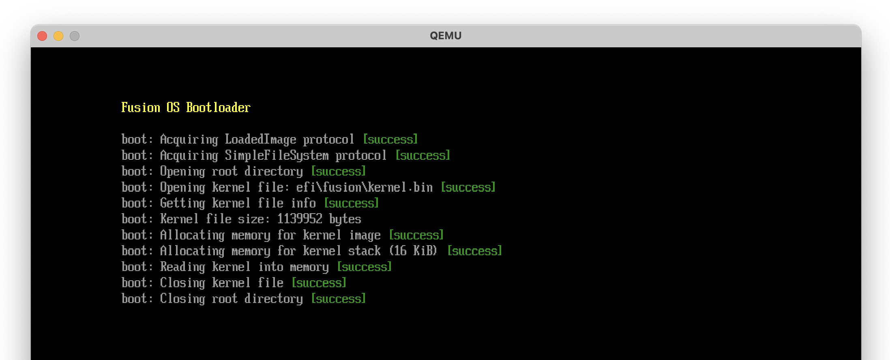
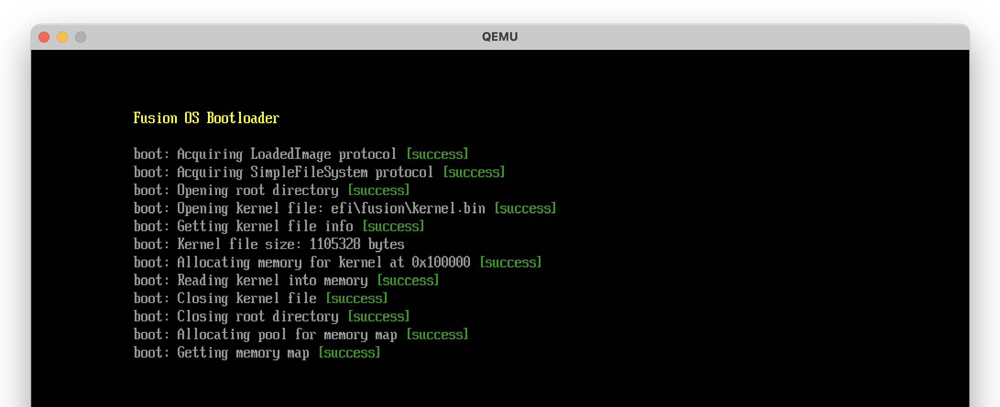
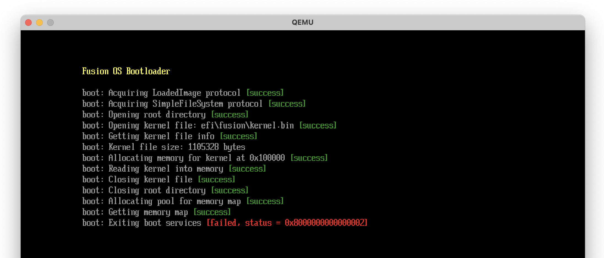
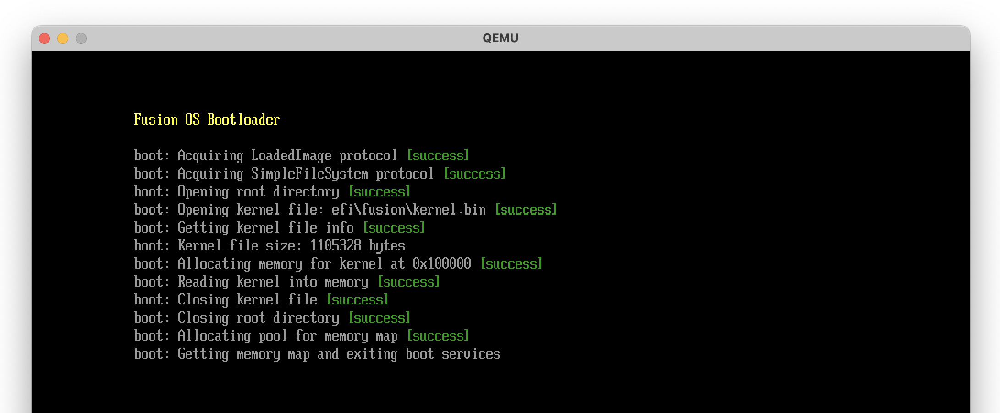
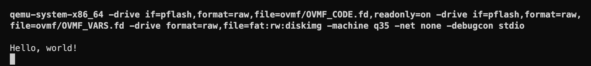
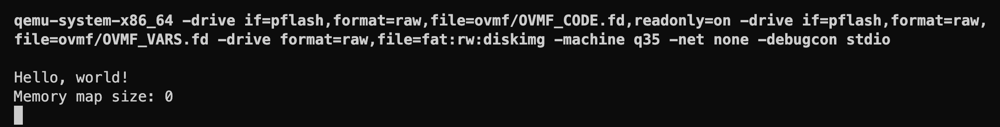
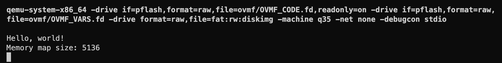
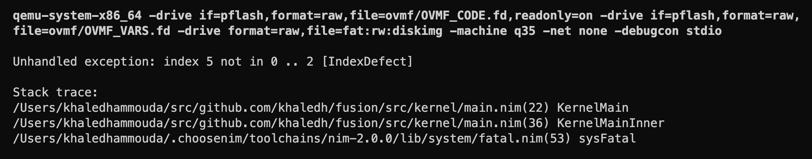

# Loading the kernel (Part 2)

In the previous section, we were able to locate the kernel image and get its size. In this section, we'll continue with our plan. We'll allocate memory for the kernel image, read it into memory, exit the Boot Services, and jump to the kernel image.

## Allocate memory

We'll use the Boot Services `AllocatePages` function to allocate enough pages, starting at address `0x100000` (1 MiB), to hold the kernel image. Let's define the `AllocatePages` function, which also requires defining the `EfiAllocateType` and `EfiPhysicalAddress` types.

```nim{6-11,14-20}
# src/common/uefi.nim

type
  EfiBootServices* = object
    ...
    allocatePages*: proc (
        allocateType: EfiAllocateType,
        memoryType: EfiMemoryType,
        pages: uint,
        memory: ptr EfiPhysicalAddress
      ): EfiStatus {.cdecl.}
    ...

  EfiAllocateType* = enum
    AllocateAnyPages,
    AllocateMaxAddress,
    AllocateAddress,
    MaxAllocateType

  EfiPhysicalAddress* = uint64
```

The `EfiAllocateType` enum is used to specify the type of allocation. We'll use `AllocateAddress` to allocate pages starting at a specific address (in our case, `0x100000`). The `EfiMemoryType` enum is used to specify the type of memory to allocate, which we'll set to `EfiLoaderCode`.

```nim{6-16}
# src/boot/bootx64.nim

proc EfiMainInner(imgHandle: EfiHandle, sysTable: ptr EFiSystemTable): EfiStatus =
  ...

  # allocate memory for the kernel
  var kernelPages = (kernelInfo.fileSize + 0xFFF).uint div 0x1000.uint # round up to nearest page
  var kernelAddr = cast[pointer](0x100000)

  consoleOut &"boot: Allocating memory for kernel at {cast[uint64](kernelAddr):#x}"
  checkStatus uefi.sysTable.bootServices.allocatePages(
    AllocateAddress,
    EfiLoaderCode,
    kernelPages,
    cast[ptr EfiPhysicalAddress](addr kernelAddr)
  )
```

## Read kernel image

The next step is to use the `read` function of the `EfiFileProtocol` to read the kernel image into memory. Let's define the `read` function.

```nim{6-12}
# src/common/uefi.nim

type
  EfiFileProtocol* = object
    ...
    read*: proc (
        this: ptr EfiFileProtocol,
        bufferSize: ptr uint,
        buffer: pointer
      ): EfiStatus {.cdecl.}
  ...
```

We'll use the `read` function to read the kernel image into the memory we allocated earlier.

```nim{6-12}
# src/boot/bootx64.nim

proc EfiMainInner(imgHandle: EfiHandle, sysTable: ptr EFiSystemTable): EfiStatus =
  ...

  # read the kernel into memory
  consoleOut "boot: Reading kernel into memory"
  checkStatus kernelFile.read(kernelFile, cast[ptr uint](addr kernelInfo.fileSize), kernelAddr)
```

## Close open files

We're done with the kernel file and the root directory, so we can close them. It's not strictly needed, but I got in the habbit of closing resources when I'm done with them. Let's define the `close` function of the `EfiFileProtocol`.

```nim{6}
# src/common/uefi.nim

type
  EfiFileProtocol* = object
    ...
    close*: proc (this: ptr EfiFileProtocol): EfiStatus {.cdecl.}
    ...
```

```nim{6-12}
# src/boot/bootx64.nim

proc EfiMainInner(imgHandle: EfiHandle, sysTable: ptr EFiSystemTable): EfiStatus =
  ...

  # close the kernel file
  consoleOut "boot: Closing kernel file"
  checkStatus kernelFile.close(kernelFile)

  # close the root directory
  consoleOut "boot: Closing root directory"
  checkStatus rootDir.close(rootDir)
```



## Get memory map

In order to get the memory map, we have to allocate memory for the map itself. But how do we know how much memory to allocate? Calling `getMemoryMap` with a buffer size of `0` will return the required buffer size in the `memoryMapSize` output parameter. We can then allocate the required memory and call `getMemoryMap` again to get the actual memory map.

Let's define the `getMemoryMap` function first (and the associated `EfiMemoryDescriptor` and `EfiVirtualAddress` types). We'll also define the `allocatePool` function of the `EfiBootServices` type, which we'll use to allocate the memory for the memory map. (The difference between `allocatePages` and `allocatePool` is that `allocatePages` allocates memory in page-sized chunks, whereas `allocatePool` allocates memory in byte-sized chunks. `allocatePool` also provides more control over the address of the allocated memory, which is why we used it to allocate memory for the kernel.)

```nim{6-17,20-25,29}
# src/common/uefi.nim

type
  EfiBootServices* = object
    ...
    getMemoryMap*: proc (
        memoryMapSize: ptr uint,
        memoryMap: ptr EfiMemoryDescriptor,
        mapKey: ptr uint,
        descriptorSize: ptr uint,
        descriptorVersion: ptr uint32
      ): EfiStatus {.cdecl.}
    allocatePool*: proc (
        poolType: EfiMemoryType,
        size: uint,
        buffer: ptr pointer
      ): EfiStatus {.cdecl.}
    ...

  EfiMemoryDescriptor* = object
    `type`*: EfiMemoryType
    physicalStart*: EfiPhysicalAddress
    virtualStart*: EfiVirtualAddress
    numberOfPages*: uint64
    attribute*: uint64
  ...

  EfiPhysicalAddress* = uint64
  EfiVirtualAddress* = uint64
```

Now we're ready to get the memory map.

```nim{6-39}
# src/boot/bootx64.nim

proc EfiMainInner(imgHandle: EfiHandle, sysTable: ptr EFiSystemTable): EfiStatus =
  ...

  # memory map
  var memoryMapSize = 0.uint
  var memoryMap: ptr UncheckedArray[EfiMemoryDescriptor]
  var memoryMapKey: uint
  var memoryMapDescriptorSize: uint
  var memoryMapDescriptorVersion: uint32

  # get memory map size
  status = uefi.sysTable.bootServices.getMemoryMap(
    addr memoryMapSize,
    cast[ptr EfiMemoryDescriptor](nil),
    cast[ptr uint](nil),
    cast[ptr uint](addr memoryMapDescriptorSize),
    cast[ptr uint32](nil)
  )
  # increase memory map size to account for the next call to allocatePool
  inc memoryMapSize, memoryMapDescriptorSize

  # allocate pool for memory map (this changes the memory map size, hence the previous step)
  consoleOut "boot: Allocating pool for memory map"
  checkStatus uefi.sysTable.bootServices.allocatePool(
    EfiLoaderData, memoryMapSize, cast[ptr pointer](addr memoryMap)
  )

  # now get the memory map
  consoleOut "boot: Getting memory map"
  checkStatus uefi.sysTable.bootServices.getMemoryMap(
    addr memoryMapSize,
    cast[ptr EfiMemoryDescriptor](memoryMap),
    addr memoryMapKey,
    addr memoryMapDescriptorSize,
    addr memoryMapDescriptorVersion
  )
```



## Exit boot services

We have all the information we need to exit the Boot Services. Let's define the `exitBootServices` function.

```nim
# src/common/uefi.nim

type
  EfiBootServices* = object
    ...
    exitBootServices*: proc (
        imageHandle: EfiHandle,
        mapKey: uint
      ): EfiStatus {.cdecl.}
    ...
```

The call to `exitBootServices` requires passing the `mapKey` that we got from `getMemoryMap`. This ensures that the memory map hasn't changed since we got it, otherwise the call will fail.

```nim
# src/boot/bootx64.nim

proc EfiMainInner(imgHandle: EfiHandle, sysTable: ptr EFiSystemTable): EfiStatus =
  ...

  # exit boot services
  consoleOut "boot: Exiting boot services"
  checkStatus uefi.sysTable.bootServices.exitBootServices(imgHandle, memoryMapKey)
```

If we compile and run now, we are faced with the following error:



Status code 2 is `EfiInvalidParameter`, which means that the `mapKey` we passed to `exitBootServices` is invalid. How can the `mapKey` be invalid if we just got it from `getMemoryMap`? This took me a while to figure out, but it turns out that merely printing to the console (or any other boot service call) may allocate memory, which changes the memory map. So basically we have to call `exitBootServices` immediately after getting the memory map, without calling any other boot service function in between. So, unfortunately, we'll have to give up printing to the console from that point on, until we transfer control to the kernel.

Let's change the call to `checkStatus` to avoid printing to the console (we'll only print to the console in case of an error).

```nim{8,15-29}
# src/boot/bootx64.nim

proc EfiMainInner(imgHandle: EfiHandle, sysTable: ptr EFiSystemTable): EfiStatus =
  ...

  # get memory map
  echo "boot: Getting memory map and exiting boot services"
  status = uefi.sysTable.bootServices.getMemoryMap(
    addr memoryMapSize,
    cast[ptr EfiMemoryDescriptor](memoryMap),
    addr memoryMapKey,
    addr memoryMapDescriptorSize,
    addr memoryMapDescriptorVersion
  )

  # IMPORTANT: After this point we cannot output anything to the console, since doing
  # so may allocate memory and change the memory map, invalidating our map key. We can
  # only output to the console in case of an error (since we quit anyway).

  if status != EfiSuccess:
    echo &"boot: Failed to get memory map: {status:#x}"
    quit()

  status = uefi.sysTable.bootServices.exitBootServices(imgHandle, memoryMapKey)
  if status != EfiSuccess:
    echo &"boot: Failed to exit boot services: {status:#x}"
    quit()

  # ======= NO MORE UEFI BOOT SERVICES =======
  ...
```

This time the call to `exitBootServices` should succeed, but we won't see a `[success]` message in the console. We'll know that it succeeded if no error messages are printed.



Great! We're done with the UEFI Boot Services. Now we're ready to jump to the kernel image.

## Jump to kernel

This part should be fairly straightforward. We'll define a `KernelEntryPoint` proc type that matches the signature of the `KernelMain` proc, and use it to call the kernel entry point. Remember that we cannot print to the console anymore, since we exited the Boot Services.

First let's recall the `KernelMain` proc definition:

```nim
# src/kernel/main.nim

import debugcon, libc, malloc

proc NimMain() {.importc.}

proc KernelMain() {.exportc.} =
  NimMain()

  debugln "Hello, world!"
  quit()
```

It's a simple proc that doesn't take any arguments (for now) and doesn't return anything. Let's define its type, cast the kernel address to that type, and call it.

```nim{3-4,9-14}
# src/boot/bootx64.nim

type
  KernelEntryPoint = proc () {.cdecl.}

proc EfiMainInner(imgHandle: EfiHandle, sysTable: ptr EFiSystemTable): EfiStatus =
  ...

  # jump to kernel
  let kernelMain = cast[KernelEntryPoint](kernelAddr)
  kernelMain()

  # we should never get here
  quit()
```

If we compile and run now, we should see the following output in the terminal (not in the QEMU window, since the kernel is printing to the QEMU debug console):



Great! Our kernel is running! This is a big milestone. But we're not done with the bootloader handover yet. We still need to pass the memory map from the bootloader to the kernel (and later a few other things). We'll use this memory map later to implement a physical memory manager in the kernel.

## Pass memory map to kernel

In order to pass the memory map to the kernel, we'll change the signature of the `KernelMain` proc to take a pointer to the memory map as an argument, as well as the memory map size, and the memory descriptor size. This way the kernel can scan the memory map and track the available memory regions.

Let's change the `KernelMain` proc signature, and print the memory map size to the debuc console to verify that we're getting the correct value.

```nim{4,8-12,16}
# src/kernel/main.nim

import debugcon
import common/[libc, malloc, uefi]

proc NimMain() {.importc.}

proc KernelMain(
  memoryMap: ptr UncheckedArray[EfiMemoryDescriptor],
  memoryMapSize: uint,
  memoryMapDescriptorSize: uint,
) {.exportc.} =
  NimMain()

  debugln "Hello, world!"
  debugln &"Memory map size: {memoryMapSize}"
```

In the bootloader, we'll change the `KernelEntryPoint` type to match the new signature, and pass the required parameters.

```nim{4-8,15}
# src/boot/bootx64.nim

type
  KernelEntryPoint = proc (
      memoryMap: ptr UncheckedArray[EfiMemoryDescriptor],
      memoryMapSize: uint,
      memoryMapDescriptorSize: uint,
    ) {.cdecl.}

proc EfiMainInner(imgHandle: EfiHandle, sysTable: ptr EFiSystemTable): EfiStatus =
  ...

  # jump to kernel
  let kernelMain = cast[KernelEntryPoint](kernelAddr)
  kernelMain(memoryMap, memoryMapSize, memoryMapDescriptorSize)

  # we should never get here
  quit()
```

Let's compile and run:



Well, that didn't work as expected. We're getting a memory map size of `0`. This one actually took me a long while to figure out. The problem, it turns out, is a difference in the calling convention between the bootloader and the kernel.

## Calling convention

Remember that the bootloader is compiled for the target `x86_64-unknown-windows`, and the kernel is compiled for `x86_64-unknown-elf`. This basically means that the bootloader is using the Microsoft x64 ABI, and the kernel is using the System V x64 ABI. Those two ABIs have different calling conventions; they pass parameters in different registers. The Microsoft x64 ABI passes the first four parameters in `rcx`, `rdx`, `r8`, and `r9`, whereas the System V x64 ABI passes the first six parameters in `rdi`, `rsi`, `rdx`, `rcx`, `r8`, and `r9`. So the bootloader is passing the memory map size in `rdx` (second parameter), but the kernel is expecting it in `rsi`. This is why we're getting a memory map size of `0`.

So how do we fix this? Ideally we can annotate the `KernelEntryPoint` type with the proper calling convention, but unfortunately Nim doesn't define a calling convention for the System V x64 ABI. So we have to take matters in our hands and do emit some C code from Nim that allows us to define the entry point function type with the proper calling convention. The C compiler supports the Sys V ABI by annotating a function with `__attribute__((sysv_abi))`. So we'll define a `KernelEntryPoint` type in C using this attribute, and use it in Nim.

```nim
# src/boot/bootx64.nim

{.emit: """/*TYPESECTION*/
typedef __attribute__((sysv_abi)) void (*KernelEntryPoint)(void*, size_t, size_t);
""".}

type
  KernelEntryPoint {.importc: "KernelEntryPoint", nodecl.} = proc (
    memoryMap: ptr UncheckedArray[EfiMemoryDescriptor],
    memoryMapSize: uint,
    memoryMapDescriptorSize: uint,
  ) {.cdecl.}

...
```

Here we're using the `{.emit.}` pragma to emit a C type definition for the `KernelEntryPoint` type. We're also using the `{.importc.}` pragma to import the type from C, and the `{.nodecl.}` pragma to prevent Nim from generating a type definition for it.

Let's compile and run:



Success! This time we're getting the correct memory map size.

## Print memory map

Just to be sure, let's iterate over the memory map and print the memory type, start address, and number of pages of each memory descriptor. We'll also print the total size of memory.

```nim{11-28}
# src/kernel/main.nim
...

proc KernelMain(
  memoryMap: ptr UncheckedArray[EfiMemoryDescriptor],
  memoryMapSize: uint,
  memoryMapDescriptorSize: uint,
) {.exportc.} =
  NimMain()

  let numMemoryMapEntries = memoryMapSize div memoryMapDescriptorSize

  debugln ""
  debugln &"Memory Map ({numMemoryMapEntries} entries):"
  debug &"""   {"Entry"}"""
  debug &"""   {"Type":22}"""
  debug &"""   {"PhysicalStart":>15}"""
  debug &"""   {"PhysicalStart (KB)":>15}"""
  debug &"""   {"NumberOfPages":>13}"""
  debugln ""
  for i in 0 ..< numMemoryMapEntries:
    let entry = cast[ptr EfiMemoryDescriptor](cast[uint64](memoryMap) + i * memoryMapDescriptorSize)
    debug &"   {i:>5}"
    debug &"   {entry.type:22}"
    debug &"   {entry.physicalStart:>#15x}"
    debug &"   {entry.physicalStart div 1024:>#18}"
    debug &"   {entry.numberOfPages:>#13}"
    debugln ""

  quit()
```

We should see the following output in the debug console:

```
Memory Map (107 entries):
   Entry   Type                       PhysicalStart   PhysicalStart (KB)   NumberOfPages
       0   EfiBootServicesCode                  0x0                    0               1
       1   EfiConventionalMemory             0x1000                    4             159
       2   EfiLoaderCode                   0x100000                 1024             280  <-- kernel image
       3   EfiConventionalMemory           0x218000                 2144            1512
       4   EfiACPIMemoryNVS                0x800000                 8192               8
       5   EfiConventionalMemory           0x808000                 8224               3
       6   EfiACPIMemoryNVS                0x80b000                 8236               1
       7   EfiConventionalMemory           0x80c000                 8240               4
       8   EfiACPIMemoryNVS                0x810000                 8256             240
       9   EfiBootServicesData             0x900000                 9216            3712
     ...
      97   EfiConventionalMemory          0x7e00000               129024             135
      98   EfiBootServicesData            0x7e87000               129564              32
      99   EfiBootServicesCode            0x7ea7000               129692              35
     100   EfiBootServicesData            0x7eca000               129832              17
     101   EfiBootServicesCode            0x7edb000               129900              25
     102   EfiRuntimeServicesData         0x7ef4000               130000             132
     103   EfiACPIMemoryNVS               0x7f78000               130528             136
     104   EfiReservedMemory             0xe0000000              3670016           65536
     105   EfiMemoryMappedIO             0xffc00000              4190208            1024
     106   EfiReservedMemory           0xfd00000000           1061158912         3145728
```

The memory map looks good. Notice that memory region at `0x100000` is marked as `EfiLoaderCode`, which is the memory region we allocated for the kernel. Its size is 280 pages (1120 KB), which matches the size of the kernel image (rounded up to the nearest page). When we implement the physical memory manager we'll have to mark this region as used.

## Handling exceptions

Before we move on to the next section, let's make sure we handle exceptions properly at the top level of the kernel, similar to what we did with the bootloader. Let's define an `unhandledException` proc that prints the exception and stack trace and quits, and move the code in `KernelMain` to a new `KernelMainInner` proc.

```nim{6-11,20-45}
# src/kernel/main.nim
...

# forward declarations
proc NimMain() {.importc.}
proc KernelMainInner(
  memoryMap: ptr UncheckedArray[EfiMemoryDescriptor],
  memoryMapSize: uint,
  memoryMapDescriptorSize: uint,
)
proc unhandledException*(e: ref Exception)

proc KernelMain(
  memoryMap: ptr UncheckedArray[EfiMemoryDescriptor],
  memoryMapSize: uint,
  memoryMapDescriptorSize: uint,
) {.exportc.} =
  NimMain()

  try:
    KernelMainInner(memoryMap, memoryMapSize, memoryMapDescriptorSize)
  except Exception as e:
    unhandledException(e)

  quit()

proc KernelMainInner(
  memoryMap: ptr UncheckedArray[EfiMemoryDescriptor],
  memoryMapSize: uint,
  memoryMapDescriptorSize: uint,
) =
  let numMemoryMapEntries = memoryMapSize div memoryMapDescriptorSize

  debugln ""
  debugln &"Memory Map ({numMemoryMapEntries} entries):"
  ...

proc unhandledException*(e: ref Exception) =
  debugln ""
  debugln &"Unhandled exception: {e.msg} [{e.name}]"
  if e.trace.len > 0:
    debugln ""
    debugln "Stack trace:"
    debugln getStackTrace(e)
  quit()
```

Let's test this by forcing an exception in `KernelMainInner`:

```nim
# src/kernel/main.nim

proc KernelMainInner(
  memoryMap: ptr UncheckedArray[EfiMemoryDescriptor],
  memoryMapSize: uint,
  memoryMapDescriptorSize: uint,
) =
  # force an IndexDefect exception
  let a = [1, 2, 3]
  let n = 5
  discard a[n]
```

We should see the following output in the debug console:



Great! We're in a great place now. We can now switch our focus to the kernel, assuming full control of the system. Where we go from here is up to us. In the next section, we'll forumlate an initial plan for the kernel.
