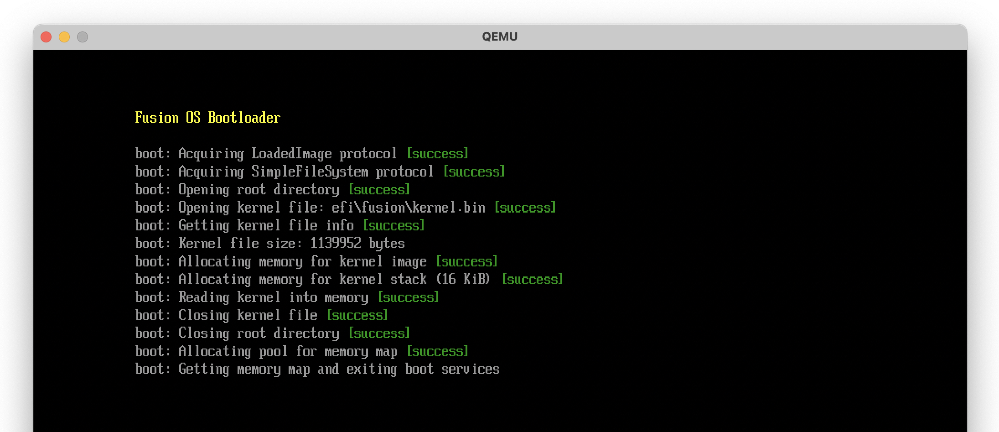

# Loading the Kernel (Part 2)

In the previous section, we located the kernel image and determined its size. In this
section, we'll continue with our plan. We'll allocate memory for the kernel image, read it
into memory, exit the Boot Services, and jump to the kernel image.

## Allocate memory

We'll use the Boot Services `AllocatePages` function to allocate enough pages, starting at
address `0x100000` (1 MiB), to hold the kernel image. We'll also allocate a region of
memory for the kernel stack. Let's define the `AllocatePages` function, which also
requires defining the `EfiAllocateType` and `EfiPhysicalAddress` types.

```nim{6-11,14-20}
# src/common/uefi.nim

type
  EfiBootServices* = object
    ...
    allocatePages*: proc (
        allocateType: EfiAllocateType,
        memoryType: EfiMemoryType,
        pages: uint,
        memory: ptr EfiPhysicalAddress
      ): EfiStatus {.cdecl.}
    ...

  EfiAllocateType* = enum
    AllocateAnyPages,
    AllocateMaxAddress,
    AllocateAddress,
    MaxAllocateType

  EfiPhysicalAddress* = uint64
```

The `EfiAllocateType` enum is used to specify the type of allocation. We'll use
`AllocateAddress` to allocate pages for the kernel image, starting at a specific address
(in our case, `0x100000`). The `EfiMemoryType` enum is used to specify the type of memory
to allocate, which we'll set to `OsvKernelCode`. For the kernel stack, we'll use
`AllocateAnyPages` to allocate any pages, and set the memory type to `OsvKernelStack`.

```nim{3-6,11-29}
# src/boot/bootx64.nim

const
  PageSize = 4096
  KernelPhysicalBase = 0x100000
  KernelStackSize = 128 * 1024'u64

proc EfiMainInner(imgHandle: EfiHandle, sysTable: ptr EFiSystemTable): EfiStatus =
  ...

  consoleOut &"boot: Allocating memory for kernel image "
  let kernelImageBase = cast[pointer](KernelPhysicalBase)
  let kernelImagePages = (kernelInfo.fileSize + 0xFFF).uint div PageSize.uint # round up to nearest page
  checkStatus uefi.sysTable.bootServices.allocatePages(
    AllocateAddress,
    OsvKernelCode,
    kernelImagePages,
    cast[ptr EfiPhysicalAddress](addr kernelImageBase)
  )

  consoleOut &"boot: Allocating memory for kernel stack (16 KiB) "
  var kernelStackBase: uint64
  let kernelStackPages = KernelStackSize div PageSize
  checkStatus uefi.sysTable.bootServices.allocatePages(
    AllocateAnyPages,
    OsvKernelStack,
    kernelStackPages,
    kernelStackBase.addr,
  )
```

## Read kernel image

The next step is to use the `read` function of the `EfiFileProtocol` to read the kernel
image into memory. Let's define the `read` function.

```nim{6-12}
# src/common/uefi.nim

type
  EfiFileProtocol* = object
    ...
    read*: proc (
        this: ptr EfiFileProtocol,
        bufferSize: ptr uint,
        buffer: pointer
      ): EfiStatus {.cdecl.}
  ...
```

We'll use the `read` function to read the kernel image into the memory we allocated
earlier.

```nim{6-12}
# src/boot/bootx64.nim

proc EfiMainInner(imgHandle: EfiHandle, sysTable: ptr EFiSystemTable): EfiStatus =
  ...

  # read the kernel into memory
  consoleOut "boot: Reading kernel into memory"
  checkStatus kernelFile.read(kernelFile, cast[ptr uint](addr kernelInfo.fileSize), kernelImageBase)
```

## Close open files

We're done with the kernel file and the root directory, so we can close them. It's not
strictly needed, but I got in the habit of closing resources when I'm done with them.
Let's define the `close` function of the `EfiFileProtocol`.

```nim{6}
# src/common/uefi.nim

type
  EfiFileProtocol* = object
    ...
    close*: proc (this: ptr EfiFileProtocol): EfiStatus {.cdecl.}
    ...
```

```nim{6-12}
# src/boot/bootx64.nim

proc EfiMainInner(imgHandle: EfiHandle, sysTable: ptr EFiSystemTable): EfiStatus =
  ...

  # close the kernel file
  consoleOut "boot: Closing kernel file"
  checkStatus kernelFile.close(kernelFile)

  # close the root directory
  consoleOut "boot: Closing root directory"
  checkStatus rootDir.close(rootDir)
```


## Get memory map

In order to get the memory map, we have to allocate memory for the map itself. But how do
we know how much memory to allocate? Calling `getMemoryMap` with a buffer size of `0` will
return the required buffer size in the `memoryMapSize` output parameter. We can then
allocate the required memory and call `getMemoryMap` again to get the actual memory map.

Let's define the `getMemoryMap` function first (and the associated `EfiMemoryDescriptor`
and `EfiVirtualAddress` types). We'll also define the `allocatePool` function of the
`EfiBootServices` type, which we'll use to allocate the memory for the memory map. (The
difference between `allocatePages` and `allocatePool` is that `allocatePages` allocates
memory in page-sized chunks, whereas `allocatePool` allocates memory in byte-sized chunks.
`allocatePool` also provides more control over the address of the allocated memory, which
is why we used it to allocate memory for the kernel.)

```nim{6-17,20-25,29}
# src/common/uefi.nim

type
  EfiBootServices* = object
    ...
    getMemoryMap*: proc (
        memoryMapSize: ptr uint,
        memoryMap: ptr EfiMemoryDescriptor,
        mapKey: ptr uint,
        descriptorSize: ptr uint,
        descriptorVersion: ptr uint32
      ): EfiStatus {.cdecl.}
    allocatePool*: proc (
        poolType: EfiMemoryType,
        size: uint,
        buffer: ptr pointer
      ): EfiStatus {.cdecl.}
    ...

  EfiMemoryDescriptor* = object
    `type`*: EfiMemoryType
    physicalStart*: EfiPhysicalAddress
    virtualStart*: EfiVirtualAddress
    numberOfPages*: uint64
    attribute*: uint64
  ...

  EfiPhysicalAddress* = uint64
  EfiVirtualAddress* = uint64
```

Now we're ready to get the memory map.

```nim{6-39}
# src/boot/bootx64.nim

proc EfiMainInner(imgHandle: EfiHandle, sysTable: ptr EFiSystemTable): EfiStatus =
  ...

  # memory map
  var memoryMapSize = 0.uint
  var memoryMap: ptr UncheckedArray[EfiMemoryDescriptor]
  var memoryMapKey: uint
  var memoryMapDescriptorSize: uint
  var memoryMapDescriptorVersion: uint32

  # get memory map size
  status = uefi.sysTable.bootServices.getMemoryMap(
    addr memoryMapSize,
    cast[ptr EfiMemoryDescriptor](nil),
    cast[ptr uint](nil),
    cast[ptr uint](addr memoryMapDescriptorSize),
    cast[ptr uint32](nil)
  )
  # increase memory map size to account for the next call to allocatePool
  inc memoryMapSize, memoryMapDescriptorSize

  # allocate pool for memory map (this changes the memory map size, hence the previous step)
  consoleOut "boot: Allocating pool for memory map"
  checkStatus uefi.sysTable.bootServices.allocatePool(
    EfiLoaderData, memoryMapSize, cast[ptr pointer](addr memoryMap)
  )

  # now get the memory map
  consoleOut "boot: Getting memory map"
  checkStatus uefi.sysTable.bootServices.getMemoryMap(
    addr memoryMapSize,
    cast[ptr EfiMemoryDescriptor](memoryMap),
    addr memoryMapKey,
    addr memoryMapDescriptorSize,
    addr memoryMapDescriptorVersion
  )
```


## Exit boot services

We have all the information we need to exit the Boot Services. Let's define the
`exitBootServices` function.

```nim
# src/common/uefi.nim

type
  EfiBootServices* = object
    ...
    exitBootServices*: proc (
        imageHandle: EfiHandle,
        mapKey: uint
      ): EfiStatus {.cdecl.}
    ...
```

The call to `exitBootServices` requires passing the `mapKey` that we got from
`getMemoryMap`. This ensures that the memory map hasn't changed since we got it, otherwise
the call will fail.

```nim
# src/boot/bootx64.nim

proc EfiMainInner(imgHandle: EfiHandle, sysTable: ptr EFiSystemTable): EfiStatus =
  ...

  # exit boot services
  consoleOut "boot: Exiting boot services"
  checkStatus uefi.sysTable.bootServices.exitBootServices(imgHandle, memoryMapKey)
```

If we compile and run now, we are faced with the following error:


Status code 2 is `EfiInvalidParameter`, which means that the `mapKey` we passed to
`exitBootServices` is invalid. How can the `mapKey` be invalid if we just got it from
`getMemoryMap`? This took me a while to figure out, but it turns out that merely printing
to the console (or any other boot service call) may allocate memory, which changes the
memory map. So basically we have to call `exitBootServices` immediately after getting the
memory map, without calling any other boot service function in between. So, unfortunately,
we'll have to give up printing to the console from that point on, until we transfer
control to the kernel.

Let's change the call to `checkStatus` to avoid printing to the console (we'll only print
to the console in case of an error).

```nim{8,15-29}
# src/boot/bootx64.nim

proc EfiMainInner(imgHandle: EfiHandle, sysTable: ptr EFiSystemTable): EfiStatus =
  ...

  # get memory map
  echo "boot: Getting memory map and exiting boot services"
  status = uefi.sysTable.bootServices.getMemoryMap(
    addr memoryMapSize,
    cast[ptr EfiMemoryDescriptor](memoryMap),
    addr memoryMapKey,
    addr memoryMapDescriptorSize,
    addr memoryMapDescriptorVersion
  )

  # IMPORTANT: After this point we cannot output anything to the console, since doing
  # so may allocate memory and change the memory map, invalidating our map key. We can
  # only output to the console in case of an error (since we quit anyway).

  if status != EfiSuccess:
    echo &"boot: Failed to get memory map: {status:#x}"
    quit()

  status = uefi.sysTable.bootServices.exitBootServices(imgHandle, memoryMapKey)
  if status != EfiSuccess:
    echo &"boot: Failed to exit boot services: {status:#x}"
    quit()

  # ======= NO MORE UEFI BOOT SERVICES =======
  ...
```

This time the call to `exitBootServices` should succeed, but we won't see a `[success]`
message in the console. We'll know that it succeeded if no error messages are printed.



Great! We're done with the UEFI Boot Services. Now we're ready to jump to the kernel
image. We'll do this in the next section.
