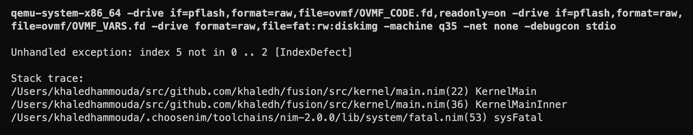

# Loading the Kernel (Part 3)

Now that the bootloader exited UEFI Boot Services, it's time to transfer control to the kernel. This part should be fairly straightforward. We'll define a `KernelEntryPoint` proc type that matches the signature of the `KernelMain` proc, and use it to call the kernel entry point. Remember that we cannot print to the console anymore, since we exited the Boot Services.

First let's recall the `KernelMain` proc definition:

```nim
# src/kernel/main.nim

import common/[libc, malloc]
import debugcon

proc NimMain() {.importc.}

proc KernelMain() {.exportc.} =
  NimMain()

  debugln "Hello, world!"
  quit()
```

It's a simple proc that doesn't take any arguments (for now) and doesn't return anything. Let's define its type, cast the kernel address to that type, and call it.

```nim{3-4,9-11}
# src/boot/bootx64.nim

type
  KernelEntryPoint = proc () {.cdecl.}

proc EfiMainInner(imgHandle: EfiHandle, sysTable: ptr EFiSystemTable): EfiStatus =
  ...

  # jump to kernel
  let kernelMain = cast[KernelEntryPoint](kernelImageBase)
  kernelMain()

  # we should never get here
  quit()
```

If we compile and run now, we should see the following output in the terminal (not in the QEMU window, since the kernel is printing to the QEMU debug console):


Great! Our kernel is running! This is a big milestone. But we're not done with the bootloader handover yet. We still need to pass the memory map from the bootloader to the kernel (and later a few other things). We'll use this memory map later to implement a physical memory manager in the kernel.

## Convert UEFI memory map

Ideally we shouldn't pass the UEFI memory map as is to the kernel. The memory map is a UEFI-specific data structure, and we don't want to tie the kernel to UEFI. Instead, we'll create our own memory map data structure that is independent of UEFI, and pass that to the kernel. Since this is going to be a data structure used by both the bootloader and the kernel, let's put it under the `common` folder in a module called `bootinfo.nim`.

```nim
# src/common/bootinfo.nim

type
  MemoryType* = enum
    Free
    KernelImage
    KernelStack
    KernelBootInfo
    Reserved

  MemoryMapEntry* = object
    `type`*: MemoryType
    start*: uint64
    nframes*: uint64

  MemoryMap* = object
    len*: uint
    entries*: ptr UncheckedArray[MemoryMapEntry]

  BootInfo* = object
    physicalMemoryMap*: MemoryMap
```

Let's also add a proc in the bootloader to convert the UEFI memory map to our boot info memory map.

```nim
# src/boot/bootx64.nim

import std/sets
...

# We use a HashSet here because the `EfiMemoryType` has values greater than 64K,
# which is the maximum value supported by Nim sets.
const
  FreeMemoryTypes = [
    EfiConventionalMemory,
    EfiBootServicesCode,
    EfiBootServicesData,
    EfiLoaderCode,
    EfiLoaderData,
  ].toHashSet

proc convertUefiMemoryMap(
  uefiMemoryMap: ptr UncheckedArray[EfiMemoryDescriptor],
  uefiMemoryMapSize: uint,
  uefiMemoryMapDescriptorSize: uint,
): seq[MemoryMapEntry] =
  let uefiNumMemoryMapEntries = uefiMemoryMapSize div uefiMemoryMapDescriptorSize

  for i in 0 ..< uefiNumMemoryMapEntries:
    let uefiEntry = cast[ptr EfiMemoryDescriptor](
      cast[uint64](uefiMemoryMap) + i * uefiMemoryMapDescriptorSize
    )
    let memoryType =
      if uefiEntry.type in FreeMemoryTypes:
        Free
      elif uefiEntry.type == OsvKernelCode:
        KernelCode
      elif uefiEntry.type == OsvKernelData:
        KernelData
      elif uefiEntry.type == OsvKernelStack:
        KernelStack
      else:
        Reserved
    result.add(MemoryMapEntry(
      type: memoryType,
      start: uefiEntry.physicalStart,
      nframes: uefiEntry.numberOfPages
    ))
```

In order to pass the memory map to the kernel, it may seem that we can just pass a `BootInfo` instance to the kernel entry point. But keep in mind that the boot memory map is currently allocated both on the stack and the heap (the `entries` array) of the bootloader. We don't want the kernel to depend on memory in the bootloader, as we'll consider this memory as available once we're in the kernel. So, what we can do is use the UEFI `AllocatePool` method to allocate a single page of memory, use it to initialize a `BootInfo` instance, and pass its address to the kernel. We'll use memory type `OsvKernelData` for this memory, since it's memory that will be used by the kernel.

Let's add this part to the `EfiMainInner` proc:

```nim{9-16}
# src/boot/bootx64.nim

proc EfiMainInner(imgHandle: EfiHandle, sysTable: ptr EFiSystemTable): EfiStatus =
  ...

  consoleOut &"boot: Allocating memory for kernel stack (16 KiB)"
  ...

  consoleOut &"boot: Allocating memory for BootInfo"
  var bootInfoBase: uint64
  checkStatus uefi.sysTable.bootServices.allocatePages(
    AllocateAnyPages,
    OsvKernelData,
    1,
    bootInfoBase.addr,
  )

  consoleOut "boot: Reading kernel into memory"
  ...
```

Now, let's convert the UEFI memory map to the boot memory map using the `convertUefiMemoryMap` proc, and manually copy it to the `BootInfo` memory we just allocated:

```nim
# src/boot/bootx64.nim

proc EfiMainInner(imgHandle: EfiHandle, sysTable: ptr EFiSystemTable): EfiStatus =
  ...

  # ======= NO MORE UEFI BOOT SERVICES =======

  let physMemoryMap = convertUefiMemoryMap(memoryMap, memoryMapSize, memoryMapDescriptorSize)

  var bootInfo = cast[ptr BootInfo](bootInfoBase)

  # copy physical memory map entries to boot info
  bootInfo.physicalMemoryMap.len = physMemoryMap.len.uint
  bootInfo.physicalMemoryMap.entries =
    cast[ptr UncheckedArray[MemoryMapEntry]](bootInfoBase + sizeof(BootInfo).uint64)
  for i in 0 ..< physMemoryMap.len:
    bootInfo.physicalMemoryMap.entries[i] = physMemoryMap[i]
```

What we're doing here is treating the start of the boot info page as a `BootInfo` instance. On line 12 & 13, we're pointing the `entries` field of the boot info memory map to the memory right after the boot info instance (instead of to some arbitrary heap memory). The last part just copies the entries from the original memory map to the boot info memory map.

## Pass BootInfo to kernel

We're now ready to pass our memory map to the kernel. We'll change the signature of the `KernelMain` proc to take a `ptr BootInfo`. Let's change the `KernelMain` proc signature, and print the memory map length to the debug console to verify that we're getting the correct info.

```nim{4,8,11-12}
# src/kernel/main.nim

import debugcon
import common/[bootinfo, libc, malloc]

proc NimMain() {.importc.}

proc KernelMain(bootInfo: ptr BootInfo) {.exportc.} =
  NimMain()

  debugln "kernel: Fusion Kernel"
  debugln &"kernel: Memory map length: {bootinfo.physicalMemoryMap.len}"

  quit()
```

In the bootloader, we'll change the `KernelEntryPoint` type to match the new signature, convert the memory map, and pass it to the kernel through the `bootinfo` argument.

```nim{3,7,12-18}
# src/boot/bootx64.nim

import common/bootinfo
...

type
  KernelEntryPoint = proc (bootInfo: ptr BootInfo) {.cdecl.}

proc EfiMainInner(imgHandle: EfiHandle, sysTable: ptr EFiSystemTable): EfiStatus =
  ...

  # jump to kernel
  let kernelMain = cast[KernelEntryPoint](kernelImageBase)
  kernelMain(bootInfo)

  # we should never get here
  quit()
```

Let's compile and run:


Well, that didn't work as expected. We're getting a memory map length of `0`. This one actually took me a long while to figure out. The problem, it turns out, is a difference in the calling convention between the bootloader and the kernel.

## Calling convention

Remember that the bootloader is compiled for the target `x86_64-unknown-windows`, and the kernel is compiled for `x86_64-unknown-elf`. This basically means that the bootloader is using the Microsoft x64 ABI, and the kernel is using the System V x64 ABI. Those two ABIs have different calling conventions; they pass parameters in different registers. The Microsoft x64 ABI passes the first four parameters in `rcx`, `rdx`, `r8`, and `r9`, whereas the System V x64 ABI passes the first six parameters in `rdi`, `rsi`, `rdx`, `rcx`, `r8`, and `r9`. So the bootloader is passing the memory map size in `rdx` (second parameter), but the kernel is expecting it in `rsi`. This is why we're getting a memory map size of `0`.

So how do we fix this? Ideally we can annotate the `KernelEntryPoint` type with the proper calling convention, but unfortunately Nim doesn't define a calling convention for the System V x64 ABI. So we have to take matters in our hands. One solution is emit some C code from Nim that allows us to define the entry point function type with the proper calling convention. The C compiler supports the Sys V ABI by annotating a function with `__attribute__((sysv_abi))`. But that's a bit too much for something simple.

Keep in mind that we also need to set up the kernel stack and switch to it before jumping to the kernel, and in a future section we'll also need to set up the kernel page tables and switch to them. So we'll need to write some assembly code anyway. Let's go ahead and do that. We'll pass the boot info address in `rdi` (first parameter), and we'll change the `rsp` register to point to the top of the kernel stack region. Finally we'll `jmp` to the kernel entry point.

```nim{6-19}
# src/boot/bootx64.nim

proc EfiMainInner(imgHandle: EfiHandle, sysTable: ptr EFiSystemTable): EfiStatus =
  ...

  # switch stacks and jump to kernel
  let kernelStackTop = kernelStackBase + KernelStackSize
  asm """
    mov rdi, %0  # bootInfo
    mov rsp, %1  # kernel stack top
    jmp %2       # kernel entry point
    :
    : "r"(`bootInfoBase`),
      "r"(`kernelStackTop`),
      "r"(`KernelPhysicalBase`)
  """

  # we should never get here
```

Let's compile and run:


Success! This time we're getting the correct memory map length.

## Print memory map

Just to be sure, let's iterate over the memory map and print the memory type, start address, and number of pages of each entry. We'll also print the total size of free memory.

```nim{9-31}
# src/kernel/main.nim
...

proc KernelMain(bootInfo: BootInfo) {.exportc.} =
  NimMain()

  debugln "kernel: Fusion Kernel"

  debugln ""
  debugln &"Memory Map ({bootInfo.physicalMemoryMap.len} entries):"
  debug &"""   {"Entry"}"""
  debug &"""   {"Type":12}"""
  debug &"""   {"Start":>12}"""
  debug &"""   {"Start (KB)":>15}"""
  debug &"""   {"#Pages":>10}"""
  debugln ""

  totalFreePages = 0
  for i in 0 ..< bootInfo.physicalMemoryMap.len:
    let entry = bootInfo.physicalMemoryMap.entries[i]
    debug &"   {i:>5}"
    debug &"   {entry.type:12}"
    debug &"   {entry.start:>#12x}"
    debug &"   {entry.start div 1024:>#15}"
    debug &"   {entry.nframes:>#10}"
    debugln ""
    if entry.type == MemoryType.Free:
      totalFreePages += entry.nframes

  debugln ""
  debugln &"Total free: {totalFreePages * 4} KiB ({totalFreePages * 4 div 1024} MiB)"

  quit()
```

We should see the following output in the debug console:

```text
kernel: Fusion Kernel

Memory Map (109 entries):
   Entry   Type                  Start        Start (KB)       #Pages
       0   Free                    0x0                 0            1
       1   Free                 0x1000                 4          159
       2   KernelCode         0x100000              1024          290
       3   Free               0x222000              2184         1502
       4   Reserved           0x800000              8192            8
       5   Free               0x808000              8224            3
       6   Reserved           0x80b000              8236            1
       7   Free               0x80c000              8240            4
       8   Reserved           0x810000              8256          240
       9   Free               0x900000              9216         3712
      10   Free              0x1780000             24064         9205
      11   Free              0x3b75000             60884           32
      12   Free              0x3b95000             61012         9887
      13   Free              0x6234000            100560          292
      14   Free              0x6358000            101728           19
      15   Free              0x636b000            101804            2
      16   KernelData        0x636d000            101812            1
      17   KernelStack       0x636e000            101816            4
      18   Free              0x6372000            101832         1781
      19   Free              0x6a67000            108956           25
      20   Free              0x6a80000            109056            2
      ...
      99   Free              0x7e00000            129024          135
     100   Free              0x7e87000            129564           32
     101   Free              0x7ea7000            129692           35
     102   Free              0x7eca000            129832           17
     103   Free              0x7edb000            129900           25
     104   Reserved          0x7ef4000            130000          132
     105   Reserved          0x7f78000            130528          136
     106   Reserved         0xe0000000           3670016        65536
     107   Reserved         0xffc00000           4190208         1024
     108   Reserved       0xfd00000000        1061158912      3145728

Total free: 124296 KiB (121 MiB)
```

The memory map looks good. Notice that the kernel memory regions are marked properly.

## Handling Nim exceptions

Before we move on to the next section, let's make sure we handle Nim exceptions properly at the top level of the kernel, similar to what we did with the bootloader. Let's define an `unhandledException` proc that prints the exception and stack trace and quits, and move the code in `KernelMain` to a new `KernelMainInner` proc.

```nim{6-7,12-15,19-21,23-30}
# src/kernel/main.nim
...

# forward declarations
proc NimMain() {.importc.}
proc KernelMainInner(bootInfo: BootInfo)
proc unhandledException*(e: ref Exception)

proc KernelMain(bootInfo: BootInfo) {.exportc.} =
  NimMain()

  try:
    KernelMainInner(bootInfo)
  except Exception as e:
    unhandledException(e)

  quit()

proc KernelMainInner(bootInfo: BootInfo) =
  debugln "kernel: Fusion Kernel"
  ...

proc unhandledException*(e: ref Exception) =
  debugln ""
  debugln &"Unhandled exception: {e.msg} [{e.name}]"
  if e.trace.len > 0:
    debugln ""
    debugln "Stack trace:"
    debugln getStackTrace(e)
  quit()
```

Let's test this by forcing an exception in `KernelMainInner`:

```nim
# src/kernel/main.nim

proc KernelMainInner(bootInfo: BootInfo) =
  # force an IndexDefect exception
  let a = [1, 2, 3]
  let n = 5
  discard a[n]
```

We should see the following output in the debug console:



Great! We're in a great place now. We can now switch our focus to the kernel, assuming full control of the system.

So where do we go from here? Ultimately we want to be able to run user programs in user space. This requires virtual memory support (using paging), where we divide the address space into two parts: the kernel space and the user space. Virtual memory requires a physical memory manager in order to allocate (and free) physical memory frames to back virtual memory pages. We already have a physical memory map, so we can use that to implement a physical memory manager. We'll do that in the next section.

<!-- TODO: move
In the next section, we'll take a closer look at the virtual address space, and how to map the kernel into a dedicated part of the virtual address space (the higher half), the so-called _kernel space_.
-->
