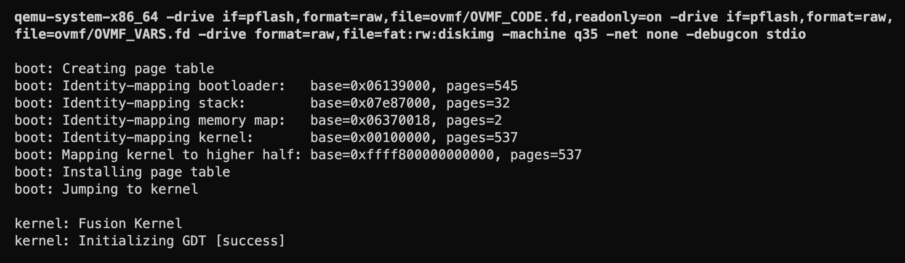
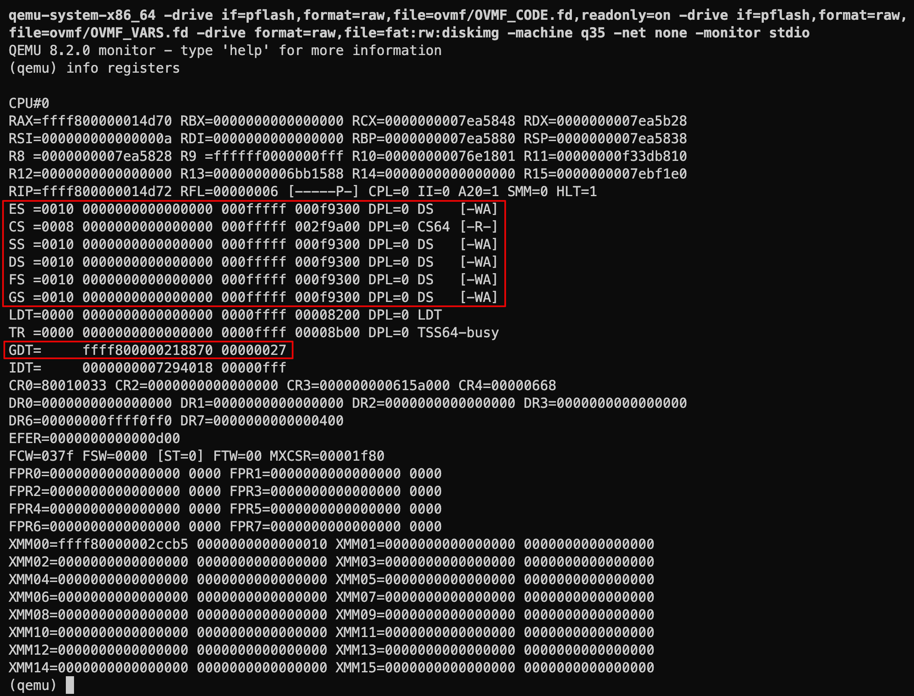

# Memory Segments

In the x86 architecture (including x86_64), all memory access is subject to segmentation. Even though in 64-bit mode segments boundaries are ignored (they're all set to the full 64-bit address space), we still need a number of them to differentiate between code and data access, and between kernel mode and user mode privileges. This is done through the **Global Descriptor Table** (GDT), which is a table of segment descriptors that the CPU uses to determine the access rights of memory accesses.

## Segment Descriptors

Segments are basically regions of memory with certain properties, including their base address and size, whether they hold code or data, whether they're writable (for data segments) or  readable (for code segments), whether they're accessible from user mode or kernel mode, and a few other things. This technique of managing memory is called **segmentation**, which offered a flexible way to allocate regions of memory in a protected manner. It's no longer used in modern operating systems as they tend to use paging only for memory management and protection. It is, however, still used by modern CPUs in a limited way. In x64, all segments assume a flat memory model, which means that each segment occupies the entire 64-bit address space. The most important features of segments for our purpose are two things:

- Their privilege level, which determines whether they're accessible from user mode or kernel mode.
- Their type, which determines whether they're code or data segments. (There's also a third type called a system segment, which we'll come back to later.)

This gives us four possible combinations:

- Kernel code segment
- Kernel data segment
- User code segment
- User data segment

However, even though we'll need two code segments, we can use only one data segment for both kernel and user mode (I explain below, under Segment Selectors, why this is the case). So we'll end up with only three segments.

All three segments will have the same base address (0) and the same size (the entire 64-bit address space). The only difference between them will be their privilege level and type. We'll need to define a segment descriptor for each of them. A segment descriptor is a 64-bit value that contains all the information about the segment. Here's a diagram of the segment descriptor format:

```text
 31                   24 23 22 21 20 19       16 15 14 13 12 11       08 07                   00
┌───────────────────────┬──┬──┬──┬──┬───────────┬──┬─────┬──┬───────────┬───────────────────────┐
│      Base Address     │G │D │L │A │   Limit   │P │ DPL │S │   Type    │     Base Address      │
│        [31:24]        │  │/ │  │V │  [19:16]  │  │     │  │           │        [23:16]        │ 4
│                       │  │B │  │L │           │  │     │  │           │                       │
└───────────────────────┴──┴──┴──┴──┴───────────┴──┴─────┴──┴───────────┴───────────────────────┘
 31                                           16 15                                           00
┌───────────────────────────────────────────────┬───────────────────────────────────────────────┐
│                  Base Address                 │                     Limit                     │ 0
│                    [15:00]                    │                    [15:00]                    │
└───────────────────────────────────────────────┴───────────────────────────────────────────────┘

Base        Segment base address
Limit       Segment Limit
Type        Segment type
S           Descriptor type (0 = system; 1 = code or data)
DPL         Descriptor privilege level
P           Segment present
AVL         Available for use by system software (unused by the CPU)
L           64-bit code segment (IA-32e mode only)
D/B         Default operation size (0 = 16-bit segment; 1 = 32-bit segment)
G           Granularity
```

The meaning of these fields is quite involved, they're described in detail in the Intel Software Developer’s Manual, section 3.2. I'm going to go over them here briefly, but I recommend reading the manual for more details.

**Base Address**
: Since we're using a flat memory model, the base address is always 0.

**Limit**
: This is the last valid offset in the segment. Since we're using a flat memory model, the limit is always `0xFFFFFFFFFFFFFFFF`, which is the maximum value for a 64-bit integer.

**Type**
: This determines whether the segment is a code segment or a data segment. It has the following subfields:

  - Bit 11: `0` for data segments, `1` for code segments.
  - Bit 10:
    - For code segments: **C** - Conforming. If set, code in this segment can be executed from a lower privilege level (under the current privilege level). If clear, code in this segment can only be executed from the same privilege level.
    - For data segments: **E** - Expand down. If set, the segment grows down, otherwise it grows up. This is used for stacks.
  - Bit 9:
    - For code segments: **R** - Readable. If set, read access for this segment is allowed. Note that code doesn't need to be readable to be executable.
    - For data segments: **W** - Writable. If set, write access for this segment is allowed.
  - Bit 8: **A** - Accessed. This is set by the CPU when the segment is accessed. The OS can use this to keep track of which segments are used and which aren't.

**S**
: This determines whether the segment is a system segment or a code or data segment. It's set for code and data segments. It's clear for system segments, which are used for special purposes, such as task state segments (we'll cover this later when we implement multitasking).

**DPL**
: This is the privilege level required to access the segment. It's a 2-bit field, so it can have one of four values: 0, 1, 2, or 3. DPL 0 is the most privileged level, under which the kernel runs. DPL 3 is the least privileged level, under which user programs run.

**P**
: This determines whether the segment is present in memory. If it's clear, the CPU will raise an exception when the segment is accessed.

**AVL**
: This is available for use by the OS. The CPU doesn't use it.

**L**
: This determines whether the segment is a 64-bit code segment. If not set, the code segment will be executed in compatibility mode, which is 32-bit mode.

**D/B**
: This determines the default operand size for the segment. It must be set to zero for 64-bit code segments (i.e. when L is set).

**G**
: This determines the granularity of the segment limit. If clear, the limit is interpreted as the number of bytes. If set, the limit is interpreted as the number of 4 KiB pages.

### Segment Selectors

Accessing a segment happens through a **segment selector**, which is a 16-bit value loaded into a segment register (CS, DS, ES, FS, GS, SS) containing the offset of a particular segment descriptor in the GDT. Only 13 bits are used to store the offset. The remaining 3 bits are used to store two things: the **RPL** (Requestor Privilege Level) and the **TI** (Table Indicator). Here's a diagram of the segment selector format:

```text
 15                                  03 02 01 00
┌──────────────────────────────────────┬──┬─────┐
│                Index                 │TI│ RPL │
└──────────────────────────────────────┴──┴─────┘
```

The TI is a 1-bit field that indicates whether the segment selector is a GDT selector (TI = 0) or an LDT (Local Descriptor Table) selector (TI = 1). We'll only be using the GDT, so TI will always be 0.

The RPL is a 2-bit field that stores the request privilege level of a segment selector (not a descriptor). It's a way to override the CPL (Current Privilege Level) of the currently running code. The effective privilege level is _max(CPL, RPL)_, which is checked against the DPL of the target segment, and access is only allowed if the effective privilege level is numerically equal to or less than the DPL of the target segment. This means that RPL in user mode has no effect (since CPL is 3, so RPL doesn't matter). In kernel mode, the kernel has access to all segments (since its CPL is 0). A higher RPL can be used by the kernel to ensure that privileged code does not access a segment on behalf of an application program unless the program itself has access privileges for that segment.

For the purpose of our kernel, we'll use a single data segment with DPL=3 and selector with RPL=3 for both kernel and user mode. The data segment will be subject to the following access checks:

- Kernel mode: max(CPL = 0, RPL = 3) = 3, DPL = 3 ==> access allowed
- User mode: max(CPL = 3, RPL = 3) = 3, DPL = 3 ==> access allowed

Protection of kernel memory will be done through paging, not segmentation. As a nice side effect, we don't have to save and restore the data segment registers when switching between kernel mode and user mode.

One exception to the accese checks done on segment registers is the stack segment register SS. The Intel manual says:

> **5.7 PRIVILEGE LEVEL CHECKING WHEN LOADING THE SS REGISTER**
>
> Privilege level checking also occurs when the SS register is loaded with the segment selector for a stack segment. Here all privilege levels related to the stack segment must match the CPL; that is, the CPL, the RPL of the stack-segment selector, and the DPL of the stack-segment descriptor must be the same. If the RPL and DPL are not equal to the CPL, a general-protection exception (#GP) is generated.

So our strategy to use a single data segment for both kernel and user mode sounds like it may not work for the stack segment. However, the manual mentions this about stack switching in long mode:

> **6.14.4 Stack Switching in IA-32e Mode**
>
> ...
> When stacks are switched as part of a 64-bit mode privilege-level change (resulting from an interrupt), a new SS descriptor is not loaded. IA-32e mode loads only an inner-level RSP from the TSS. The new SS selector is forced to NULL and the SS selector’s RPL field is set to the new CPL. [...] The old SS and RSP are saved on the new stack (Figure 6-9). On the subsequent IRET, the old SS is popped from the stack and loaded into the SS register.

So if I understand this correctly, we can use a NULL SS selector for the kernel. When we switch to user mode we'll set SS to the data segment selector (where CPL = RPL = DPL = 3), and upon switching to kernel mode, the CPU will force SS to NULL again, saving the user mode SS on the kernel stack (to be popped later by IRET).

## Global Descriptor Table

When we want to use a new segment, we need to create a segment descriptor for it and store it in the GDT. The GDT is stored in memory, and we tell the CPU where it is by loading its address into a special register called the **GDTR**. The GDTR contains the base address (64-bit address) of the GDT and its limit (16-bit value representing the last valid offset in the GDT).

As I mentioned above, we'll need three segments: a kernel code segment, a user code segment, and a shared data segment. We also need a null segment, which is a segment with all fields set to zero. The null segment needs to be the first segment in the GDT.

Here's a daigram illustrating the layout of the GDT and the GDTR.

```text
                          GDT

   offset    segment descriptor
             ┌───────────────────────────┐ ◄──┬── GDTR Base
   0x00      │ Null Segment              │    │
             ├───────────────────────────┤    │
   0x08      │ Kernel Code Segment       │    │
             ├───────────────────────────┤    ├── GDTR Limit
   0x10      │ User Code Segment         │    │
             ├───────────────────────────┤    │
   0x18      │ Data Segment              │    │
             └───────────────────────────┘ ◄──┘
    ▲
    │
  segment
  selector
    │········┐ ·······┐ ·······┐ ·······┐ ·······┐
 ┌──┴───┐ ┌──┴───┐ ┌──┴───┐ ┌──┴───┐ ┌──┴───┐ ┌──┴───┐
 │  CS  │ │  DS  │ │  ES  │ │  FS  │ │  GS  │ │  SS  │  ◄── segment registers
 └──────┘ └──────┘ └──────┘ └──────┘ └──────┘ └──────┘
```

The diagram also shows the segment registers, which store the segment selector (i.e. offset) of the currently active segment descriptor for that register. For example, when executing in user mode, the CS register will contain the offset of the user code segment descriptor (0x18), and the DS register will contain the offset of the data segment (0x18). If the CPU is interrupted, or the user program makes a system call, the CPU will switch to kernel mode, and the CS register will be updated to point to the kernel code segment (0x08).

Enough theory, Let's define the types for the segment descriptors and the GDT in a new file `src/kernel/gdt.nim`. I'm defining three types for the segment descriptors: `CodeSegmentDescriptor`, `DataSegmentDescriptor`, and `SegmentDescriptorValue` which I mainly use for the null segment descriptor constant `NullSegmentDescriptor`.

```nim
# src/kernel/gdt.nim

type
  CodeSegmentDescriptor* {.packed.} = object
    limit00: uint16 = 0xffff
    base00: uint16 = 0
    base16: uint8 = 0
    code {.bitsize: 1.}: uint8 = 1
    conforming* {.bitsize: 1.}: uint8 = 0
    readable* {.bitsize: 1.}: uint8 = 1
    accessed* {.bitsize: 1.}: uint8 = 0
    s {.bitsize: 1.}: uint8 = 1
    dpl* {.bitsize: 2.}: uint8
    p* {.bitsize: 1.}: uint8 = 1
    limit16 {.bitsize: 4.}: uint8 = 0xf
    avl* {.bitsize: 1.}: uint8 = 0
    l {.bitsize: 1.}: uint8 = 1
    d {.bitsize: 1.}: uint8 = 0
    g {.bitsize: 1.}: uint8 = 0
    base24: uint8 = 0

  DataSegmentDescriptor* {.packed.} = object
    limit00: uint16 = 0xffff
    base00: uint16 = 0
    base16: uint8 = 0
    code {.bitsize: 1.}: uint8 = 0
    expandDown* {.bitsize: 1.}: uint8 = 0
    writable* {.bitsize: 1.}: uint8 = 1
    accessed* {.bitsize: 1.}: uint8 = 0
    s {.bitsize: 1.}: uint8 = 1
    dpl* {.bitsize: 2.}: uint8
    p* {.bitsize: 1.}: uint8 = 1
    limit16 {.bitsize: 4.}: uint8 = 0xf
    avl* {.bitsize: 1.}: uint8 = 0
    l {.bitsize: 1.}: uint8 = 0
    b {.bitsize: 1.}: uint8 = 0
    g {.bitsize: 1.}: uint8 = 0
    base24: uint8 = 0

  SegmentDescriptorValue = distinct uint32

  SegmentDescriptor = CodeSegmentDescriptor | DataSegmentDescriptor | SegmentDescriptorValue

  GdtDescriptor* {.packed.} = object
    limit*: uint16
    base*: pointer

const
  NullSegmentDescriptor* = SegmentDescriptorValue(0)
```

We will almost never need to change the default values for the segment descriptors, which makes creating them simple: we only need to set the `dpl` field to the desired privilege level.

Since we need to store the segment descriptors in an array, they all need to be of the same type. Unfortunately we can't use a variant object for this, because it introduces a `kind` field that shouldn't be part of the segment descriptor. Also, we can't use the union type `SegmentDescriptor` declared above, because it's not a true union type (in the C sense); an array cannot hold mixed types of this union type. The simplest solution is to let the array hold simple `uint64` values representing the segment descriptors. We can then define a proc to convert a segment descriptor object to a `uint64` value:

```nim
# src/kernel/gdt.nim

proc value*(sd: SegmentDescriptor): uint64 =
  result = cast[uint64](sd)
```

Then we can define the GDT as follows:

```nim
# src/kernel/gdt.nim

const
  KernelCodeSegmentSelector* = 0x08
  UserCodeSegmentSelector* = 0x10 or 3 # RPL = 3
  DataSegmentSelector* = 0x18 or 3    # RPL = 3

let
  gdtEntries = [
    NullSegmentDescriptor.value,
    CodeSegmentDescriptor(dpl: 0).value,
    DataSegmentDescriptor(dpl: 0).value,
    CodeSegmentDescriptor(dpl: 3).value,
    DataSegmentDescriptor(dpl: 3).value,
  ]
```

Now we can define the GDT descriptor type and a single instance of it:

```nim
# src/kernel/gdt.nim

type
  GdtDescriptor* {.packed.} = object
    limit*: uint16
    base*: pointer

let
  gdtDescriptor = GdtDescriptor(
    limit: sizeof(gdtEntries) - 1,
    base: gdtEntries.addr
  )
```

## Loading the GDT

Finally, we can now define an `initGdt` proc that loads the GDT descriptor into the GDTR register using the `lgdt` instruction. We'll also load the segment selectors for the kernel code and data segments into the segment registers.

```nim
# src/kernel/gdt.nim

proc initGdt*() {.asmNoStackFrame.} =
  # Ideally we would use a far jump here to reload the CS register, but support
  # for 64-bit far jumps (`JMP m16:64`) is not supported by the LLVM integrated
  # assembler. It's also only supported by Intel processors, not AMD. So we use
  # a far return instead.
  asm """
    lgdt %0

    # reload CS using a far return
    lea rax, [rip + 1f]
    push %1    # cs
    push rax   # rip
    retfq

  1:
    # reload data segment registers
    mov rax, %2
    mov ds, rax
    mov es, rax
    mov fs, rax
    mov gs, rax

    # set SS to NULL
    xor rax, rax
    mov ss, rax
    :
    : "m"(`gdtDescriptor`),
      "i"(`KernelCodeSegmentSelector`),
      "i"(`DataSegmentSelector`)
    : "rax"
  """
```

The comment explains why we're using a far return instead of a far jump. The `retfq` instruction is a far return, which pops the instruction pointer and the code segment selector from the stack and jumps to the `1:` label. It's as if the CPU continued execution right after the `retfq` instruction, but with the new code segment selector. The rest of the code reloads the other segment registers with the data segment selector. (The last `:` constraint tell the compiler that the `asm` block clobbers the `rax` register.)

Now we're ready to call `initGdt` from `src/kernel/main.nim`:

```nim{14-16}
# src/kernel/main.nim

import gdt
...

proc KernelMainInner(
  memoryMap: ptr UncheckedArray[EfiMemoryDescriptor],
  memoryMapSize: uint,
  memoryMapDescriptorSize: uint,
) =
  debugln ""
  debugln "kernel: Fusion Kernel"

  debug "kernel: Initializing GDT "
  initGdt()
  debugln "[success]"

  quit()
```

Let's compile and run.



Phew! We have a working GDT. Let's double check the CPU registers using the QEMU monitor command `info registers` (I temporarily replaced the `-debugcon stdio` flag with the `-monitor stdio` flag in the `justfile` to make it easier to access the QEMU monitor through the terminal):



This looks good. The `CS` register contains the kernel code segment selector `0x08`, and the other segment registers contain the data segment selector `0x18`. The `GDT` register seems to contain the address of the GDT descriptor (the address seems legit), and the limit is `0x27`, which is the size of the GDT in bytes minus 1 (5 entires * 8 bytes per entry - 1).

For now we'll be using only the kernel code and data segments. We'll come back to the user code and data segments when we implement user mode. We'll also come back to the GDT when we implement multitasking, because we'll need to add a new segment descriptor for the task state segment (TSS), which is required by the CPU when switching from user mode to kernel mode (e.g. when making a system call or when an interrupt occurs).

We'll now move to implementing the interrupt descriptor table (IDT) to handle CPU exceptions (and later hardware and software interrupts).
