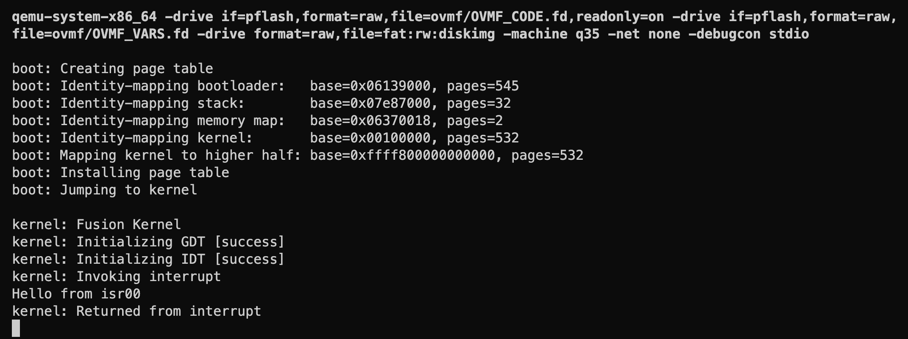
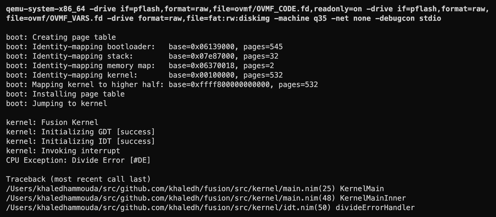
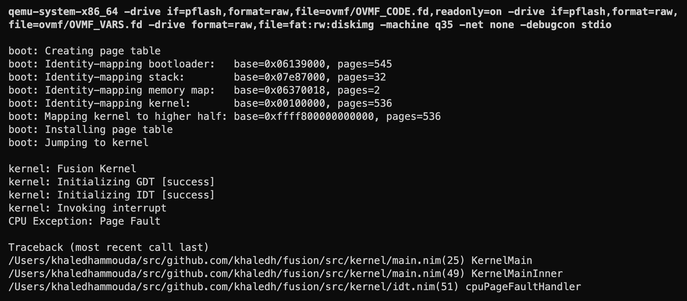

# Interrupts

When the CPU encounters an error, e.g. a division by zero or a page fault, it will raise an exception, which is a kind of interrupt. The CPU consults a table, called the **Interrupt Descriptor Table** (IDT), to find the address of the exception handler. The IDT is a table of 256 entries, not all of which are used. Each entry contains the address of an interrupt handler, which is a function in the kernel that handles the interrupt. Intel reserves the first 32 entries for CPU exceptions, which is what we'll focus on in this section. The remaining entries are for hardware or software interrupts, which we'll cover in a later section.

## Interrupt Descriptors

The IDT is an array of 256 entries, each is a 16-byte descriptor (in 64-bit mode). The index (not the offset) of a descriptor in the IDT is called an **interrupt vector**. Each descriptor points to an interrupt handler, which is a function in the kernel that handles that particular interrupt vector. During an interrupt, the interrupt vector is delievered to the CPU, which uses it as an index into the IDT to find the corresponding interrupt handler.

For example, the interrupt vector for a page fault is 14, so when a page fault occurs, the CPU will look at the 14th entry in the IDT to find the page fault handler. Another example is when a device is configured to use a particular interrupt vector, then when the device raises an interrupt, it places that vector on the bus, and the CPU will use it to find the interrupt handler in the IDT.

There are three types of descriptors in the IDT: task gates, interrupt gates, and trap gates. Task gates are used for hardware task switching, which is obsolete in 64-bit mode, so we'll focus only on interrupt gates and trap gates. The difference between the two is that interrupt gates disable interrupts when the handler is running, while trap gates do not.

Here's a diagram of interrupt/trap gate descriptors:

```text
                                       Interrupt/Trap Gate
 31                                                                                           00
┌───────────────────────────────────────────────────────────────────────────────────────────────┐
│                                            Reserved                                           │ 12
└───────────────────────────────────────────────────────────────────────────────────────────────┘
 31                                                                                           00
┌───────────────────────────────────────────────────────────────────────────────────────────────┐
│                                        Offset[63:32]                                          │ 8
└───────────────────────────────────────────────────────────────────────────────────────────────┘
 31                                           16 15 14 13 12 11       08 07       04 03 02    00
┌───────────────────────────────────────────────┬──┬─────┬──┬───────────┬────────┬──┬──┬────────┐
│                 Offset[31:16]                 │P │ DPL │ 0│   Type    │0  0  0 │0 │0 │  IST   │ 4
└───────────────────────────────────────────────┴──┴─────┴──┴───────────┴────────┴──┴──┴────────┘
 31                                           16 15                                           00
┌───────────────────────────────────────────────┬───────────────────────────────────────────────┐
│               Segment Selector                │                 Offset[15:00]                 │ 0
└───────────────────────────────────────────────┴───────────────────────────────────────────────┘

DPL         Descriptor Privilege Level
Offset      Offset to procedure entry point
P           Segment Present flag
Selector    Segment Selector for destination code segment
IST         Interrupt Stack Table (index into IST in TSS)
```

Some notes about the fields:

- The **Segment Selector** field is the segment selector for the destination code segment. Since all interrupt handlers are in the kernel, we'll set it to the kernel code segment selector.
- The **IST** field has to do with stack switching during an interrupt, which we'll cover in a later section. For now, we'll set it to 0.
- The **Type** field determines the type of interrupt gate. In 64-bit mode, there are two types of gates: interrupt gate (Type = `0b1110`) and trap gate (Type = `0b1111`).
- The **DPL** field determines the privilege level required to invoke the interrupt handler. It's checked only if an exception or interrupt is generated with an INT n, INT3, or INTO instruction. This is to prevent user programs from invoking privileged interrupt handlers, so we'll set it to 0.

Let's create a new `idt.nim` module and define a type for interrupt gates. We'll also define a type for interrupt handlers, which is a procedure that takes a pointer to the interrupt stack frame as an argument.

```nim
# src/kernel/idt.nim
import gdt

type
  InterruptGate {.packed.} = object
    offset00: uint16
    selector: uint16 = KernelCodeSegmentSelector
    ist {.bitsize: 3.}: uint8 = 0
    zero0 {.bitsize: 5.}: uint8 = 0
    `type` {.bitsize: 4.}: uint8 = 0b1110
    zero1 {.bitsize: 1.}: uint8 = 0
    dpl {.bitsize: 2.}: uint8 = 0
    present {.bitsize: 1.}: uint8 = 1
    offset16: uint16
    offset32: uint32
    reserved: uint32 = 0

  InterruptHandler = proc (frame: pointer) {.cdecl.}
```

Let's also define a helper function to create a new interrupt gate given an interrupt handler.

```nim
# src/kernel/idt.nim

proc newInterruptGate(handler: InterruptHandler): InterruptGate =
  let offset = cast[uint64](handler)
  result = InterruptGate(
    offset00: uint16(offset),
    offset16: uint16(offset shr 16),
    offset32: uint32(offset shr 32),
  )
```

Now we can create the IDT. We'll use a Nim array to represent the IDT. We'll also define a type for the IDT descriptor and declare a single instance of it, which we'll use to load the IDT into the LDTR register later.

```nim{8-19}
# src/kernel/idt.nim
...

type
  InterruptGate {.packed.} = object
    ...

  IdtDescriptor {.packed.} = object
    limit: uint16
    base: pointer

var
  idtEntries: array[256, InterruptGate]

let
  idtDescriptor = IdtDescriptor(
    limit: sizeof(idtEntries) - 1,
    base: idtEntries.addr
  )
```

## Defining Interrupt Handlers

Interrupt procedures are not normal procedures; there's a catch. When an interrupt handler is called, the CPU pushes some information onto the stack, called the **interrupt stack frame**. The handler must also return using the `iretq` instruction (as opposed to using `ret`), which pops the interrupt stack frame and returns to the interrupted program. Here's a diagram of the interrupt stack frame:

```text
      Handler's Stack

    ├──────────────────┤
    │                  │
    ├──────────────────┤     ◄──┐                   ◄──┐
    │        SS        │ +40    │                      │
    ├──────────────────┤        │                      │
    │        RSP       │ +32    │                      │
    ├──────────────────┤        │   Stack              │   Stack
    │       RFLAGS     │ +24    ├── Frame              ├── Frame 
    ├──────────────────┤        │  (no error code)     │  (with error code)
    │        CS        │ +16    │                      │
    ├──────────────────┤        │                      │
    │        RIP       │ +8     │                      │
    ├──────────────────┤     ◄──┘                      │
    │    Error Code    │  0                            │
    ├──────────────────┤                            ◄──┘
    │                  │
    ├──────────────────┤
```
▼
Notice that some CPU exceptions push an error code onto the stack. For others, the error code is not pushed. So we have to be careful when defining the different interrupt handlers.

Given this information, we can't just define a normal procedure as an interrupt handler; we have to tell the compiler to generate it differently. Fortunately, the C compiler has a special attribute called `interrupt` that can be used to define interrupt handlers. It generates appropriate function entry/exit code so that it can be used directly as an interrupt service routine. We can use the `codegenDecl` pragma to add this attribute to our interrupt handler signature.

Let's define a proof of concept interrupt handler that prints a debug message.

```nim
# src/kernel/idt.nim
...

proc isr00(frame: pointer) {.cdecl, codegenDecl: "__attribute__ ((interrupt)) $# $#$#".} =
  debugln "Hello from isr00"
```

Let's install this handler in the IDT. We'll use the `newInterruptGate` helper function we defined earlier to create a new interrupt gate, and then we'll assign it to the appropriate entry in the IDT. We'll also load the IDT into the LDTR register using the `lidt` instruction.

```nim
# src/kernel/idt.nim
...

proc initIdt*():
  idtEntries[100] = newInterruptGate(isr00)

  asm """
    lidt %0
    :
    : "m"(`idtDescriptor`)
  """
```

I installed the handler at interrupt vector 100. This is just an arbitrary choice for testing. Let's now test it out by raising an interrupt using the `int` instruction.

```nim{18-24}
# src/kernel/main.nim

import idt
...

proc KernelMainInner(
  memoryMap: ptr UncheckedArray[EfiMemoryDescriptor],
  memoryMapSize: uint,
  memoryMapDescriptorSize: uint,
) =
  debugln ""
  debugln "kernel: Fusion Kernel"

  debug "kernel: Initializing GDT "
  initGdt()
  debugln "[success]"

  debug "kernel: Initializing IDT "
  initIdt()
  debugln "[success]"

  debugln "kernel: Invoking interrupt"
  asm "int 100"
  debugln "kernel: Returned from interrupt"

  quit()
```

If we run the kernel now, we should see the debug message printed to the terminal.



Great! We have a working interrupt handler. Now we're ready to define interrupt handlers for CPU exceptions.

## Handling CPU Exceptions

As mentioned earlier, Intel reserves the first 32 entries in the IDT for CPU exceptions. Not all 32 are used. Here's the list of CPU exceptions and interrupts as defined in the Intel manual:

```text
┌────────┬──────────┬─────────────────────────┬───────────┬───────┬────────────────────────────────────┐
│ Vector │ Mnemonic │ Description             │ Type      │ Error │ Source                             │
│        │          │                         │           │ Code  │                                    │
├────────┼──────────┼─────────────────────────┼───────────┼───────┼────────────────────────────────────┤
│ 0      │ #DE      │ Divide Error            │ Fault     │ No    │ DIV and IDIV instructions.         │
│ 1      │ #DB      │ Debug Exception         │ Fault /   │ No    │ Instruction, data, and I/O         │
│        │          │                         │ Trap      │       │ breakpoints; single-step; and      │
│        │          │                         │           │       │ others.                            │
│ 2      │ -        │ NMI Interrupt           │ Interrupt │ No    │ Nonmaskable external interrupt.    │
│ 3      │ #BP      │ Breakpoint              │ Trap      │ No    │ INT3 instruction.                  │
│ 4      │ #OF      │ Overflow                │ Trap      │ No    │ INTO instruction.                  │
│ 5      │ #BR      │ BOUND Range Exceeded    │ Fault     │ No    │ BOUND instruction.                 │
│ 6      │ #UD      │ Invalid Opcode          │ Fault     │ No    │ UD instruction or reserved opcode. │
│ 7      │ #NM      │ Device Not Available    │ Fault     │ No    │ Floating-point or WAIT/FWAIT       │
│        │          │ (No Math Coprocessor)   │           │       │ instruction.                       │
│ 8      │ #DF      │ Double Fault            │ Abort     │ Yes   │ Any instruction that can generate  │
│        │          │                         │           │ (zero)│ an exception, an NMI, or an INTR.  │
│ 9      │ -        │ Coprocessor Segment     │ Fault     │ No    │ Floating-point instruction.        │
│        │          │ Overrun (reserved)      │           │       │                                    │
│ 10     │ #TS      │ Invalid TSS             │ Fault     │ Yes   │ Task switch or TSS access.         │
│ 11     │ #NP      │ Segment Not Present     │ Fault     │ Yes   │ Loading segment registers or       │
│        │          │                         │           │       │ accessing system segments.         │
│ 12     │ #SS      │ Stack-Segment Fault     │ Fault     │ Yes   │ Stack operations and SS register   │
│        │          │                         │           │       │ loads.                             │
│ 13     │ #GP      │ General Protection      │ Fault     │ Yes   │ Any memory reference and other     │
│        │          │                         │           │       │ protection checks.                 │
│ 14     │ #PF      │ Page Fault              │ Fault     │ Yes   │ Any memory reference.              │
│ 15     │ -        │ (Intel reserved. Do not │ -         │ No    │ -                                  │
│        │          │ use.)                   │           │       │                                    │
│ 16     │ #MF      │ x87 FPU Floating-Point  │ Fault     │ No    │ x87 FPU floating-point or WAIT/    │
│        │          │ Error (Math Fault       │           │       │ FWAIT instruction.                 │
│ 17     │ #AC      │ Alignment Check         │ Fault     │ Yes   │ Any data reference in memory.      │
│        │          │                         │           │ (zero)│                                    │
│ 18     │ #MC      │ Machine Check           │ Abort     │ No    │ Error codes (if any) and source    │
│        │          │                         │           │       │ are model dependent.               │
│ 19     │ #XM      │ SIMD Floating-Point     │ Fault     │ No    │ SSE/SSE2/SSE3 floating-point       │
│        │          │ Exception               │           │       │ instructions.                      │
│ 20     │ #VE      │ Virtualization Exception│ Fault     │ No    │ EPT violation                      │
│ 21     │ #CP      │ Control Protection      │ Fault     │ Yes   │ RET, IRET, RSTORSSP, and SETSSBSY  │
│        │          │ Exception               │           │       │ instructions.                      │
│ 22-31  │ -        │ Intel Reserved. Do not  │ -         │ -     │ -                                  │
│        │          │ use.                    │           │       │                                    │
│ 32-255 │ -        │ User Defined            │ Interrupt │ -     │ External interrupt or INT n        │
│        │          │ use.                    │           │       │ instruction.                       │
└────────┴──────────┴─────────────────────────┴───────────┴───────┴────────────────────────────────────┘
```

The difference between **Fault** and **Trap** exceptions is that upon returning from a Fault, the CPU will re-execute the instruction that caused the fault (e.g. a page fault handled may allocate the missing page and then return to the instruction that caused the page fault, with no loss of continuity). On the other hand, upon returning from a Trap, the CPU will continue execution from the next instruction (e.g. a breakpoint trap handler may print a debug message and then return to the next instruction). **Abort** exceptions are not recoverable, and usually indicate severe errors, such as hardware errors.

Let's start by defining an exception handler for the divide error exception. Because this exception is a Fault, it will be retried indifinitely by the CPU. To avoid an infinite loop, we'll just print a debug message (and the stack trace) and then quit the kernel.

```nim
# src/kernel/idt.nim

proc divideErrorHandler(frame: pointer) {.cdecl, codegenDecl: "__attribute__ ((interrupt)) $# $#$#".} =
  debugln "CPU Exception: Divide Error [#DE]"
  debugln ""
  debugln getStackTrace()
  quit()
```

We'll also define a helper function to install the handler in the IDT.

```nim
# src/kernel/idt.nim

proc installHandler(vector: uint8, handler: InterruptHandler) =
  idtEntries[vector] = newInterruptGate(handler)
```

Now we can install the handler in the IDT.

```nim{4}
# src/kernel/idt.nim

proc initIdt*():
  installHandler(0, divideErrorHandler)
  ...
```

Let's try it out by raising a divide error exception.

```nim{12-16}
# src/kernel/main.nim

import idt

proc KernelMainInner(
  memoryMap: ptr UncheckedArray[EfiMemoryDescriptor],
  memoryMapSize: uint,
  memoryMapDescriptorSize: uint,
) =
  ...
  debugln "kernel: Invoking interrupt"
  asm """
    # Divide by zero
    xor rcx, rcx
    idiv rcx
  """
  debugln "kernel: Returned from interrupt"
  ...
```

When we run the kernel, we should see the debug message and the stack trace printed to the terminal.



Great! Our exception handler is working, and we can see the stack trace (since the interrupt is using the same stack). Now we can define handlers for the remaining CPU exceptions. But it would be tedious to write almost the same code for each handler. So let's use a Nim template to generate the handlers for us.

```nim
# src/kernel/idt.nim

template createHandler*(name: untyped, msg: string) =
  proc name*(frame: pointer) {.cdecl, codegenDecl: "__attribute__ ((interrupt)) $# $#$#".} =
    debugln "CPU Exception: ", msg
    debugln ""
    debugln getStackTrace()
    quit()

createHandler(cpuDivideErrorHandler, "Divide Error")
createHandler(cpuDebugErrorHandler, "Debug Exception")
createHandler(cpuNmiInterruptHandler, "NMI Interrupt")
createHandler(cpuBreakpointHandler, "Breakpoint")
createHandler(cpuOverflowHandler, "Overflow")
createHandler(cpuBoundRangeExceededHandler, "Bound Range Exceeded")
createHandler(cpuInvalidOpcodeHandler, "Invalid Opcode")
createHandler(cpuDeviceNotAvailableHandler, "Device Not Available")
createHandler(cpuDoubleFaultHandler, "Double Fault")
createHandler(cpuCoprocessorSegmentOverrunHandler, "Coprocessor Segment Overrun")
createHandler(cpuInvalidTssHandler, "Invalid TSS")
createHandler(cpuSegmentNotPresentHandler, "Segment Not Present")
createHandler(cpuStackSegmentFaultHandler, "Stack Segment Fault")
createHandler(cpuGeneralProtectionFaultHandler, "General Protection Fault")
createHandler(cpuPageFaultHandler, "Page Fault")
createHandler(cpuX87FloatingPointErrorHandler, "x87 Floating Point Error")
createHandler(cpuAlignmentCheckHandler, "Alignment Check")
createHandler(cpuMachineCheckHandler, "Machine Check")
createHandler(cpuSimdFloatingPointExceptionHandler, "SIMD Floating Point Exception")
createHandler(cpuVirtualizationExceptionHandler, "Virtualization Exception")
createHandler(cpuControlProtectionExceptionHandler, "Control Protection Exception")
```

Now we can install the handlers in the IDT.

```nim{5-25}
# src/kernel/idt.nim
...

proc initIdt*() =
  installHandler(0, cpuDivideErrorHandler)
  installHandler(1, cpuDebugErrorHandler)
  installHandler(2, cpuNmiInterruptHandler)
  installHandler(3, cpuBreakpointHandler)
  installHandler(4, cpuOverflowHandler)
  installHandler(5, cpuBoundRangeExceededHandler)
  installHandler(6, cpuInvalidOpcodeHandler)
  installHandler(7, cpuDeviceNotAvailableHandler)
  installHandler(8, cpuDoubleFaultHandler)
  installHandler(9, cpuCoprocessorSegmentOverrunHandler)
  installHandler(10, cpuInvalidTssHandler)
  installHandler(11, cpuSegmentNotPresentHandler)
  installHandler(12, cpuStackSegmentFaultHandler)
  installHandler(13, cpuGeneralProtectionFaultHandler)
  installHandler(14, cpuPageFaultHandler)
  installHandler(16, cpuX87FloatingPointErrorHandler)
  installHandler(17, cpuAlignmentCheckHandler)
  installHandler(18, cpuMachineCheckHandler)
  installHandler(19, cpuSimdFloatingPointExceptionHandler)
  installHandler(20, cpuVirtualizationExceptionHandler)
  installHandler(21, cpuControlProtectionExceptionHandler)

  asm """
    lidt %0
    :
    : "m"(`idtDescriptor`)
  """
```

Let's try it out by raising a page fault exception.

```nim{8-9}
# src/kernel/main.nim

import idt

proc KernelMainInner(...) =
  ...
  debugln "kernel: Invoking interrupt"
  let p = cast[ptr uint8](0xdeadbeef)
  let x = p[]
  debugln "kernel: Returned from interrupt"
  ...
```

And when we run the kernel, we should see the page fault error message.



Beautiful! We now have a safety net for CPU exceptions. If we mess up something in the kernel, we should get a debug message instead of a random hang or reboot. We will come back to properly implement some of these handlers later, especially the page fault handler.

In the next sesction we'll try to execute a function in user mode.
