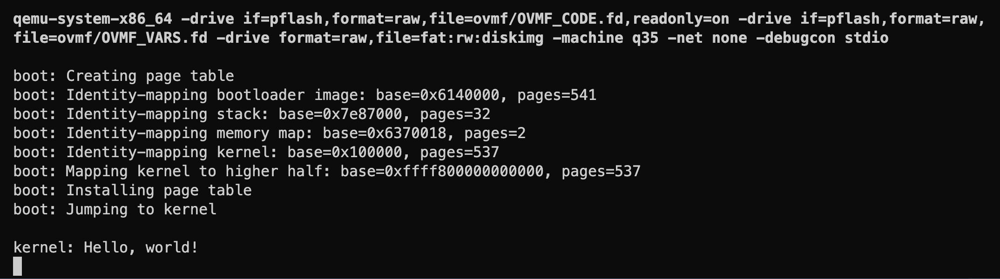

# Higher Half Kernel

The kernel is currently linked at address `0x100000`, not at the higher half of the address space. The UEFI environment does have paging enabled, but we need to build our own page tables, and map the kernel at the higher half of the address space. This needs to be done in the bootloader, before we jump to the kernel (since we'll change the kernel to be linked at the higher half). Once we're in the kernel, we can set up different page tables that fit our needs (although we'll still need to map the kernel at the higher half of the address space).

## Linking the kernel

To link the kernel at the higher half of the address space, we need to change the base address of the kernel in the linker script. However, instead of linking the kernel at exactly `0xFFFF800000000000`, we'll link it at 1 MiB above that address, i.e. `0xFFFF800000100000`. This will make virtual addresses and physical addresses line up nicely, and we can compare them visually by just looking at least significant bytes of the address, which makes debugging page table mappings easier.

```ld{5}
/* src/kernel/kernel.ld */

SECTIONS
{
  . = 0xFFFF800000100000;
  .text   : {
    *main*.o(.*text.KernelMain)
    *main*.o(.*text.*)
    *(.*text*)
  }
  .rodata : { *(.*rodata*) }
  .data   : { *(.*data) *(.*bss) }
  .shstrtab : { *(.shstrtab) }

  /DISCARD/ : { *(*) }
}
```

If we try to compile and link the kernel, we'll get a bunch of relocation errors:

```sh-session
$ just kernel
ld.lld: error: /Users/khaledhammouda/src/github.com/khaledh/fusion/build/@mmain.nim.c.o:(function KernelMainInner__main_u7: .text.KernelMainInner__main_u7+0x232): relocation R_X86_64_32S out of range: -140737488267184 is not in [-2147483648, 2147483647]; references section '.rodata'
>>> referenced by @mmain.nim.c
...
```

The problem here is that the compiler has something called a "code model", which determines how it generates code. The default code model is `small`, which means that the compiler assumes that the code and data are linked in the lower 2 GiB of the address space. What we need here is the `large` code model, which assumes that the code and data are linked anywhere in the address space. We can specify the code model using the `-mcmodel` flag, so let's add it to the kernel's `nim.cfg` file.

```properties
# src/kernel/nim.cfg
...

--passc:"-mcmodel=large"
```

Now the kernel should compile and link successfully. Let's take a quick look at the linker map.

```sh-session
$ head -n 10 build/kernel.map
             VMA              LMA     Size Align Out     In      Symbol
               0                0 ffff800000100000     1 . = 0xFFFF800000100000
ffff800000100000 ffff800000100000    2048c    16 .text
ffff800000100000 ffff800000100000      1ee    16         .../fusion/build/@mmain.nim.c.o:(.ltext.KernelMain)
ffff800000100000 ffff800000100000      1ee     1                 KernelMain
ffff8000001001f0 ffff8000001001f0     261f    16         .../fusion/build/@mmain.nim.c.o:(.ltext.KernelMainInner__main_u13)
ffff8000001001f0 ffff8000001001f0     261f     1                 KernelMainInner__main_u13
ffff800000102810 ffff800000102810       9b    16         .../fusion/build/@mmain.nim.c.o:(.ltext.nimFrame)
ffff800000102810 ffff800000102810       9b     1                 nimFrame
ffff8000001028b0 ffff8000001028b0       25    16         .../fusion/build/@mmain.nim.c.o:(.ltext.nimErrorFlag)
```

Looks good. Next, we'll look at how to set up paging in the bootloader.

## Bootloader paging setup

We know we need to map the kernel to the higher half. But since we're going to be changing the paging structures in the bootloader, we'll need to identity-map the bootloader image itself. The reason is that the bootloader code is currently running from the bootloader image, which is mapped to the lower half of the address space. If we change the page tables, the bootloader code will no longer be accessible, and we'll get a page fault. Keep in mind also that the bootloader stack is also mapped to the lower half of the address space, so we'll need to identity-map that as well. So here's a list of things we need to map:

- The bootloader image (identity-mapped)
- The bootloader stack (identity-mapped)
- The memory map (identity-mapped)
- The kernel image (identity-mapped)
- The kernel image (mapped to the higher half)

Most of the above mappings are easy, except for the bootloader stack (which will continue to be the kernel stack as we transfer control to it). There's no easy way in the UEFI environment to get the memory region allocated for the stack of the currently loaded image. So what we're going to do is manually get the current stack address, and scan the memory map to find the memory region that contains the stack. Let's add a proc do this.

```nim
# src/boot/bootx64.nim
...

proc getStackRegion(
  memoryMap: ptr EfiMemoryDescriptor,
  memoryMapSize: uint64,
  memoryMapDescriptorSize: uint64
): tuple[stackBase: uint64, stackPages: uint64] =
  # get stack pointer
  var rsp: uint64
  asm """
    mov %0, rsp
    :"=r"(`rsp`)
  """

  # scan memory map until we find the stack region
  var stackBase: uint64
  var stackPages: uint64
  let numMemoryMapEntries = memoryMapSize div memoryMapDescriptorSize
  for i in 0 ..< numMemoryMapEntries:
    let entry = cast[ptr EfiMemoryDescriptor](cast[uint64](memoryMap) + i * memoryMapDescriptorSize)
    if rsp > entry.physicalStart and rsp < entry.physicalStart + entry.numberOfPages * PageSize:
      stackBase = entry.physicalStart
      stackPages = entry.numberOfPages
      break

  return (stackBase, stackPages)
```

Now let's setup paging at the end of the `EfiMainInner` proc.

```nim{4-6,14-43}
# src/boot/bootx64.nim
...

const
  KernelPhysicalBase = 0x100000'u64
  KernelVirtualBase = 0xFFFF800000100000'u64


proc EfiMainInner(imgHandle: EfiHandle, sysTable: ptr EFiSystemTable): EfiStatus =
  ...

  # ======= NO MORE UEFI BOOT SERVICES =======

  debugln "boot: Creating page table"
  # initialize a throw-away page table to map the kernel
  var pml4 = new PML4Table

  # identity-map bootloader image
  let bootloaderBase = cast[uint64](loadedImage.imageBase)
  let bootloaderPages = (loadedImage.imageSize.uint + 0xFFF) div 0x1000.uint
  debugln &"boot: Identity-mapping bootloader image: base={bootloaderBase:#x}, pages={bootloaderPages}"
  identityMapPages(pml4, bootloaderBase, bootloaderPages.uint64, paReadWrite, pmSupervisor)

  # identity-map bootloader stack
  let (stackBase, stackPages) = getStackRegion(memoryMap, memoryMapSize, memoryMapDescriptorSize)
  debugln &"boot: Identity-mapping stack: base={stackBase:#x}, pages={stackPages}"
  identityMapPages(pml4, stackBase, stackPages, paReadWrite, pmSupervisor)

  # identity-map memory map
  let memoryMapPages = (memoryMapSize + 0xFFF) div 0x1000.uint
  debugln &"boot: Identity-mapping memory map: base={cast[uint64](memoryMap):#x}, pages={memoryMapPages}"
  identityMapPages(pml4, cast[uint64](memoryMap), memoryMapPages, paReadWrite, pmSupervisor)

  # identity-map kernel
  debugln &"boot: Identity-mapping kernel: base={KernelPhysicalBase:#x}, pages={kernelPages}"
  identityMapPages(pml4, KernelPhysicalBase, kernelPages, paReadWrite, pmSupervisor)

  # map kernel to higher half
  debugln &"boot: Mapping kernel to higher half: base={KernelVirtualBase}, pages={kernelPages}"
  mapPages(pml4, KernelVirtualBase, KernelPhysicalBase, kernelPages, paReadWrite, pmSupervisor)

  debugln "boot: Installing page table"
  installPageTable(pml4)

  # jump to kernel
  debugln "boot: Jumping to kernel"
  var kernelMain = cast[KernelEntryPoint](KernelVirtualBase)
  kernelMain(memoryMap, memoryMapSize, memoryMapDescriptorSize)

  # we should never get here
  quit()
```

We should be good to go. Let's try it out.



Great! We've entered the kernel, which is now running at the higher half of the address space. This is another big milestone.

There are many things we can tackle next, but one important thing we need to take care of before we add more code is handling CPU exceptions. The reason is that sooner or later our kernel will crash, and we won't know why. Handling CPU exceptions gives us a way to print a debug message and halt the CPU, so we can see what went wrong.

But before we can do that, we need to set up the **Global Descriptor Table** (GDT), which we'll look at in the next section.
