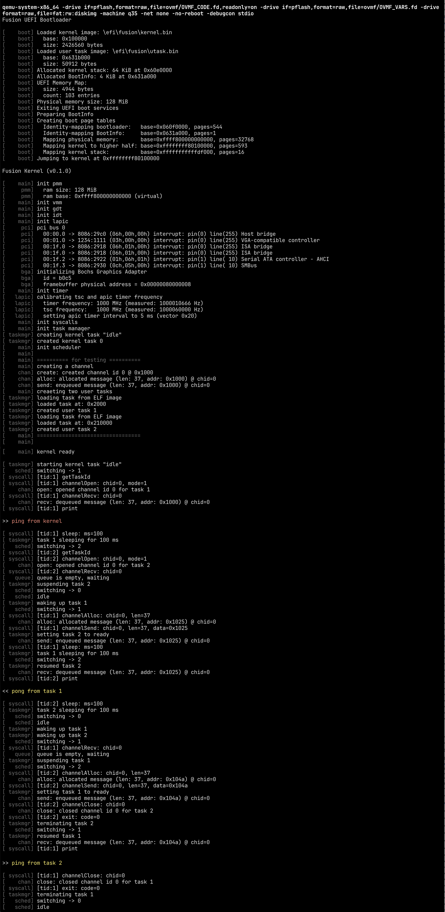

# Fusion OS

This is both a documentation and a tutorial for building an operating system, Fusion OS,
from scratch in Nim. You can find the source code on GitHub at
[https://github.com/khaledh/fusion](https://github.com/khaledh/fusion).

> Note: The source for this documentation is on GitHub at [https://github.com/khaledh/khaledh.github.io](https://github.com/khaledh/khaledh.github.io).
Comments and contributions are welcome through GitHub issues and pull requests.

## Screenshots

**UEFI Bootloader**

**GUI** (_Note: This screenshot is from the `graphics` branch, which is still a work-in-progress._)

**Booting and Running the Kernel**

## Features

The following features are currently implemented:

- UEFI Bootloader
- Memory Management
  - Single Address Space
  - Physical Memory Manager
  - Virtual Memory Manager
  - Higher Half Kernel
- Task Management
  - Kernel Tasks
  - User Mode Tasks
  - Preemptive Multitasking
  - Priority-based Scheduling
  - ELF Loader
- System Calls
  - System Call Interface
  - SYSCALL/SYSRET
  - User Mode Library
- IPC
  - Synchronization Primitives
  - Channel-based IPC
  - Message Passing
- Hardware
  - Timer Interrupts
  - PCI Device Enumeration
  - Bochs Graphics Adapter Driver

#### Planned

- Capability-based Security
- Event-based Task State Machines
- Demand Paging
- Disk I/O
- File System
- Keyboard/Mouse Input
- Shell
- GUI
- Networking

